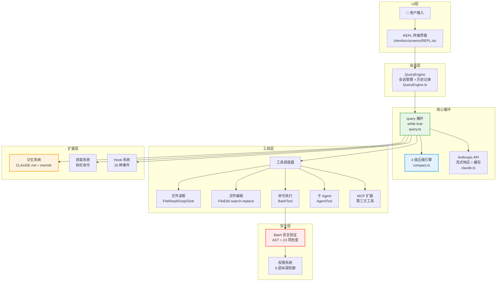

# 第 1 章：整体架构一览

> **本章目标**：建立对 Claude Code 整体结构的直觉，了解各个模块的职责和关系。

---

## 1.1 Claude Code 解决什么问题

Claude Code 不是一个简单的“CLI 调用大模型”工具。它是 Anthropic 官方推出的 **受控工具循环 Agent（Controlled Tool-Loop Agent）**，专为真实软件工程任务设计。

### 从工具到 Agent：三级范式

要理解 Claude Code 的定位，我们需要先理解 AI 辅助编程的三级范式：

**第一级：代码补全**（如 Copilot）。模型的工作是“预测下一行代码”。它看到你的光标位置和上下文，生成一个补全建议。这本质上是一个**单次预测问题**——模型不需要理解整个项目，不需要执行任何操作，只需要根据局部上下文生成合理的代码片段。用户始终是驾驶员，模型只是副驾。

**第二级：IDE 聊天助手**（如 Cursor Chat、Copilot Chat）。用户可以用自然语言描述需求，模型生成代码片段或修改建议。但关键限制是：**模型不能执行操作**。它生成一个 diff，由用户决定是否 apply。如果 diff 有问题（比如依赖了一个不存在的函数），用户需要手动发现并反馈，模型无法自行验证。

**第三级：自主 Agent**（Claude Code）。模型不仅生成代码，还能**自主执行多步操作**。考虑一个真实场景：你想给项目添加一个新的 REST endpoint。Copilot 会给你一个函数体。IDE 聊天可能会建议一个修改方案。而 Claude Code 的做法是：先用 Grep 搜索现有路由定义理解项目的路由模式，用 FileRead 读取中间件配置，然后创建 handler 文件、注册路由、编写测试，接着运行 `npm test` 发现测试失败，读取错误信息，修复代码，再次运行测试直到通过，最后提交 git commit。整个过程是一个**自主决策循环**——模型决定下一步做什么，执行后观察结果，再决定下一步。

这种范式跃迁带来了根本性的架构差异。一个 Agent 需要：

- **循环**（Loop）：不是单次调用，而是反复“思考→执行→观察”直到任务完成
- **工具**（Tools）：不是只生成文本，而是能读文件、写文件、执行命令
- **记忆**（Memory）：不是每次从零开始，而是记住用户偏好和项目上下文
- **安全控制**（Safety）：因为它在用户机器上执行真实操作，所以需要严格的权限管理

Claude Code 的每一个架构决策都围绕这四个需求展开。

---

## 1.2 先用大白话理解

把 Claude Code 想象成一家小型公司：

- **前台（REPL）**：接待你，显示对话内容，接收你的输入
- **项目经理（QueryEngine）**：管理整个会话，记住对话历史，决定什么时候需要压缩记忆
- **核心员工（query 循环）**：真正干活的人，在「思考 → 行动 → 观察」的循环里工作
- **工具箱（66+ Tools）**：各种专业工具，读文件、写文件、执行命令……
- **安保（安全系统）**：在执行危险操作前把关，防止出事
- **记忆库（Memory）**：记住你的偏好和项目规则，下次不用重新解释

这家公司的特别之处在于：**核心员工（AI）是决策者**，它决定下一步做什么，而不是你来一步步指挥。

---

## 1.3 六条核心设计原则

在看具体架构之前，先理解 Claude Code 的设计哲学。这六条原则解释了很多「为什么这样设计」的问题：

**原则一：Generator-based 流式架构**。从 API 调用到 UI 渲染，全链路使用异步生成器（`async function*`）。这不是技术细节，而是根本性的设计选择——它让每一个 Token、每一个工具结果都能实时流向用户界面，零缓冲延迟。

核心查询循环的签名是：

```typescript
// src/query.ts
export async function* query(
  params: QueryParams,
): AsyncGenerator<StreamEvent | Message | ToolUseSummaryMessage, Terminal>
```

这是一个异步生成器——它不是一次性返回结果，而是**边执行边 yield 事件**。整个数据流形成了一个嵌套的 generator 管道：`REPL.tsx` → `QueryEngine.submitMessage()` → `query()` → `queryModelWithStreaming()`。每一层 generator 在管道上叠加自己的处理逻辑（压缩、错误恢复、权限检查），但对上层来说，它只是一个统一的 `AsyncGenerator` 事件流。

**原则二：防御性分层安全**。AI 在用户机器上执行真实命令，一条错误指令就可能造成不可挂回的损失。五层纵深防御，任何一层拦住就不执行。

**原则三：渐进式降级**。遇到问题不是直接报错，而是先尝试恢复。上下文太长？先压缩，实在不行再报错。Token 超限？自动升级到更大的限制再重试。

**原则四：编译时 Feature Gate**。Claude Code 有很多内部功能（协调器模式、Swarm 团队等）在公开版本中需要完全移除。通过 Bun 的编译时 Feature Flag，这些代码在构建时被物理删除，而非运行时隐藏。

**原则五：工具统一接口**。所有工具——内置的和第三方的——都遵循同一套接口规范，走同一条执行流水线。这让系统可以无缝扩展，不需要为每种工具写特殊处理逻辑。

**原则六：Agent-first**。模型是循环中的决策者，而非人类。人类设定目标并审批危险操作，但在两次人类交互之间，模型自主决定做什么。

这体现在源码中最核心的一行——`src/query.ts:307` 的 `while (true)`：

```typescript
// src/query.ts:307
while (true) {
    // ... 压缩 → API 调用 → 工具执行 → 继续/退出
}
```

这个循环**只有当模型的响应不包含任何工具调用时才会退出**。换句话说，是模型——而不是代码逻辑——决定任务是否完成。代码只是提供了执行环境，真正的“大脑”是模型本身。

---

## 1.4 整体架构图



---

## 1.5 数据流：一次对话的完整旅程

当你输入一条消息，它经历了什么？

**第一步：输入捕获**。REPL（终端界面）捕获你的输入，传递给 QueryEngine。

**第二步：上下文构建**。QueryEngine 把你的消息、历史对话、系统提示词、项目规则（CLAUDE.md）、环境信息（当前目录、git 状态）组装成一个完整的请求。

**第三步：压缩检查**。在发送给 API 之前，检查上下文是否接近限制。如果是，触发压缩流水线。

**第四步：API 调用**。把组装好的请求发送给 Anthropic API，开始接收流式响应。

**第五步：工具执行**。如果 AI 的响应包含工具调用（「我要读这个文件」），立刻执行对应工具，把结果加入对话历史，继续循环。

**第六步：循环判断**。如果 AI 的响应不包含工具调用，说明它认为任务完成了（或者需要你的输入），循环退出，结果显示给你。

```mermaid
sequenceDiagram
    participant U as 用户
    participant REPL as 终端界面
    participant QE as QueryEngine
    participant Loop as query 循环
    participant API as Anthropic API
    participant Tool as 工具

    U->>REPL: 输入消息
    REPL->>QE: 传递消息
    QE->>Loop: 启动查询循环
    loop 直到 AI 不再调用工具
        Loop->>API: 发送上下文（含历史）
        API-->>Loop: 流式返回响应
        alt 响应包含工具调用
            Loop->>Tool: 执行工具
            Tool-->>Loop: 返回结果
            Loop->>Loop: 结果加入历史，继续
        else 响应不含工具调用
            Loop-->>QE: 返回最终结果
        end
    end
    QE-->>REPL: 显示结果
    REPL-->>U: 展示给用户
```

---

## 1.6 9 阶段并行启动

Claude Code 的启动速度很快（关键路径约 235ms），因为它把不相关的初始化任务并行执行：

| 阶段 | 内容 | 是否并行 |
|------|------|---------|
| 1 | 解析命令行参数 | — |
| 2 | 加载用户配置 | ✓ 并行 |
| 3 | 检测 git 仓库 | ✓ 并行 |
| 4 | 加载 CLAUDE.md | ✓ 并行 |
| 5 | 初始化 MCP 连接 | ✓ 并行 |
| 6 | 加载技能列表 | ✓ 并行 |
| 7 | 预热 API 连接 | ✓ 并行 |
| 8 | 初始化记忆系统 | ✓ 并行 |
| 9 | 渲染 UI | — |

---

## 1.7 关键数据

| 指标 | 数值 |
|------|------|
| 源码总行数 | 512,000+ |
| TypeScript 文件数 | 1,884 |
| 内置工具数量 | 66+ |
| 压缩流水线级数 | 5 级 |
| 安全防御层数 | 5 层 |
| Hook 事件数量 | 25 种 |
| 启动关键路径 | ~235ms |
| Bash 安全检查项 | 23 项 |

---

> 下一章：[源码目录结构 →](#/docs/02-source-structure)

---

## 1.8 数据流详解：一次完整的用户交互

理解 Claude Code 的最好方式是追踪一条用户消息从输入到输出的完整旅程：

**Step 1：用户输入**。用户在终端输入一条消息（如「帮我找出所有未处理的 TODO 注释」）并按下 Enter。`PromptInput` 组件捕获这个输入，REPL 层将其封装为 `UserMessage` 并传递给 `QueryEngine.processUserTurn()`。

**Step 2：预处理**。QueryEngine 检查消息类型：是斜杠命令（如 `/compact`）？是文件附件（如 `@src/main.ts`）？还是普通 prompt？对于普通 prompt，它被追加到对话历史，然后调用核心 `query()` 函数。

**Step 3：上下文组装**。`query()` 循环的第一步是组装上下文：系统提示词（memoized，首次调用时构建）、CLAUDE.md 内容（通过 `<system-reminder>` 注入）、压缩后的消息历史。如果这是一个新会话（上下文还没满），消息历史直接使用；当历史消息累积到接近上下文窗口上限时，压缩管道会自动介入。

**Step 4：API 调用**。系统提示词、压缩后的消息历史和工具 schema 被发送到 Claude API。响应以 token-by-token 的方式流式返回，每个 token 被 yield 为 `StreamEvent` 沿着 generator 链向上传递到 UI，用户立即看到文字出现。

**Step 5：工具在流式过程中即开始执行**。这是 Claude Code 的一个重要性能优化：`StreamingToolExecutor` **不等待模型的完整响应**。当流式解析器检测到一个 `tool_use` JSON block 已经完整，工具执行立即开始——此时模型可能还在继续生成后面的文字或其他工具调用。只读且并发安全的工具（如 Grep、Glob）甚至可以**并行执行**，进一步缩短多工具调用的总耗时。

**Step 6：结果注入，循环继续**。工具的执行结果被封装为 `tool_result` 消息追加到对话历史中。循环回到 Step 3——再次检查是否需要压缩，再次调用 API。模型看到工具结果后决定下一步：继续调用更多工具，或者生成最终的文字回复。

**Step 7：循环退出，结果组装**。当模型的响应中不包含任何 `tool_use` block 时，`query()` 返回一个 `Terminal` 值。`QueryEngine` 组装最终结果，持久化对话历史，更新 usage/cost 追踪。

### 关于性能：流式工具预执行

Step 5 中的「流式工具预执行」值得单独强调。在朴素的实现中，流程是串行的：等待模型完整响应 → 解析工具调用 → 顺序执行工具 → 发送结果。Claude Code 的流程是重叠的：模型还在生成文字的同时，已解析完成的工具调用已经在执行。对于一次包含 3-4 个工具调用的响应，这种重叠可以显著减少端到端延迟。

### 关于错误恢复

数据流中隐藏着多层错误恢复机制：

- **API 错误**（429 限速、529 服务过载）：`withRetry` 层自动进行指数退避重试，严重情况下可以降级到备选模型
- **上下文过长**（`prompt_too_long`）：触发 reactive compact——紧急执行一轮压缩然后重试 API 调用
- **工具执行失败**：错误信息被包装为 `tool_result`（标记 `is_error: true`）返回给模型，模型可以自行决定是重试还是换一种方法

关键洞察：**数据通过嵌套的 async generator 流动**。每一层都在 generator 管道上添加自己的处理逻辑（权限检查、压缩、错误恢复），但对上层来说，它只是一个统一的事件流。这使得关注点完全分离——QueryEngine 不需要知道压缩细节，REPL 不需要知道错误恢复逻辑。

---

## 1.9 模块依赖规则

这个分层有一条关键的依赖规则：**核心循环（query.ts）依赖服务层，但永远不依赖 UI 层；UI 层（REPL.tsx）依赖 QueryEngine，但永远不直接依赖 query.ts**。

这意味着你可以把整个终端 UI 替换为 Web UI，只需要重写 REPL 层——QueryEngine 及其以下的所有模块完全不用改动。SDK 模式就是这个设计的直接体现：它绕过了整个 UI 层，直接与 QueryEngine 交互。

### 三种运行模式的统一

**入口层（main.tsx）**处理三种截然不同的运行模式：

- **REPL 模式**：交互式终端，用户实时输入
- **Print 模式**（`-p` 标志）：单次查询后退出，适合脚本调用
- **SDK/Bridge 模式**：供第三方程序调用（IDE 插件、CI/CD 系统）

关键设计是：**三种模式全部汇聚到同一个 QueryEngine**。这意味着核心 Agent 循环是模式无关的——无论 Claude Code 是被人类交互使用、被 CI 脚本以 `-p` 调用、还是被 IDE 插件通过 SDK 集成，底层执行的都是同一个 `query()` 函数。这对测试也很有价值：Print 模式本质上就是一个无头测试工具。

---

## 1.10 设计洞察（深度扩展）

**「三级范式」的本质**：Claude Code 的设计遵循三级范式——工具（Tools）、上下文（Context）、循环（Loop）。工具是能力的载体，上下文是知识的载体，循环是决策的载体。三者缺一不可：没有工具，模型只能「说」不能「做」；没有上下文，模型只能「做当前」不能「做连续」；没有循环，模型只能「做一次」不能「做到完成」。

**「流式工具预执行」的延迟隐藏**：这是一种「延迟隐藏」（Latency Hiding）技术——将不同操作的延迟重叠起来，减少用户感知的总延迟。在 GPU 编程中，这被称为「流水线」（Pipelining）；在数据库中，这被称为「预取」（Prefetching）。Claude Code 将这个技术应用到 AI 系统中，是一个有价值的工程实践。

**「9 阶段并行启动」的用户体验优先**：启动优化的核心目标是「最小化用户感知的启动时间」，而不是「最小化总初始化时间」。这两个目标看似相同，实则不同——用户感知的是「输入 `claude` 后多快看到输入提示符」，而不是「所有后台任务何时完成」。通过将非关键任务延迟到首帧渲染之后，Claude Code 在不牺牲功能完整性的情况下，大幅提升了用户感知的启动速度。

---

> 下一章：[源码目录结构 →](#/docs/02-source-structure)
