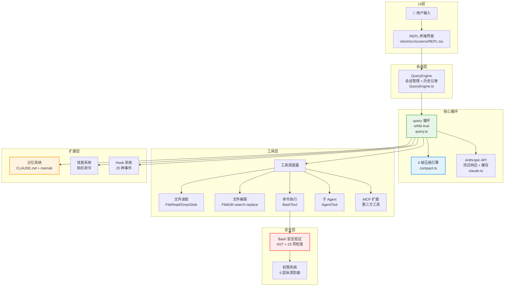

# 第 1 章：整体架构一览

> **本章目标**：建立对 Claude Code 整体结构的直觉，了解各个模块的职责和关系。

---

## 先用大白话理解

把 Claude Code 想象成一家小型公司：

- **前台（REPL）**：接待你，显示对话内容，接收你的输入
- **项目经理（QueryEngine）**：管理整个会话，记住对话历史，决定什么时候需要压缩记忆
- **核心员工（query 循环）**：真正干活的人，在「思考 → 行动 → 观察」的循环里工作
- **工具箱（66+ Tools）**：各种专业工具，读文件、写文件、执行命令……
- **安保（安全系统）**：在执行危险操作前把关，防止出事
- **记忆库（Memory）**：记住你的偏好和项目规则，下次不用重新解释

这家公司的特别之处在于：**核心员工（AI）是决策者**，它决定下一步做什么，而不是你来一步步指挥。

---

## 六条核心设计原则

在看具体架构之前，先理解 Claude Code 的设计哲学。这六条原则解释了很多「为什么这样设计」的问题：

**原则一：Generator-based 流式架构**。从 API 调用到 UI 渲染，全链路使用异步生成器（`async function*`）。这不是技术细节，而是根本性的设计选择——它让每一个 Token、每一个工具结果都能实时流向用户界面，零缓冲延迟。

**原则二：防御性分层安全**。AI 在用户机器上执行真实命令，一条错误指令就可能造成不可挽回的损失。五层纵深防御，任何一层拦住就不执行。

**原则三：渐进式降级**。遇到问题不是直接报错，而是先尝试恢复。上下文太长？先压缩，实在不行再报错。Token 超限？自动升级到更大的限制再重试。

**原则四：编译时 Feature Gate**。Claude Code 有很多内部功能（协调器模式、Swarm 团队等）在公开版本中需要完全移除。通过 Bun 的编译时 Feature Flag，这些代码在构建时被物理删除，而非运行时隐藏。

**原则五：工具统一接口**。所有工具——内置的和第三方的——都遵循同一套接口规范，走同一条执行流水线。这让系统可以无缝扩展，不需要为每种工具写特殊处理逻辑。

**原则六：Agent-first**。模型是循环中的决策者，而非人类。人类设定目标并审批危险操作，但在两次人类交互之间，模型自主决定做什么。

---

## 整体架构图



---

## 数据流：一次对话的完整旅程

当你输入一条消息，它经历了什么？

**第一步：输入捕获**。REPL（终端界面）捕获你的输入，传递给 QueryEngine。

**第二步：上下文构建**。QueryEngine 把你的消息、历史对话、系统提示词、项目规则（CLAUDE.md）、环境信息（当前目录、git 状态）组装成一个完整的请求。

**第三步：压缩检查**。在发送给 API 之前，检查上下文是否接近限制。如果是，触发压缩流水线。

**第四步：API 调用**。把组装好的请求发送给 Anthropic API，开始接收流式响应。

**第五步：工具执行**。如果 AI 的响应包含工具调用（「我要读这个文件」），立刻执行对应工具，把结果加入对话历史，继续循环。

**第六步：循环判断**。如果 AI 的响应不包含工具调用，说明它认为任务完成了（或者需要你的输入），循环退出，结果显示给你。

```mermaid
sequenceDiagram
    participant U as 用户
    participant REPL as 终端界面
    participant QE as QueryEngine
    participant Loop as query 循环
    participant API as Anthropic API
    participant Tool as 工具

    U->>REPL: 输入消息
    REPL->>QE: 传递消息
    QE->>Loop: 启动查询循环
    loop 直到 AI 不再调用工具
        Loop->>API: 发送上下文（含历史）
        API-->>Loop: 流式返回响应
        alt 响应包含工具调用
            Loop->>Tool: 执行工具
            Tool-->>Loop: 返回结果
            Loop->>Loop: 结果加入历史，继续
        else 响应不含工具调用
            Loop-->>QE: 返回最终结果
        end
    end
    QE-->>REPL: 显示结果
    REPL-->>U: 展示给用户
```

---

## 9 阶段并行启动

Claude Code 的启动速度很快（关键路径约 235ms），因为它把不相关的初始化任务并行执行：

| 阶段 | 内容 | 是否并行 |
|------|------|---------|
| 1 | 解析命令行参数 | — |
| 2 | 加载用户配置 | ✓ 并行 |
| 3 | 检测 git 仓库 | ✓ 并行 |
| 4 | 加载 CLAUDE.md | ✓ 并行 |
| 5 | 初始化 MCP 连接 | ✓ 并行 |
| 6 | 加载技能列表 | ✓ 并行 |
| 7 | 预热 API 连接 | ✓ 并行 |
| 8 | 初始化记忆系统 | ✓ 并行 |
| 9 | 渲染 UI | — |

---

## 关键数据

| 指标 | 数值 |
|------|------|
| 源码总行数 | 512,000+ |
| TypeScript 文件数 | 1,884 |
| 内置工具数量 | 66+ |
| 压缩流水线级数 | 4 级 |
| 安全防御层数 | 5 层 |
| Hook 事件数量 | 25 种 |
| 启动关键路径 | ~235ms |
| Bash 安全检查项 | 23 项 |

---

> 下一章：[源码目录结构 →](#/docs/02-source-structure)
