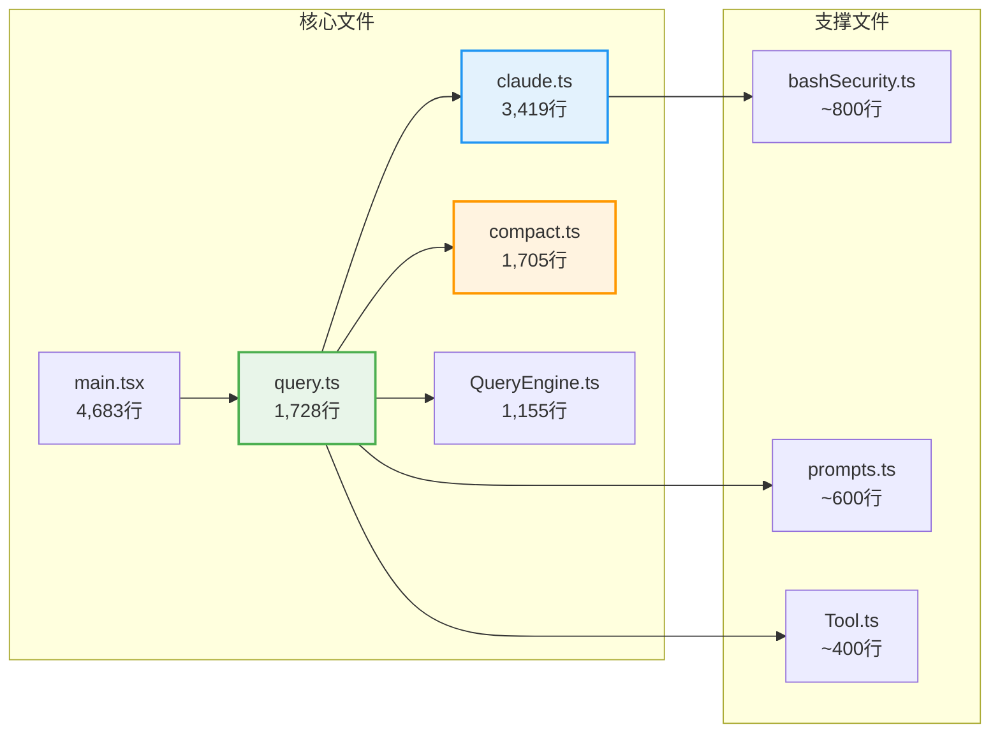
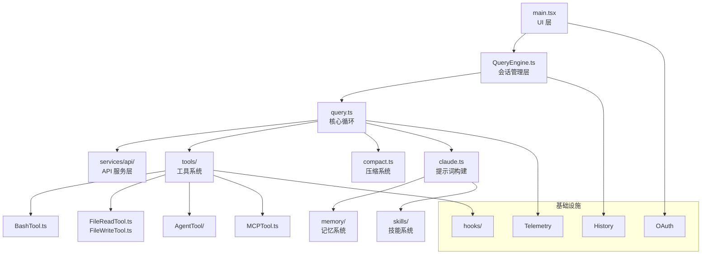

# 第 2 章：源码目录结构

> **本章目标**：了解 512,000 行代码是怎么组织的，找到你感兴趣的部分在哪里。

---

## 2.1 先用大白话理解

想象一个大型超市的仓库：

- **入口区（screens/）**：顾客进来看到的界面，收银台、服务台
- **核心运营（query.ts、QueryEngine.ts）**：整个超市的运营中枢，决定怎么接待顾客、处理订单
- **工具区（tools/）**：各种专业设备，扫码枪、收银机、叉车……
- **安保室（utils/bash/）**：监控系统，防止有人偷东西或做危险的事
- **仓储系统（services/compact/）**：货架管理，东西太多了就整理压缩
- **供应商对接（services/mcp/）**：和外部供应商（第三方工具）的对接系统
- **员工手册（constants/prompts.ts）**：写着所有员工（AI）的行为规范

---

## 2.2 技术栈

| 层次 | 技术选型 | 说明 |
|------|---------|------|
| 运行时 | Bun | 高性能 JS/TS 运行时，支持编译时 Feature Flag 消除 |
| 语言 | TypeScript | 全量 TypeScript，严格类型检查 |
| UI 框架 | React + Ink（自研） | 基于 React 的终端 UI 框架，自研 Ink 渲染器（251KB） |
| 布局引擎 | Yoga | Facebook 的 Flexbox 布局引擎，适配终端 |
| Schema 验证 | Zod | 运行时类型校验，用于工具输入、Hook 输出、配置验证 |
| CLI 框架 | Commander.js | 命令行参数解析，分发到 REPL/headless/SDK 模式 |
| API 协议 | Anthropic SDK | 官方 TypeScript SDK，支持流式响应 |

技术选型本身不是本文重点，但有两个选择尤其影响了架构设计：

**Bun 的 `feature()` 宏**：Claude Code 内部有大量功能（协调器模式、Swarm 团队等）在外部发布版本中需要完全移除。Bun 提供的编译时 Feature Flag 让这些代码在构建时被物理删除，而非运行时隐藏。这意味着外部用户即使反编译也看不到这些功能的代码——它们根本不存在于发布的二进制文件中。

**自研 React 终端渲染器**：Claude Code 的终端 UI 复杂度远超普通 CLI——权限确认对话框、流式代码高亮、嵌套工具进度指示器都需要组件化的状态管理。团队维护了一个 251KB 的定制 Ink 渲染器（而非使用上游库），以支持这些复杂的 UI 需求。

---

## 2.3 顶层目录结构

```
src/
├── main.tsx              ← CLI 主入口（4,683 行）
│                           Commander.js 解析参数，分发到 REPL/headless/SDK 模式
├── query.ts              ← 核心查询循环（1,728 行，最重要的文件）
├── QueryEngine.ts        ← 会话引擎（1,155 行）
├── Tool.ts               ← 工具接口定义（~400 行）
├── tools.ts              ← 工具注册表（~200 行）
├── context.ts            ← 上下文构建（190 行）
│
├── screens/              ← 终端 UI 界面
│   ├── REPL.tsx          ← 主界面（核心交互，React + Ink）
│   ├── PermissionDialog/ ← 权限确认对话框
│   └── ...
│
├── tools/                ← 66+ 内置工具实现
│   ├── BashTool/         ← 命令执行工具（含安全模块）
│   │   ├── BashTool.ts   ← 工具主体
│   │   └── security.ts   ← AST 安全检查
│   ├── FileReadTool/     ← 文件读取
│   ├── FileEditTool/     ← 文件编辑（search-replace 机制）
│   ├── FileWriteTool/    ← 文件写入
│   ├── GlobTool/         ← 文件名搜索
│   ├── GrepTool/         ← 内容搜索（正则）
│   ├── AgentTool/        ← 子 Agent 调度
│   ├── TodoTool/         ← 任务管理
│   └── ...
│
├── services/             ← 核心服务
│   ├── api/
│   │   └── claude.ts     ← API 调用逻辑（3,419 行，最大的文件）
│   │                       流式处理 + 工具预执行 + Prompt Cache
│   ├── compact/
│   │   └── compact.ts    ← 5 级压缩引擎（1,705 行）
│   └── mcp/              ← MCP 集成（第三方工具桥接）
│
├── utils/                ← 工具函数
│   ├── bash/
│   │   └── bashSecurity.ts ← Bash 安全验证（23 项 AST 检查）
│   ├── settings/         ← 配置管理（用户/项目/系统三级）
│   ├── hooks/            ← Hook 系统（25 种事件）
│   └── swarm/            ← Swarm 多 Agent 协调
│
├── coordinator/          ← 协调器模式（多 Agent 编排）
├── memdir/               ← 记忆系统（跨会话知识管理）
├── skills/               ← 技能系统（斜杠命令）
├── buddy/                ← 宠物系统（彩蛋功能）
│
└── constants/
    └── prompts.ts        ← 系统提示词（AI 的行为规范，~600 行）
```

---

## 2.4 最重要的 10 个文件

按重要性排序，这 10 个文件包含了 Claude Code 最核心的逻辑：

| 排名 | 文件 | 行数 | 为什么重要 |
|------|------|------|-----------|
| 1 | `src/query.ts` | 1,728 | **Agent 循环的心脏**，包含核心 `while(true)` 循环 |
| 2 | `src/services/api/claude.ts` | 3,419 | API 调用、流式处理、工具预执行、Prompt Cache |
| 3 | `src/services/compact/compact.ts` | 1,705 | 5 级压缩引擎，解决上下文超限问题 |
| 4 | `src/QueryEngine.ts` | 1,155 | 会话管理，历史记录，多轮对话 |
| 5 | `src/main.tsx` | 4,683 | CLI 入口，9 阶段并行启动，三种运行模式 |
| 6 | `src/utils/bash/bashSecurity.ts` | ~800 | Bash 安全验证，23 项 AST 检查 |
| 7 | `src/constants/prompts.ts` | ~600 | 系统提示词，AI 的行为规范 |
| 8 | `src/Tool.ts` | ~400 | 工具接口定义，所有工具的基础 |
| 9 | `src/coordinator/coordinator.ts` | ~500 | 多 Agent 协调器 |
| 10 | `src/memdir/` | — | 记忆系统，跨会话知识管理 |

---

## 2.5 主入口文件深度分析

### main.tsx：命令分发中心

`src/main.tsx`（4,683 行）是整个系统的入口。它的核心职责是根据命令行参数将用户分发到不同的运行模式：

```typescript
// 三种主要运行模式
if (args.print) {
  // 单次查询模式：-p "..."
  await runHeadlessMode(args);
} else if (args.sdk) {
  // SDK 模式：程序化调用
  await runSDKMode(args);
} else {
  // REPL 模式：交互式终端
  await runREPLMode(args);
}
```

`main.tsx` 还负责 9 阶段并行启动（详见第 1 章）和全局错误处理。

### query.ts：Agent 循环的心脏

`src/query.ts`（1,728 行）包含了整个系统最核心的逻辑。它的签名是：

```typescript
export async function* query(
  params: QueryParams,
): AsyncGenerator<StreamEvent | Message | ToolUseSummaryMessage, Terminal>
```

这个异步生成器实现了整个 Agent 循环：

1. 检查是否需要压缩上下文（调用 `compact.ts`）
2. 调用 `queryModelWithStreaming()` 获取流式响应
3. 遍历响应中的工具调用
4. 对每个工具调用执行权限检查和安全验证
5. 执行工具，把结果加入对话历史
6. 如果没有工具调用，退出循环

### claude.ts：API 通信层

`src/services/api/claude.ts`（3,419 行）是整个项目最大的单个文件。它包含：

**流式响应处理**：将 Anthropic API 的 SSE 流转换为内部事件流。每个 Token 到达时立即 yield，实现零延迟显示。

**工具预执行（Streaming Tool Pre-execution）**：这是 Claude Code 的一个独特优化。在流式响应还没完成时，如果已经能确定某个工具调用的参数（比如 `FileRead` 的文件路径），就提前开始执行。这样当模型输出完成时，工具结果已经准备好了，大幅减少等待时间。

```typescript
// 工具预执行的核心逻辑
if (toolCall.isComplete && !toolCall.isExecuting) {
  toolCall.isExecuting = true;
  // 提前开始执行，不等待流式响应完成
  const result = await executeTool(toolCall);
  toolResults.set(toolCall.id, result);
}
```

**Prompt Cache 管理**：维护 `cache_control` 标记，最大化缓存命中率。系统提示词、CLAUDE.md 内容、长文件内容都会被标记为可缓存，显著降低 API 成本。

**7 种错误恢复策略**：
1. Token 超限 → 自动升级到更大的 context window 重试
2. 速率限制 → 指数退避重试
3. 网络超时 → 重新连接重试
4. 服务器错误 → 延迟重试
5. 无效请求 → 截断历史重试
6. 认证失败 → 提示用户重新配置
7. 未知错误 → 记录并上报

### compact.ts：压缩引擎

`src/services/compact/compact.ts`（1,705 行）实现了五级压缩流水线（详见第 5 章）。它的设计是渐进式的——先用低成本手段，不够再升级：

```
级别 1: 截断旧工具结果（最便宜，无损）
级别 2: 截断旧消息内容（低成本，轻微有损）
级别 3: AI 摘要压缩（中等成本，有损）
级别 4: 强制截断（高成本，有损）
级别 5: 清空历史（最后手段）
```

---

## 2.6 按功能模块分类

### 用户界面层

`screens/REPL.tsx` 是用户看到的终端界面。它基于 React + Ink（一个把 React 用在终端里的框架）构建，支持流式输出、代码高亮、权限确认对话框等复杂 UI 元素。

REPL 的核心是一个 React 组件，它通过 `useEffect` 监听用户输入，调用 `QueryEngine.submitMessage()`，然后通过 `for await` 消费 generator 产生的事件流，实时更新 UI。

### 核心循环层

`query.ts` 是整个系统的心脏。它的核心是一个 `while(true)` 循环，每次迭代：检查是否需要压缩上下文 → 调用 API → 处理响应 → 执行工具（如果有）→ 判断是否继续。

`QueryEngine.ts` 是循环的管理者。它维护对话历史、管理会话状态、处理并发请求、决定何时触发压缩。

### 工具层

`tools/` 目录下有 66+ 个工具，每个工具都是一个独立的模块，实现同一套接口（`Tool.ts` 定义）。工具分为几类：

- **文件操作**：FileRead、FileEdit、FileWrite、FileDelete
- **搜索**：Grep（内容搜索）、Glob（文件名搜索）
- **命令执行**：BashTool（含完整安全系统）
- **Agent 调度**：AgentTool（启动子 Agent）
- **MCP 桥接**：动态加载第三方工具

### 安全层

`utils/bash/bashSecurity.ts` 是整个安全系统中最复杂的部分。它使用 tree-sitter 把 Bash 命令解析成抽象语法树（AST），然后对语法树进行 23 项安全检查，而不是简单的字符串匹配。

这种 AST 方法的优势在于：它能识别各种混淆技巧。比如 `rm -rf /` 和 `r\m -rf /` 在字符串层面不同，但在 AST 层面是同一个命令。

### 服务层

`services/api/claude.ts` 处理所有与 Anthropic API 的通信，包括流式响应处理、工具预执行、错误重试、Token 限制管理。

`services/compact/compact.ts` 实现五级压缩引擎，在上下文接近限制时自动压缩历史记录。

### 扩展层

`memdir/` 实现记忆系统，把用户偏好、项目规则、历史教训存储为结构化数据，支持语义召回。

`skills/` 实现技能系统，用户可以通过斜杠命令（如 `/commit`）调用预定义的工作流。

`hooks/` 实现 Hook 系统，允许用户在工具执行前后插入自定义逻辑。

---

## 2.7 代码规模感受

512,000 行代码是什么概念？

- 如果每天读 1,000 行，需要 512 天才能读完
- 最大的单个文件（`claude.ts`）有 3,419 行，相当于一本薄薄的技术书
- 整个系统有 1,884 个 TypeScript 文件

但这份教程不需要你读完所有代码。我们会聚焦在最关键的几个文件，理解核心设计思路。



---

> 下一章：[代理循环：AI 的心跳 →](#/docs/03-agentic-loop)

---

## 2.8 关键文件深度分析

### query.ts（1,728 行）——核心循环

`query.ts` 是整个系统的心脏。它是一个 `async function*`（异步生成器），实现了 Agent 的核心循环：

```typescript
// query.ts 的核心结构（简化版）
export async function* query(
  messages: Message[],
  tools: Tool[],
  options: QueryOptions,
): AsyncGenerator<StreamEvent> {
  let state: LoopState = initState(options);
  
  while (true) {
    // 1. 检查是否需要压缩
    if (shouldCompact(state)) {
      yield* compact(state);
    }
    
    // 2. 调用 API
    const stream = queryModelWithStreaming(state.messages, tools, options);
    
    // 3. 处理流式响应
    for await (const event of stream) {
      yield event;  // 实时传递给 UI
      
      if (event.type === 'tool_use') {
        // 4. 执行工具（流式预执行）
        const result = await executeTool(event.tool, event.input);
        state.messages.push(toolResultMessage(result));
      }
    }
    
    // 5. 判断是否继续
    if (!hasToolUse(state.lastResponse)) {
      return;  // 没有工具调用，循环结束
    }
    
    state.turns++;
    if (state.turns >= options.maxTurns) return;
  }
}
```

`query.ts` 中最复杂的部分是 7 个「继续点」（Continue Sites）的处理——每种错误恢复策略对应一个继续点。

### claude.ts（3,419 行）——系统提示词

`claude.ts` 是 Claude Code 的「大脑配置文件」。它包含：

- **系统提示词构建**：`getSystemPrompt()` 函数，将数十个模块化的提示词片段组装成完整的系统提示词
- **工具定义**：所有内置工具的 JSON Schema 定义
- **行为指令**：告诉模型如何使用工具、如何处理错误、如何与用户交互

`claude.ts` 的结构是高度模块化的：

```typescript
// claude.ts 的提示词构建（简化版）
export function getSystemPrompt(context: SystemContext): string {
  return [
    getCoreInstructions(),           // 核心行为指令
    getToolUsageInstructions(),      // 工具使用指令
    getCodeEditingInstructions(),    // 代码编辑指令
    getSecurityInstructions(),       // 安全限制
    getMemoryInstructions(context),  // 记忆系统指令
    getSkillsInstructions(context),  // 技能系统指令
    getProjectContext(context),      // 项目上下文（CLAUDE.md 内容）
    getEnvironmentInfo(context),     // 环境信息（OS、shell、git 状态）
  ].filter(Boolean).join('\n\n');
}
```

每个子函数都是独立的，可以单独测试和修改。这种模块化设计让提示词工程变得可维护。

### compact.ts（1,705 行）——压缩系统

`compact.ts` 实现了 5 级压缩流水线（详见第 5 章）。它的核心是 `compactMessages()` 函数：

```typescript
// compact.ts 的核心结构（简化版）
export async function compactMessages(
  messages: Message[],
  options: CompactOptions,
): Promise<CompactResult> {
  // 1. 尝试 Context Collapse（无损压缩）
  const collapsed = tryContextCollapse(messages);
  if (collapsed.savedTokens > options.minSavings) {
    return collapsed;
  }
  
  // 2. 尝试 Microcompact（轻量摘要）
  if (options.allowMicrocompact) {
    const micro = await microcompact(messages);
    if (micro.savedTokens > options.minSavings) {
      return micro;
    }
  }
  
  // 3. 全量摘要压缩
  return await fullCompact(messages, options);
}
```

### QueryEngine.ts（1,155 行）——会话管理

`QueryEngine.ts` 是会话级的管理器，包装了 `query()` 函数：

```typescript
class QueryEngine {
  private messages: Message[] = [];
  private totalUsage: TokenUsage = { input: 0, output: 0, cache_read: 0 };
  
  async processUserTurn(input: UserInput): Promise<AsyncIterator<Event>> {
    // 1. 预处理（斜杠命令、文件附件等）
    const processed = await this.preprocess(input);
    
    // 2. 追加到历史
    this.messages.push(userMessage(processed));
    
    // 3. 调用核心循环
    const stream = query(this.messages, this.tools, this.options);
    
    // 4. 处理结果（更新历史、追踪 Token）
    return this.wrapStream(stream);
  }
}
```

### main.tsx（4,683 行）——UI 层

`main.tsx` 是最大的文件，包含了整个终端 UI 的实现。它使用 React（通过 Ink 框架）渲染终端界面：

```typescript
// main.tsx 的顶层结构（简化版）
function App({ initialQuery }: AppProps) {
  const [messages, setMessages] = useState<Message[]>([]);
  const [isProcessing, setIsProcessing] = useState(false);
  
  return (
    <Box flexDirection="column">
      <MessageList messages={messages} />
      <ToolExecutionStatus />
      <PromptInput
        onSubmit={handleUserInput}
        disabled={isProcessing}
      />
    </Box>
  );
}
```

`main.tsx` 的复杂性主要来自：
- 虚拟消息列表（只渲染可见部分，防止大量消息时性能下降）
- 流式渲染（token 级别的实时更新）
- 键盘事件处理（Vim 模式、快捷键等）
- 权限确认对话框的状态管理

---

## 2.9 模块依赖关系



**关键约束**：
- `query.ts` 不依赖 `main.tsx`（核心循环不知道 UI 的存在）
- `tools/` 不依赖 `compact.ts`（工具不知道压缩的存在）
- `claude.ts` 不依赖 `query.ts`（提示词构建不知道循环的存在）

这些约束确保了各层的独立性，使得单元测试和模块替换成为可能。

---

## 2.10 构建系统

Claude Code 使用 **Bun** 作为构建工具（而不是 Webpack 或 esbuild）。Bun 的选择有几个原因：

1. **编译时 Feature Gate**：Bun 支持 `feature()` 函数，可以在编译时删除特定代码块
2. **TypeScript 原生支持**：不需要额外的 TypeScript 编译步骤
3. **快速构建**：Bun 的构建速度比 Webpack 快 10-100 倍
4. **单文件输出**：可以将整个应用打包为单个可执行文件

构建产物：
- `claude`：Linux/macOS 可执行文件
- `claude.exe`：Windows 可执行文件
- `@anthropic-ai/claude-code`：npm 包（包含 Node.js 可执行文件）

---

## 2.11 测试架构

Claude Code 的测试分为三层：

### 单元测试（`src/__tests__/`）

针对单个函数或模块的测试，不需要 API 调用：

```typescript
// 测试压缩算法
describe('contextCollapse', () => {
  it('should collapse tool result pairs', () => {
    const messages = createTestMessages([
      { type: 'tool_use', tool: 'bash', input: 'ls' },
      { type: 'tool_result', content: 'file1.ts\nfile2.ts' },
    ]);
    
    const result = contextCollapse(messages);
    expect(result.savedTokens).toBeGreaterThan(0);
  });
});
```

### 集成测试（`src/__integration_tests__/`）

需要真实 API 调用的测试，使用测试账号：

```typescript
// 测试完整的工具调用流程
describe('BashTool integration', () => {
  it('should execute safe commands', async () => {
    const result = await runQuery('列出当前目录的文件');
    expect(result.toolsUsed).toContain('bash');
    expect(result.content).toMatch(/\.(ts|js|md)/);
  });
});
```

### Eval 测试（`evals/`）

基于真实用户场景的质量评估，用于衡量提示词工程的效果：

```typescript
// eval: 记忆系统的召回准确率
const eval = {
  name: 'memory_recall_accuracy',
  cases: [
    {
      setup: 'Tell Claude your preferred code style is 2-space indent',
      query: 'Write a new function',
      expected: 'Uses 2-space indentation',
    },
  ],
};
```

Eval 测试是提示词工程的核心工具——每次修改提示词后，运行 eval 来验证改动是否有效（详见第 10 章的「eval 驱动的提示词工程」）。

---

## 2.12 设计洞察

**「单文件 vs 模块化」的权衡**：`claude.ts`（3,419 行）和 `main.tsx`（4,683 行）是两个超大文件，这看起来违反了「单一职责原则」。但这是有意为之的——系统提示词的各个部分高度相互依赖（一个指令可能引用另一个指令的概念），将它们分散到多个文件会增加理解成本。对于「必须整体理解才能修改」的代码，集中在一个文件中反而更好。

**「Bun 编译时 Feature Gate」的安全价值**：使用 Bun 的 `feature()` 函数而不是运行时 `if (process.env.FEATURE_X)` 检查，是一个重要的安全决策。运行时检查可以被绕过（修改环境变量），但编译时删除是不可绕过的——代码根本不存在于二进制文件中。这对于内部功能（协调器、Swarm）的保护至关重要。

**「三层测试」的质量保证**：单元测试、集成测试、Eval 测试三层测试覆盖了不同类型的质量问题。单元测试捕捉逻辑错误，集成测试捕捉系统交互问题，Eval 测试捕捉「模型行为是否符合预期」这类无法用传统测试验证的问题。这三层测试的组合是 AI 系统质量保证的标准实践。

---

> 下一章：[代理循环：AI 的心跳 →](#/docs/03-agentic-loop)
