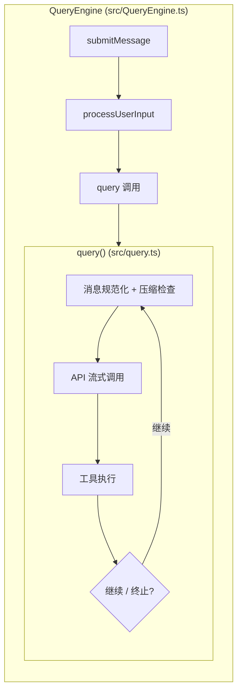
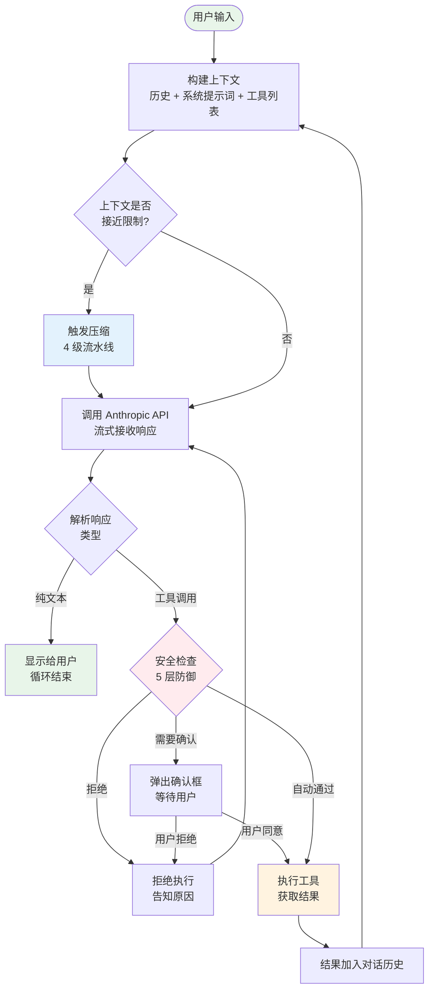
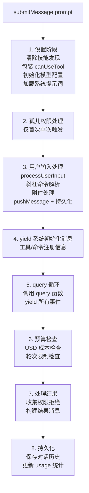
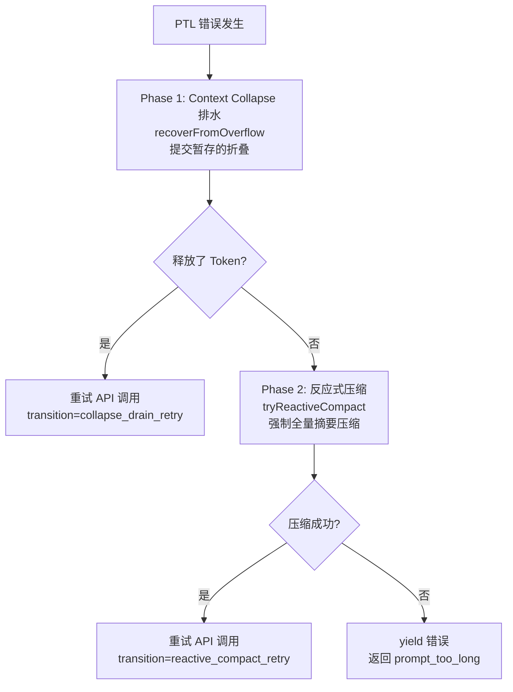

# 第 3 章：代理循环——AI 的心跳

> **本章目标**：理解 Claude Code 最核心的运行机制——「思考 → 行动 → 观察」的无限循环，以及它的双层架构设计。

---

## 先用大白话理解

想象一个厨师接到一道菜的订单：「做一份红烧肉」。

一个**普通厨师**会这样做：想好所有步骤，一次性列出来，然后开始做。

一个**有经验的厨师**会这样做：先焯水，尝一下，加调料，再尝，调整，继续炖，再尝……每一步都根据上一步的结果来决定下一步。

Claude Code 就是第二种厨师。它不是「想好了再做」，而是「做一步，看结果，再做下一步」。这个「做一步、看结果、再做下一步」的循环，就是**代理循环（Agentic Loop）**。

---

## 3.1 循环的本质

代理循环的核心逻辑极其简单，用伪代码表示就是：

```
while (任务未完成) {
    思考：下一步应该做什么？
    行动：调用工具执行操作
    观察：看工具返回了什么结果
    把结果加入记忆，继续循环
}
```

这个循环在源码 `src/query.ts` 里实现，是整个系统最重要的文件（**1,728 行**）。

---

## 3.2 双层生成器架构

Claude Code 的查询系统采用**双层生成器架构**，清晰分离会话管理与查询执行：



| 维度 | QueryEngine | query() |
|------|-------------|---------|
| 作用域 | 对话全生命周期 | 单次查询循环 |
| 状态 | 持久化（mutableMessages, usage） | 循环内（State 对象每次迭代重新赋值） |
| 预算追踪 | USD/轮次检查，结构化输出重试 | Task Budget 跨压缩结转，Token 预算续写 |
| 恢复策略 | 权限拒绝、孤儿权限 | PTL 排水/压缩、max_output_tokens 升级/重试 |

为什么要分两层？因为**会话管理和查询执行的关注点完全不同**。QueryEngine 关心的是「用户说了什么、花了多少钱、这轮结果是否成功」；query() 关心的是「消息是否需要压缩、API 返回了什么、工具执行是否成功、是否需要恢复」。双层分离使得每层的代码都更聚焦、更容易测试。

---

## 3.3 循环的完整流程



---

## 3.4 源码核心片段

`query.ts` 的核心循环结构（简化版）：

```typescript
// src/query.ts
async function* query(
  messages: Message[],
  tools: Tool[],
  options: QueryOptions
): AsyncGenerator<AssistantMessage | ToolResult> {

  while (true) {
    // 1. 检查是否需要压缩上下文
    if (shouldCompress(messages)) {
      messages = await compress(messages);
    }

    // 2. 调用 API，流式接收响应
    const response = await callAPI(messages, tools);

    // 3. 解析响应
    for await (const chunk of response) {
      yield chunk; // 实时流式输出给用户
    }

    // 4. 如果没有工具调用，任务完成，退出循环
    if (!response.hasToolUse) {
      break;
    }

    // 5. 执行所有工具调用
    const toolResults = await executeTools(response.toolUses);

    // 6. 把工具结果加入历史，继续循环
    messages = [...messages, response, ...toolResults];
  }
}
```

注意这是一个 `async function*`（异步生成器）。这意味着每生成一个 Token，就立刻 `yield` 出去显示给用户，而不是等全部生成完再显示。

---

## 3.5 submitMessage() 八阶段生命周期

`QueryEngine.submitMessage()` 驱动一次完整的用户交互，分为 8 个阶段：



**阶段 1（设置）** 是最复杂的。它需要：
- 清除上一轮的技能发现缓存（`clearSkillDiscoveryCache()`）
- 包装 `canUseTool` 函数以追踪所有权限拒绝事件
- 根据 Feature Flag 决定使用哪个模型
- 构建完整的系统提示词（包括 CLAUDE.md 内容）

**阶段 2（孤儿权限）** 处理一种边缘情况：上一次会话在用户授权「始终允许 BashTool」后崩溃，权限没有持久化。下次启动时，这个「孤儿权限」会被重放一次，确保用户不需要再次授权。

---

## 3.6 工具预执行：为什么感觉这么快？

Claude Code 有一个聪明的优化：**在 AI 还在「说话」的时候，就开始执行工具了**。

普通做法：
```
AI 生成完整响应（5-30 秒）→ 解析工具调用 → 执行工具（1 秒）→ 显示结果
```

Claude Code 的做法：
```
AI 开始生成响应 → 检测到工具调用标记 → 立刻开始执行工具
                                        ↓（并行）
                   AI 继续生成剩余文本（5-30 秒）
                                        ↓
                   工具执行完成（1 秒）→ 结果已就绪
```

利用模型生成的 5-30 秒窗口，把约 1 秒的工具延迟完全隐藏了。这个技术叫做**流式工具并行执行（Streaming Tool Parallelism）**，在源码 `src/utils/streamingToolExecution.ts` 中实现。

---

## 3.7 七个继续点（Continue Sites）

`query()` 循环有 7 个导致循环继续的位置，每个对应一种恢复策略：

| 继续原因 | 触发条件 | 处理方式 |
|---------|---------|---------|
| `next_turn` | 模型调用了工具 | 正常继续，带上工具结果 |
| `collapse_drain_retry` | PTL 错误 + Context Collapse 有暂存 | 提交折叠，释放 Token，重试 |
| `reactive_compact_retry` | PTL 错误 + Collapse 不够 | 强制全量摘要压缩，重试 |
| `max_output_tokens_escalate` | 输出 Token 不够 | 升级到 64K Token 限制 |
| `max_output_tokens_recovery` | 升级不可用/已用 | 注入续写提示，最多重试 3 次 |
| `stop_hook_blocking` | Stop Hook 阻止终止 | 继续执行 |
| `token_budget_continuation` | Token 预算续写 | 继续生成 |

### PTL（Prompt-Too-Long）恢复流程



---

## 3.8 错误扣留策略（Withholding）

这是 Claude Code 最巧妙的设计之一：**可恢复的错误不立即 yield 给上层**。

当出现 `prompt_too_long` 或 `max_output_tokens` 错误时，query() 不会立即通知调用方。它将错误推入 `assistantMessages` 但保留引用，然后运行恢复检查。如果恢复成功，错误**永远不会暴露给调用者**，用户完全感知不到中间的错误。

```typescript
// src/query.ts — 错误扣留检测函数
function isWithheldMaxOutputTokens(
  msg: Message | StreamEvent | undefined,
): msg is AssistantMessage {
  return msg?.type === 'assistant' && msg.apiError === 'max_output_tokens'
}
```

**一个实际场景**：假设模型正在编辑一个大文件，生成了 16,000 Token 的输出后被截断：

1. **错误发生**：API 返回 `stop_reason: 'max_output_tokens'`
2. **扣留而非暴露**：错误被包装为 `AssistantMessage`，推入消息列表但**不 yield** 给调用方
3. **恢复策略 1 — 升级**：检查是否可以升级到 `ESCALATED_MAX_TOKENS`（64K）。如果可以，直接用更大的 Token 限制重试
4. **恢复策略 2 — 续写**：如果升级不可用，注入一条 meta 用户消息让模型从断点继续，最多重试 3 次
5. **成功恢复**：那条被扣留的错误消息永远不会 yield——用户感知到的是一次流畅的响应

---

## 3.9 并行工具执行

当 AI 在一次响应中调用多个工具时，Claude Code 会智能地决定哪些可以并行执行：

```typescript
// 只读工具可以并行执行（不会互相影响）
const readOnlyTools = toolCalls.filter(t => t.tool.isReadOnly());
const writeTools = toolCalls.filter(t => !t.tool.isReadOnly());

// 并行执行所有只读工具
const readResults = await Promise.all(
  readOnlyTools.map(t => executeToolCall(t))
);

// 串行执行写操作工具（防止冲突）
const writeResults = [];
for (const toolCall of writeTools) {
  writeResults.push(await executeToolCall(toolCall));
}
```

这个设计让多文件读取操作可以同时进行，大幅提升速度。

---

## 3.10 循环的终止条件

循环在以下情况下退出：

| 情况 | 说明 |
|------|------|
| AI 不再调用工具 | 正常完成，AI 认为任务已完成 |
| 达到最大轮次限制 | 防止无限循环，默认上限约 200 轮 |
| 用户主动中断（Ctrl+C） | 立即停止，清理资源 |
| USD 预算超限 | `getTotalCost() > maxBudgetUsd` |
| 发生不可恢复的错误 | API 错误、权限错误等 |
| 连续压缩失败 3 次 | 熔断器触发，防止无限重试 |

> **设计决策：为什么熔断阈值是 3 次？**
>
> `MAX_CONSECUTIVE_AUTOCOMPACT_FAILURES = 3`（`src/services/compact/autoCompact.ts`）。源码注释引用了生产数据：*"BQ 2026-03-10: 1,279 sessions had 50+ consecutive failures (up to 3,272) in a single session, wasting ~250K API calls/day globally."* 没有这个熔断器之前，压缩一旦进入失败循环，会无限重试——每次消耗一个完整的 API 调用（约 20K output tokens）。3 次阈值在「给压缩服务恢复机会」和「避免资源浪费」之间取得平衡。

---

## 3.11 设计亮点总结

1. **双层生成器分离关注点**：QueryEngine 管会话生命周期，query() 管单次循环
2. **流式工具并行执行**：利用 API 流式窗口覆盖工具延迟
3. **错误扣留保证用户无感知恢复**：可恢复错误不暴露给上层
4. **7 个精确的继续点**：每种恢复策略都有明确的 transition 标记，可测试、可追踪
5. **熔断器防止资源浪费**：3 次连续失败后停止，基于真实生产数据设计

---

> 下一章：[对话引擎深度解析 →](#/docs/04-query-engine)

---

## 3.12 七个继续点（Continue Sites）

`query()` 循环有 7 个导致循环继续的位置，每个对应一种恢复策略：

| 继续原因 | 触发条件 | 处理方式 |
|---------|---------|---------|
| `next_turn` | 模型调用了工具 | 正常继续，带上工具结果 |
| `collapse_drain_retry` | PTL 错误 + Context Collapse 有暂存 | 提交折叠，释放 Token，重试 |
| `reactive_compact_retry` | PTL 错误 + Collapse 不够 | 强制全量摘要压缩，重试 |
| `max_output_tokens_escalate` | 输出 Token 不够 | 升级到 64K Token 限制 |
| `max_output_tokens_recovery` | 升级不可用/已用 | 注入续写提示，最多重试 3 次 |
| `stop_hook_blocking` | Stop Hook 阻止终止 | 继续执行 |
| `token_budget_continuation` | Token 预算续写 | 继续生成 |

---

## 3.13 PTL（Prompt-Too-Long）恢复流程

当上下文超出模型限制时，系统会按两个阶段尝试恢复：


**Phase 1 优先**：Context Collapse 是轻量级操作（只是折叠已有内容），代价远低于全量压缩。只有 Collapse 不够用时，才升级到 Phase 2。

**Phase 2 的代价**：全量摘要压缩需要一次完整的 API 调用（约 20K output tokens），耗时 5-30 秒。这就是为什么 Phase 1 要先尝试——能省则省。

---

## 3.14 错误扣留策略（Error Withholding）

这是 Claude Code 最巧妙的设计之一：**可恢复的错误不立即 yield 给上层**。

### 工作原理

当出现 `prompt_too_long` 或 `max_output_tokens` 错误时，`query()` 不会立即通知调用方。它将错误推入 `assistantMessages` 但保留引用，然后运行恢复检查。如果恢复成功，错误**永远不会暴露给调用者**——用户完全感知不到中间的错误。

### 一个实际场景

假设模型正在编辑一个大文件，生成了 16,000 Token 的输出后被 `max_output_tokens` 截断：

1. **错误发生**：API 返回 `stop_reason: 'max_output_tokens'`
2. **扣留而非暴露**：错误被包装为 `AssistantMessage`（带 `apiError: 'max_output_tokens'`），推入消息列表但**不 yield** 给调用方
3. **恢复策略 1 — 升级**：检查是否可以升级到 `ESCALATED_MAX_TOKENS`（64K）。如果可以，直接用更大的 Token 限制重试，不注入任何用户消息
4. **恢复策略 2 — 续写**：如果升级不可用或已经用过，注入一条 meta 用户消息 `"Output token limit hit. Resume directly from where you left off..."` 让模型从断点继续，最多重试 3 次
5. **成功恢复**：如果恢复成功，那条被扣留的错误消息永远不会 yield——用户感知到的是一次流畅的响应

只有当所有恢复尝试都失败时，错误才会被 yield 给上层。

### 为什么这么设计？

如果不做扣留，SDK 消费者（桌面应用、Bridge 模式）收到 `error` 类型的消息后会终止会话——即使后端的恢复循环还在运行，前端已经不再监听了。扣留机制确保前端只看到「干净」的结果流。

---

## 3.15 Token 使用追踪

QueryEngine 维护完整的 Token 使用统计：

```typescript
totalUsage: {
  input_tokens: 0,
  output_tokens: 0,
  cache_read_input_tokens: 0,
  cache_creation_input_tokens: 0,
  server_tool_use_input_tokens: 0,
}
```

追踪机制：
- 每条 API 响应的 `message_delta` 事件中，`currentMessageUsage` 被更新
- `message_stop` 时，`currentMessageUsage` 通过 `accumulateUsage()` 累加到 `totalUsage`
- `getTotalCost()` 基于 `totalUsage` 和模型定价计算 USD 总成本
- 一旦 `getTotalCost() > maxBudgetUsd`，整个查询终止——这是防止意外高成本的安全机制

`cache_read_input_tokens` 和 `cache_creation_input_tokens` 的追踪对提示词缓存策略至关重要——它们告诉系统缓存是否在有效工作。缓存断裂检测就依赖这些数据来判断是否发生了缓存失效。

---

## 3.16 设计亮点总结（扩展）

**异步生成器的优势**：`query()` 是一个 `async function*`，通过 `yield` 逐步输出事件。相比回调模式（如 EventEmitter），生成器有两个关键优势：（1）**背压控制**——消费端不处理完上一个事件，生产端不会继续执行，天然防止事件堆积；（2）**线性控制流**——循环的 7 个 continue site 可以用普通的 `state = { ... }; continue` 表达，不需要状态机的显式转换表。

**错误扣留的哲学**：「用户不应该看到系统内部的恢复过程」。这个设计原则在很多高质量系统中都有体现——用户看到的是最终结果，而不是系统为达到这个结果所做的所有尝试和失败。

**熔断器的数据驱动**：3 次连续失败的阈值来自真实生产数据（1,279 个会话连续失败超过 50 次）。这提醒我们：工程系统的参数应该来自真实数据，而不是直觉或「感觉合理」的数字。

---

> 下一章：[对话引擎深度解析 →](#/docs/04-query-engine)
