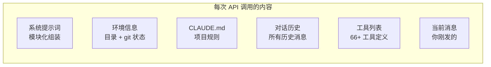

# 第 4 章：对话引擎深度解析

> **本章目标**：理解 QueryEngine 如何管理多轮对话、构建上下文，以及系统提示词的模块化设计。

---

## 先用大白话理解

想象你在和一个翻译官合作：

每次你说一句话，翻译官不只是翻译你这一句，而是把**整个对话历史**都翻译给对方听——因为对方需要完整的上下文才能理解你现在说的话。

Claude Code 的 QueryEngine 就是这个翻译官。每次你发一条消息，它不只是把这条消息发给 AI，而是把**整个对话历史 + 系统规则 + 当前环境信息**打包在一起发过去。

这就是为什么 AI 能「记住」你之前说了什么——不是因为它有真正的记忆，而是因为每次都把历史记录一起发过去了。

---

## QueryEngine 的职责

`QueryEngine.ts`（1,155 行）是会话管理的核心，负责：

- 维护对话历史（`Message[]` 数组）
- 构建每次 API 调用的完整上下文
- 管理并发请求（防止多个请求同时修改历史）
- 决定何时触发上下文压缩
- 处理会话的创建、恢复、保存

---

## 上下文的组成结构

每次调用 API，发送的不只是你的消息，而是一个精心构建的完整上下文：



这些内容按顺序拼接，形成一个可能长达数万 Token 的请求。

---

## 系统提示词的模块化设计

这是 Claude Code 最值得借鉴的设计之一：**系统提示词不是一大段文字，而是按功能分成独立模块，根据场景动态组合**。

```typescript
// src/constants/prompts.ts（简化）

// 模块 1：角色定义
const ROLE_MODULE = `
You are Claude Code, Anthropic's official CLI for Claude.
You are an interactive CLI tool that helps users with software engineering tasks.
`;

// 模块 2：核心行为规则
const BEHAVIOR_MODULE = `
When given a task, think carefully before acting.
Break complex tasks into smaller steps.
Always verify your work after making changes.
`;

// 模块 3：工具使用规范
const TOOL_MODULE = `
Use tools to gather information before making changes.
Prefer reading files before editing them.
Run tests after making code changes.
`;

// 模块 4：安全规则
const SAFETY_MODULE = `
Never delete files without explicit user confirmation.
Always explain what you're about to do before doing it.
If unsure, ask rather than assume.
`;

// 模块 5：语气风格（根据场景切换）
const INTERACTIVE_STYLE = `
Be concise. Avoid unnecessary explanations.
`;

const TASK_STYLE = `
Be thorough. Document your reasoning.
`;

// 根据场景组合
function buildSystemPrompt(isInteractive: boolean): string {
  return [
    ROLE_MODULE,
    BEHAVIOR_MODULE,
    TOOL_MODULE,
    SAFETY_MODULE,
    isInteractive ? INTERACTIVE_STYLE : TASK_STYLE,
  ].join('\n\n');
}
```

这种模块化设计的好处：修改某一类行为只需要改对应模块，不会影响其他模块；不同场景加载不同模块，灵活可维护。

---

## 环境信息注入

每次对话开始时，Claude Code 会自动收集当前环境信息，注入到上下文中：

```typescript
// 自动收集的环境信息
const environmentInfo = {
  workingDirectory: process.cwd(),           // 当前工作目录
  gitStatus: await getGitStatus(),           // git 状态（哪些文件改了）
  gitBranch: await getGitBranch(),           // 当前分支
  platform: process.platform,               // 操作系统
  nodeVersion: process.version,             // Node.js 版本
  projectType: await detectProjectType(),   // 项目类型（React/Python/etc.）
  claudeMdContent: await loadClaudeMd(),    // 项目规则文件
};
```

这就是为什么你不需要告诉 AI「我在 /home/user/myproject 目录下」——它自己知道。

---

## CLAUDE.md 的加载优先级

CLAUDE.md 文件按以下优先级加载，越靠后的优先级越高（会覆盖前面的规则）：

```
~/.claude/CLAUDE.md          ← 全局规则（对所有项目生效）
    ↓
~/projects/CLAUDE.md         ← 父目录规则
    ↓
~/projects/myapp/CLAUDE.md   ← 项目根目录规则（最常用）
    ↓
~/projects/myapp/src/CLAUDE.md ← 子目录规则（最高优先级）
```

这个设计让你可以在全局设置通用规则，在项目级别覆盖特定规则，在子目录级别进一步细化。

---

## 对话历史的管理

QueryEngine 维护一个 `Message[]` 数组，每条消息有三种角色：

| 角色 | 含义 | 示例 |
|------|------|------|
| `user` | 用户消息 | 你发的文字 |
| `assistant` | AI 响应 | AI 的回复（含工具调用） |
| `tool` | 工具结果 | 工具执行后的返回值 |

一次完整的工具调用在历史里看起来像这样：

```
user: "帮我读一下 config.json"
assistant: [工具调用: FileRead("config.json")]
tool: [工具结果: "{ 'name': 'myapp', 'version': '1.0' }"]
assistant: "config.json 的内容是：项目名称 myapp，版本 1.0"
```

---

## 并发控制

QueryEngine 使用一个简单但有效的锁机制，防止多个请求同时修改对话历史：

```typescript
class QueryEngine {
  private isProcessing = false;
  private queue: PendingRequest[] = [];

  async processMessage(message: string) {
    if (this.isProcessing) {
      // 排队等待
      return new Promise(resolve => {
        this.queue.push({ message, resolve });
      });
    }

    this.isProcessing = true;
    try {
      const result = await this.executeQuery(message);
      return result;
    } finally {
      this.isProcessing = false;
      // 处理队列中的下一个请求
      if (this.queue.length > 0) {
        const next = this.queue.shift();
        this.processMessage(next.message).then(next.resolve);
      }
    }
  }
}
```

---

## 你学到了什么

QueryEngine 是对话的管理者，不是执行者。它的核心工作是：把「你现在说的话」和「所有历史记录 + 环境信息 + 项目规则」打包成一个完整的上下文，发给 AI。系统提示词的模块化设计让不同场景可以加载不同的行为规则，这个思路可以直接用在你自己的 AI 应用设计上。

---

> 下一章：[上下文工程与压缩 →](docs/05-context-compression.md)
