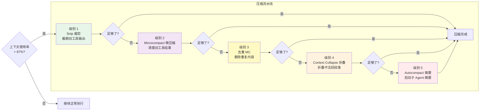
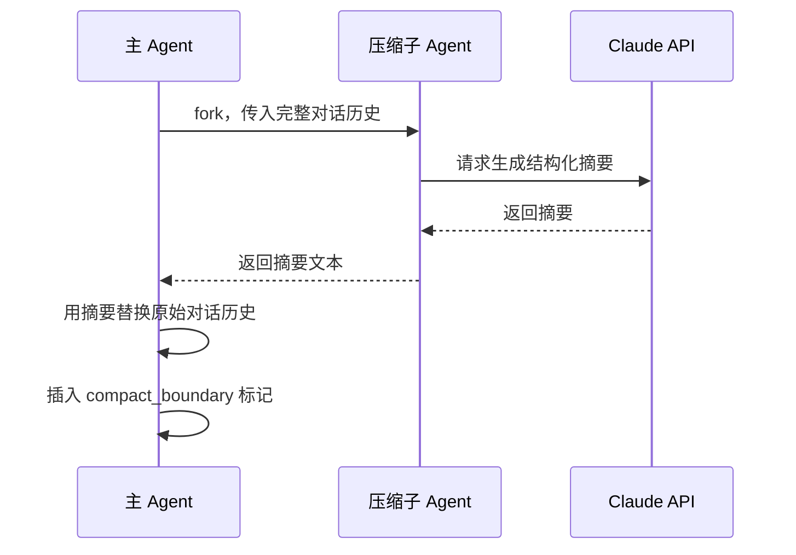

# 第 5 章：上下文工程与压缩

> **本章目标**：理解 Claude Code 如何管理有限的「记忆空间」，以及五级压缩流水线的工作原理。

---

## 先用大白话理解

想象你在和一个助理合作，但这个助理有个限制：**他的工作台只能放 200 张纸**。

你们合作了很久，工作台上的纸越来越多。当快满的时候，助理需要整理一下：

- **第一步**：把那些超长的报告裁剪一下，只保留关键部分（Snip 裁剪）
- **第二步**：把很久没用到的工具结果替换为占位符（Microcompact 微压缩）
- **第三步**：把重复的内容删掉（去重）
- **第四步**：把不活跃的对话段落折叠起来（Context Collapse 折叠）
- **第五步**：如果还是太多，请一个专门的整理员来把所有内容写成摘要（Autocompact 摘要）

这就是 Claude Code 的五级压缩流水线。

---

## 为什么需要压缩？

AI 的「记忆」叫做**上下文窗口（Context Window）**，是有大小限制的（以 Token 计量，大约是字数的 1.5 倍）。

当对话历史 + 工具结果 + 系统提示词的总量接近这个限制时，就需要压缩。不压缩的后果：API 报错，对话中断。

Claude Code 的上下文管理策略：在达到限制的 **87%** 时触发自动压缩，留出足够的缓冲空间（压缩本身也需要输出空间）。

---

## 5.2 五级压缩流水线



**设计哲学**：渐进式压缩——先用成本最低的手段尝试释放空间，只在必要时才动用更重的武器。每一级压缩都会检查「现在够了吗」，够了就停止，不会做多余的压缩。

**优先级顺序的逻辑**：

1. **Snip 优先**：成本极低，直接截断文本，不调用 API
2. **Microcompact 次之**：清理旧工具结果，成本极低，但需要遍历消息列表
3. **去重再次**：需要比较消息内容，计算成本略高
4. **Context Collapse 在 Autocompact 之前**：折叠可能使 Token 使用量降到 Autocompact 阈值以下，从而阻止不必要的全量压缩——保留了更细粒度的上下文
5. **Autocompact 作为最后手段**：需要 fork 一个子 Agent 调用 API 生成摘要，成本最高，且不可逆

---

## 5.3 五级详解

### 级别 1：Snip 裁剪

**成本：极低**。`snipCompactIfNeeded()` 是 Feature-gated 功能（`HISTORY_SNIP`），通过剪裁历史消息中的冗余部分释放 Token。

工具输出（比如 `cat` 一个大文件的结果）往往很长，但 AI 通常只需要开头部分来理解内容。裁剪把这些长输出截断，释放大量空间：

```typescript
// 把超过阈值的工具输出截断
function snipToolOutput(content: string, maxTokens: number): string {
  if (estimateTokens(content) <= maxTokens) return content;
  const truncated = truncateToTokens(content, maxTokens);
  return truncated + '\n[... 内容已截断，原始长度超过 Token 限制 ...]';
}
```

**重要细节**：`snipCompactIfNeeded()` 释放的 Token 数量通过 `snipTokensFreed` 传递给后续的 autocompact 阈值检查。这很重要，因为 snip 移除了消息但最后一条 assistant 消息的 `usage` 仍然反映 snip 前的上下文大小，不做修正会导致 autocompact 过早触发。

### 级别 2：Microcompact 微压缩

Microcompact 是 Claude Code 压缩体系中最精巧的机制之一。它的目标是**清理历史中不再需要的旧工具结果**——如果你 30 分钟前读取了一个文件，那个工具结果大概率已经不再有用，但它可能还占着数千 Token。

关键设计：Microcompact 有**两条完全不同的路径**，根据缓存状态选择：

**路径 A：基于时间的 Microcompact（缓存已冷）**

当上次 API 调用距今超过 `MICROCOMPACT_TIME_THRESHOLD`（约 5 分钟）时，缓存已经过期。在这种情况下，Microcompact **直接修改消息内容**：

```typescript
// 只保留最近 N 个可压缩工具的结果，其他全部替换为占位符
const COMPRESSIBLE_TOOLS = [
  'FileRead', 'Shell', 'Bash', 'Grep', 'Glob',
  'WebSearch', 'WebFetch', 'FileEdit', 'FileWrite'
]

function microcompactMessages(messages: Message[], keepRecent = 1): Message[] {
  const toolResults = messages.filter(m => isCompressibleToolResult(m))
  const toCompress = toolResults.slice(0, -keepRecent) // 保留最近 N 个
  return messages.map(msg => {
    if (toCompress.includes(msg)) {
      return {
        ...msg,
        content: `[已压缩：${msg.toolName} 的结果（原始 ${estimateTokens(msg.content)} tokens）]`
      }
    }
    return msg
  })
}
```

因为缓存已经冷了，修改消息内容不会造成额外的缓存失效——缓存本来就需要重建。

**路径 B：缓存编辑 Microcompact（缓存仍热）**

当缓存仍然有效时，直接修改消息内容会导致缓存失效，得不偿失。此时 Microcompact 使用一种更精妙的方式：**通过 `cache_control` 的 `ephemeral` 标记，在不修改消息内容的前提下，告诉 API 这些内容不需要被缓存**。

这样，旧工具结果的 Token 在 API 侧仍然被处理（不影响模型的理解），但不会占用缓存存储——下次请求时，这些内容会被重新发送但不会被缓存，从而在缓存层面「释放」了空间。

### 级别 3：去重（Message Consolidation）

**成本：极低**。删除对话历史中重复的内容。

比如你多次问「这个函数做什么」，AI 多次给出相似的解释，这些重复内容会被合并。

### 级别 4：Context Collapse 折叠

**成本：低**。把不活跃的对话段落折叠成占位符，但保留恢复能力。

「不活跃」的判断标准：这段对话涉及的文件最近没有被修改过。折叠后，如果后续对话又涉及到这些文件，可以自动恢复：

```typescript
// 折叠不活跃段落
function collapseInactiveSegments(messages: Message[]): Message[] {
  return messages.map(msg => {
    if (isInactive(msg)) {
      return {
        ...msg,
        content: '[已折叠：关于 ' + msg.topic + ' 的讨论]',
        collapsed: true,
        original: msg.content, // 保留原始内容，可恢复
      };
    }
    return msg;
  });
}
```

**Context Collapse 与 Autocompact 的竞争关系**：Context Collapse 在约 **90%** 上下文利用率时提交折叠，而 Autocompact 在约 **87%** 触发。两者同时运行会竞争——Autocompact 可能销毁 Collapse 正要保存的细粒度上下文。因此，**当 Context Collapse 启用且活跃时，Autocompact 被抑制**。

### 级别 5：Autocompact 自动全量压缩

**成本：高**（需要额外的 API 调用）。这是最后的手段——当所有轻量级压缩都无法将 Token 使用量控制在安全范围内时，系统 fork 一个子 Agent 来生成整个对话的摘要。



这个摘要 Agent 的任务不是简单地缩短文字，而是提取「对继续工作最重要的信息」：

- 当前任务状态（做到哪一步了）
- 已完成的工作（修改了哪些文件，做了什么改动）
- 关键决策和原因（为什么选择这个方案）
- 待处理的问题（还有哪些没解决）

**Autocompact 是不可逆的**：原始消息被摘要替换后，无法恢复到压缩前的状态。这就是为什么它是最后手段。

---

## 5.4 压缩边界（Compact Boundary）

当 Autocompact 发生后，消息列表中会插入一个 `compact_boundary` 标记。之后的 API 调用只发送边界之后的消息：

```
[会话开始的消息...]
[compact_boundary]  ← 这里之前的消息不再发送给 API
[压缩摘要]
[压缩后的新消息...]
```

这个设计确保了：即使对话很长，每次 API 调用的实际消息数量也是可控的。

## 5.5 /compact 命令与手动压缩

用户可以随时通过 `/compact` 命令手动触发压缩。与自动压缩不同，手动 `/compact` 直接触发 Autocompact（级别 5），生成完整摘要。

`/compact` 还会调用 `clearSystemPromptSections()`，重置所有 section 级别的缓存，让下一次对话获得完全新鲜的状态。这意味着 `/compact` 之后，系统提示词会被重新计算，所有工具描述、安全规则等都会重新生成。

---

## 5.6 上下文利用率监控

Claude Code 实时监控上下文使用情况，并在 UI 上显示：

| 使用率 | 状态 | 行动 |
|--------|------|------|
| 0-70% | 正常 | 无操作 |
| 70-85% | 警告 | 显示警告颜色 |
| 85-87% | 接近阈值 | 准备压缩 |
| 87-95% | 触发压缩 | 自动运行压缩流水线 |
| 95%+ | 紧急 | 强制 Autocompact，可能中断当前操作 |

---

## 5.7 设计洞察

1. **渐进式降级原则**：先用低成本方案，不够再升级，避免不必要的开销。这个原则在很多工程系统中都适用——不要一开始就用最重的武器。

2. **缓存感知的压缩策略**：Microcompact 的两条路径（基于时间 vs 缓存编辑）体现了对 prompt cache 的深度感知。在缓存仍热时，修改消息内容的代价是缓存失效，可能比不压缩更贵。

3. **不可逆操作的最后手段原则**：Autocompact 是不可逆的，因此被放在最后。这是一个通用的工程原则：不可逆操作应该尽量推迟，给可逆操作更多机会。

4. **Context Collapse 与 Autocompact 的竞争抑制**：当 Context Collapse 活跃时，Autocompact 被抑制。这种「更精细的机制优先」的设计，防止了重量级操作破坏轻量级操作的成果。

5. **压缩边界作为会话分割点**：`compact_boundary` 不只是一个标记，它是会话的「重生点」——之前的历史被摘要替换，之后的对话在新的上下文下继续。这种设计让长时间运行的 Agent 任务成为可能。

---

> 下一章：[工具系统与权限安全 →](#/docs/06-tools-permissions)
