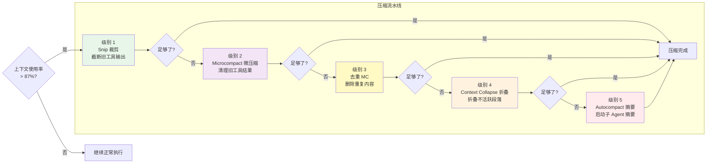
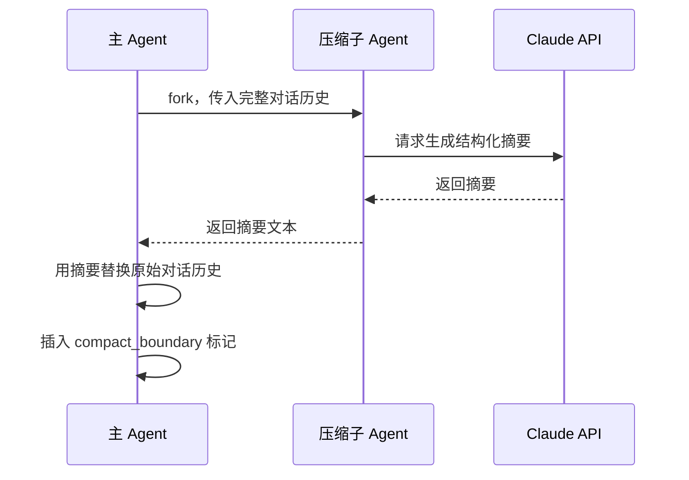
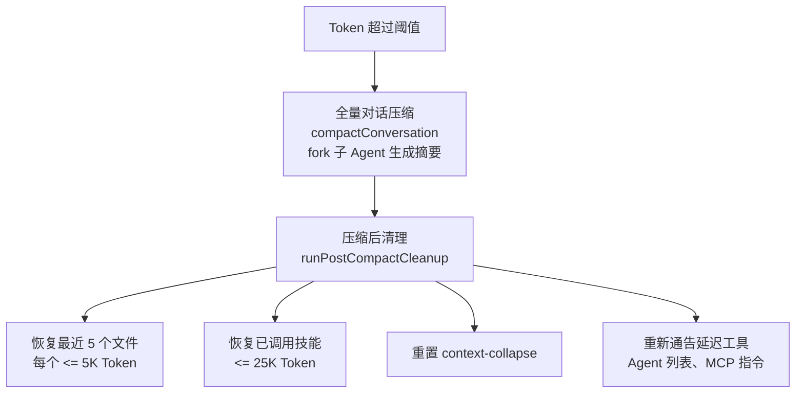

# 第 5 章：上下文工程与压缩

> **本章目标**：理解 Claude Code 如何管理有限的「记忆空间」，以及五级压缩流水线的工作原理。

---

## 先用大白话理解

想象你在和一个助理合作，但这个助理有个限制：**他的工作台只能放 200 张纸**。

你们合作了很久，工作台上的纸越来越多。当快满的时候，助理需要整理一下：

- **第一步**：把那些超长的报告裁剪一下，只保留关键部分（Snip 裁剪）
- **第二步**：把很久没用到的工具结果替换为占位符（Microcompact 微压缩）
- **第三步**：把重复的内容删掉（去重）
- **第四步**：把不活跃的对话段落折叠起来（Context Collapse 折叠）
- **第五步**：如果还是太多，请一个专门的整理员来把所有内容写成摘要（Autocompact 摘要）

这就是 Claude Code 的五级压缩流水线。

---

## 为什么需要压缩？

AI 的「记忆」叫做**上下文窗口（Context Window）**，是有大小限制的（以 Token 计量，大约是字数的 1.5 倍）。

当对话历史 + 工具结果 + 系统提示词的总量接近这个限制时，就需要压缩。不压缩的后果：API 报错，对话中断。

Claude Code 的上下文管理策略：在达到限制的 **87%** 时触发自动压缩，留出足够的缓冲空间（压缩本身也需要输出空间）。

---

## 5.2 五级压缩流水线



**设计哲学**：渐进式压缩——先用成本最低的手段尝试释放空间，只在必要时才动用更重的武器。每一级压缩都会检查「现在够了吗」，够了就停止，不会做多余的压缩。

**优先级顺序的逻辑**：

1. **Snip 优先**：成本极低，直接截断文本，不调用 API
2. **Microcompact 次之**：清理旧工具结果，成本极低，但需要遍历消息列表
3. **去重再次**：需要比较消息内容，计算成本略高
4. **Context Collapse 在 Autocompact 之前**：折叠可能使 Token 使用量降到 Autocompact 阈值以下，从而阻止不必要的全量压缩——保留了更细粒度的上下文
5. **Autocompact 作为最后手段**：需要 fork 一个子 Agent 调用 API 生成摘要，成本最高，且不可逆

---

## 5.3 五级详解

### 级别 1：Snip 裁剪

**成本：极低**。`snipCompactIfNeeded()` 是 Feature-gated 功能（`HISTORY_SNIP`），通过剪裁历史消息中的冗余部分释放 Token。

工具输出（比如 `cat` 一个大文件的结果）往往很长，但 AI 通常只需要开头部分来理解内容。裁剪把这些长输出截断，释放大量空间：

```typescript
// 把超过阈值的工具输出截断
function snipToolOutput(content: string, maxTokens: number): string {
  if (estimateTokens(content) <= maxTokens) return content;
  const truncated = truncateToTokens(content, maxTokens);
  return truncated + '\n[... 内容已截断，原始长度超过 Token 限制 ...]';
}
```

**重要细节**：`snipCompactIfNeeded()` 释放的 Token 数量通过 `snipTokensFreed` 传递给后续的 autocompact 阈值检查。这很重要，因为 snip 移除了消息但最后一条 assistant 消息的 `usage` 仍然反映 snip 前的上下文大小，不做修正会导致 autocompact 过早触发。

### 级别 2：Microcompact 微压缩

Microcompact 是 Claude Code 压缩体系中最精巧的机制之一。它的目标是**清理历史中不再需要的旧工具结果**——如果你 30 分钟前读取了一个文件，那个工具结果大概率已经不再有用，但它可能还占着数千 Token。

关键设计：Microcompact 有**两条完全不同的路径**，根据缓存状态选择：

**路径 A：基于时间的 Microcompact（缓存已冷）**

当上次 API 调用距今超过 `MICROCOMPACT_TIME_THRESHOLD`（约 5 分钟）时，缓存已经过期。在这种情况下，Microcompact **直接修改消息内容**：

```typescript
// 只保留最近 N 个可压缩工具的结果，其他全部替换为占位符
const COMPRESSIBLE_TOOLS = [
  'FileRead', 'Shell', 'Bash', 'Grep', 'Glob',
  'WebSearch', 'WebFetch', 'FileEdit', 'FileWrite'
]

function microcompactMessages(messages: Message[], keepRecent = 1): Message[] {
  const toolResults = messages.filter(m => isCompressibleToolResult(m))
  const toCompress = toolResults.slice(0, -keepRecent) // 保留最近 N 个
  return messages.map(msg => {
    if (toCompress.includes(msg)) {
      return {
        ...msg,
        content: `[已压缩：${msg.toolName} 的结果（原始 ${estimateTokens(msg.content)} tokens）]`
      }
    }
    return msg
  })
}
```

因为缓存已经冷了，修改消息内容不会造成额外的缓存失效——缓存本来就需要重建。

**路径 B：缓存编辑 Microcompact（缓存仍热）**

当缓存仍然有效时，直接修改消息内容会导致缓存失效，得不偿失。此时 Microcompact 使用一种更精妙的方式：**通过 `cache_control` 的 `ephemeral` 标记，在不修改消息内容的前提下，告诉 API 这些内容不需要被缓存**。

这样，旧工具结果的 Token 在 API 侧仍然被处理（不影响模型的理解），但不会占用缓存存储——下次请求时，这些内容会被重新发送但不会被缓存，从而在缓存层面「释放」了空间。

### 级别 3：去重（Message Consolidation）

**成本：极低**。删除对话历史中重复的内容。

比如你多次问「这个函数做什么」，AI 多次给出相似的解释，这些重复内容会被合并。

### 级别 4：Context Collapse 折叠

**成本：低**。把不活跃的对话段落折叠成占位符，但保留恢复能力。

「不活跃」的判断标准：这段对话涉及的文件最近没有被修改过。折叠后，如果后续对话又涉及到这些文件，可以自动恢复：

```typescript
// 折叠不活跃段落
function collapseInactiveSegments(messages: Message[]): Message[] {
  return messages.map(msg => {
    if (isInactive(msg)) {
      return {
        ...msg,
        content: '[已折叠：关于 ' + msg.topic + ' 的讨论]',
        collapsed: true,
        original: msg.content, // 保留原始内容，可恢复
      };
    }
    return msg;
  });
}
```

**Context Collapse 与 Autocompact 的竞争关系**：Context Collapse 在约 **90%** 上下文利用率时提交折叠，而 Autocompact 在约 **87%** 触发。两者同时运行会竞争——Autocompact 可能销毁 Collapse 正要保存的细粒度上下文。因此，**当 Context Collapse 启用且活跃时，Autocompact 被抑制**。

### 级别 5：Autocompact 自动全量压缩

**成本：高**（需要额外的 API 调用）。这是最后的手段——当所有轻量级压缩都无法将 Token 使用量控制在安全范围内时，系统 fork 一个子 Agent 来生成整个对话的摘要。



这个摘要 Agent 的任务不是简单地缩短文字，而是提取「对继续工作最重要的信息」：

- 当前任务状态（做到哪一步了）
- 已完成的工作（修改了哪些文件，做了什么改动）
- 关键决策和原因（为什么选择这个方案）
- 待处理的问题（还有哪些没解决）

**Autocompact 是不可逆的**：原始消息被摘要替换后，无法恢复到压缩前的状态。这就是为什么它是最后手段。

---

## 5.4 压缩边界（Compact Boundary）

当 Autocompact 发生后，消息列表中会插入一个 `compact_boundary` 标记。之后的 API 调用只发送边界之后的消息：

```
[会话开始的消息...]
[compact_boundary]  ← 这里之前的消息不再发送给 API
[压缩摘要]
[压缩后的新消息...]
```

这个设计确保了：即使对话很长，每次 API 调用的实际消息数量也是可控的。

## 5.5 /compact 命令与手动压缩

用户可以随时通过 `/compact` 命令手动触发压缩。与自动压缩不同，手动 `/compact` 直接触发 Autocompact（级别 5），生成完整摘要。

`/compact` 还会调用 `clearSystemPromptSections()`，重置所有 section 级别的缓存，让下一次对话获得完全新鲜的状态。这意味着 `/compact` 之后，系统提示词会被重新计算，所有工具描述、安全规则等都会重新生成。

---

## 5.6 上下文利用率监控

Claude Code 实时监控上下文使用情况，并在 UI 上显示：

| 使用率 | 状态 | 行动 |
|--------|------|------|
| 0-70% | 正常 | 无操作 |
| 70-85% | 警告 | 显示警告颜色 |
| 85-87% | 接近阈值 | 准备压缩 |
| 87-95% | 触发压缩 | 自动运行压缩流水线 |
| 95%+ | 紧急 | 强制 Autocompact，可能中断当前操作 |

---

## 5.7 设计洞察

1. **渐进式降级原则**：先用低成本方案，不够再升级，避免不必要的开销。这个原则在很多工程系统中都适用——不要一开始就用最重的武器。

2. **缓存感知的压缩策略**：Microcompact 的两条路径（基于时间 vs 缓存编辑）体现了对 prompt cache 的深度感知。在缓存仍热时，修改消息内容的代价是缓存失效，可能比不压缩更贵。

3. **不可逆操作的最后手段原则**：Autocompact 是不可逆的，因此被放在最后。这是一个通用的工程原则：不可逆操作应该尽量推迟，给可逆操作更多机会。

4. **Context Collapse 与 Autocompact 的竞争抑制**：当 Context Collapse 活跃时，Autocompact 被抑制。这种「更精细的机制优先」的设计，防止了重量级操作破坏轻量级操作的成果。

5. **压缩边界作为会话分割点**：`compact_boundary` 不只是一个标记，它是会话的「重生点」——之前的历史被摘要替换，之后的对话在新的上下文下继续。这种设计让长时间运行的 Agent 任务成为可能。

---

> 下一章：[工具系统与权限安全 →](#/docs/06-tools-permissions)

---

## 5.8 压缩触发阈值计算

Autocompact 的触发阈值不是固定的，而是根据模型的上下文窗口动态计算：

```
触发阈值 = effectiveWindow - 13,000
```

对于 200K 上下文窗口 + 16K 最大输出的模型，阈值约在 **171,000 Token**（约 85.5% 利用率）。可通过 `CLAUDE_AUTOCOMPACT_PCT_OVERRIDE` 环境变量按百分比覆盖。

| 常量 | 值 | 用途 |
|------|-----|------|
| AUTOCOMPACT_BUFFER_TOKENS | 13,000 | 触发阈值缓冲 |
| WARNING_THRESHOLD_BUFFER_TOKENS | 20,000 | UI 警告阈值 |
| MAX_CONSECUTIVE_AUTOCOMPACT_FAILURES | 3 | 熔断器阈值 |
| POST_COMPACT_MAX_FILES_TO_RESTORE | 5 | 压缩后恢复文件数 |
| POST_COMPACT_MAX_TOKENS_PER_FILE | 5,000 | 每个恢复文件的 Token 上限 |
| POST_COMPACT_SKILLS_TOKEN_BUDGET | 25,000 | 技能恢复总预算 |

---

## 5.9 压缩提示词的两阶段设计

压缩的质量取决于给子 Agent 的提示词。Claude Code 使用了一个精巧的「分析-摘要」两阶段模式：

**第一阶段：`<analysis>` 块**——思考草稿，按时间顺序分析对话中的每条消息：用户的意图、采取的方法、关键决策、文件名、代码片段、错误及修复、用户反馈。

**第二阶段：`<summary>` 块**——正式摘要，包含 9 个标准化部分：

| # | 部分 | 内容 |
|---|------|------|
| 1 | Primary Request | 用户的所有显式请求和意图 |
| 2 | Key Technical Concepts | 讨论的技术概念、框架 |
| 3 | Files and Code | 检查/修改/创建的文件及关键代码片段 |
| 4 | Errors and Fixes | 遇到的错误及修复方式，特别是用户反馈 |
| 5 | Problem Solving | 已解决的问题和进行中的排查 |
| 6 | All User Messages | 所有非工具结果的用户消息（原文） |
| 7 | Pending Tasks | 待完成的任务 |
| 8 | Current Work | 压缩前正在进行的工作（最详细） |
| 9 | Optional Next Step | 下一步计划（包含原始对话的直接引用） |

**关键设计巧思**：`formatCompactSummary()` 会剥离 `<analysis>` 块，只保留 `<summary>` 进入上下文。这是经典的「链式思考草稿」（Chain-of-Thought Scratchpad）技术——让模型先推理再总结，质量远超直接生成摘要，但推理过程本身如果保留在上下文中会浪费大量 Token。丢弃分析、保留结论，两全其美。

---

## 5.10 压缩后恢复机制

Autocompact 的风险是让模型「忘记」刚编辑的文件。系统会在压缩后自动执行 `runPostCompactCleanup()`：



恢复步骤的详细说明：

1. **恢复最近 5 个文件**：从压缩前的 `readFileState` 缓存中取出最近读取的 5 个文件，每个限 5K Token，作为附件消息注入
2. **恢复所有已激活的技能**：预算 25K Token（每个技能限 5K Token），确保已加载的技能不丢失
3. **重新通告上下文增量**：压缩吃掉了之前的延迟工具、Agent 列表、MCP 指令等增量通告，重新从当前状态生成
4. **重置 Context Collapse**：清除折叠状态，为下一轮压缩准备

这个恢复机制是 Claude Code 能在超长对话中保持连贯性的关键。没有它，模型在压缩后会忘记自己刚才编辑了哪些文件，导致后续操作可能重复读取或产生不一致的修改。

---

## 5.11 Token 估算算法

`tokenCountWithEstimation()` 是上下文大小估算的核心函数。它的设计原则是**从不调用 API**——避免网络延迟对压缩决策的影响。

核心思路可以用一个类比来理解：**假设你今早称了体重是 75 公斤，此后吃了一顿午饭。你不需要再次上称——估计 75.5 公斤就足够好了。** 函数的「体重秤」是 API 返回的 `usage` 数据（服务端精确计算的 Token 数），「午饭」是此后新增的少量消息。

```typescript
function tokenCountWithEstimation(messages: readonly Message[]): number {
  // 1. 从消息末尾向前查找，找到最近一条有 API usage 数据的消息
  let i = messages.length - 1
  while (i >= 0) {
    const usage = getTokenUsage(messages[i])
    if (usage) {
      // 2. 用 server 报告的 token 数作为锚点
      //    加上后续消息的粗略估算（字符数 × 4/3 的保守系数）
      return getTokenCountFromUsage(usage) +
             roughTokenCountEstimationForMessages(messages.slice(i + 1))
    }
    i--
  }
  // 3. 如果没有任何 usage 数据，完全靠字符串长度估算
  return roughTokenCountEstimationForMessages(messages)
}
```

这比完全靠客户端估算精确得多（误差从可能的 30%+ 降到通常 <5%），同时又不需要额外的 API 调用。

---

## 5.12 熔断器机制

**压缩请求本身可能超限**：当对话已经极长时，发送完整消息让子 Agent 摘要的请求本身也可能触发 Prompt-Too-Long 错误。`truncateHeadForPTLRetry()` 通过按 API 轮次分组、从头部丢弃最旧的轮次来缩小压缩请求，最多重试 3 次。

**熔断器**：连续 3 次 autocompact 失败（`MAX_CONSECUTIVE_AUTOCOMPACT_FAILURES`），停止重试——上下文不可恢复地超限。这个熔断器来自真实数据：曾有 1,279 个会话连续失败超过 50 次（最高 3,272 次），浪费了约 250K 次 API 调用/天。

---

## 5.13 设计洞察（扩展）

**「分析-摘要」两阶段的本质**：这是 Chain-of-Thought 技术在「压缩质量」问题上的应用。直接让模型生成摘要，模型会因为「没有推理过程」而遗漏重要细节。先让模型「思考」（`<analysis>` 块），再「总结」（`<summary>` 块），质量显著提升。丢弃推理过程只保留结论，是 Token 效率和摘要质量的最优平衡点。

**熔断器的数据驱动设计**：`MAX_CONSECUTIVE_AUTOCOMPACT_FAILURES = 3` 不是拍脑袋的数字，而是来自真实生产数据——1,279 个会话连续失败超过 50 次，浪费了 250K 次 API 调用/天。这个例子说明了为什么工程系统需要真实数据驱动的熔断设计，而不是「理论上不会发生」的乐观假设。

**恢复机制是「长寿命 Agent」的关键**：压缩后恢复最近文件和技能，这个设计让 Claude Code 能够处理需要数百轮对话的复杂任务。没有恢复机制，每次压缩都会导致「失忆」，模型需要重新读取文件、重新理解上下文，效率极低。

---

> 下一章：[工具系统与权限安全 →](#/docs/06-tools-permissions)

---

## 5.14 `<system-reminder>` 注入机制

Claude Code 需要在对话的各个位置注入系统级信息——当前可用的延迟工具列表、记忆文件内容、安全提醒等。但直接插入这些内容会产生一个问题：**模型可能误认为这是用户说的话**，从而做出不恰当的响应。

`<system-reminder>` 是解决这个问题的统一机制。系统提示词中有明确说明：

> Tool results and user messages may include `<system-reminder>` tags. They contain useful information and reminders added by the system, unrelated to the specific tool results or user messages in which they appear.

### 注入位置

**1. 用户上下文前置**（`prependUserContext()` in `src/utils/api.ts`）：

CLAUDE.md 内容、当前日期等被包装在 `<system-reminder>` 标签中，作为第一条 `isMeta` 用户消息插入：

```typescript
createUserMessage({
  content: `<system-reminder>
As you answer the user's questions, you can use the following context:
# claudeMd
${claudeMdContent}
# currentDate
Today's date is 2026-04-01.
IMPORTANT: this context may or may not be relevant to your tasks.
</system-reminder>`,
  isMeta: true,
})
```

**2. 附件消息**：记忆预取结果、延迟工具列表（Tool Search 的发现结果）、技能列表、Agent 定义列表等，都作为附件消息注入，内容包裹在 `<system-reminder>` 中。

**3. 工具结果中的提醒**：某些工具在返回结果时附带系统提醒。例如：
- 文件读取发现文件为空时：`Warning: file exists but is empty`
- 文件读取偏移超过文件长度时的提醒
- MCP 资源访问后的安全边界提醒

### 为什么用 XML 标签？

XML 标签创建了一个清晰的语义边界。模型通过训练知道 `<system-reminder>` 内的内容是系统自动注入的元数据，而不是用户的直接输入。这使得系统可以在对话的**任意位置**注入上下文——工具结果之后、用户消息之间——而不会混淆消息的「发言者」身份。

---

## 5.15 记忆预取

记忆预取是 Claude Code 在模型生成响应的同时，并行搜索相关记忆文件的优化机制。它的核心价值是**隐藏延迟**——搜索记忆文件需要磁盘 I/O，与其等模型响应完再搜索（串行），不如在模型思考的同时就开始搜索（并行）。

`startRelevantMemoryPrefetch()`（`src/utils/attachments.ts`）在每次 query 循环迭代入口启动：

```typescript
// src/query.ts — 使用 using 关键字确保 dispose
using pendingMemoryPrefetch = startRelevantMemoryPrefetch(
  state.messages, state.toolUseContext,
)
```

工作流程：

1. **启动条件**：`isAutoMemoryEnabled()` 为 true 且相关 feature flag 活跃
2. **并行执行**：在 `callModel()` 流式调用期间并行运行，搜索 `~/.claude/memory/` 目录中与当前对话相关的记忆文件
3. **单次消费**：通过 `settledAt` 守卫确保每轮只消费一次。如果 query 循环因 PTL 恢复而重试，预取结果不会被重复注入
4. **去重**：`readFileState` 追踪已读文件，防止同一个记忆文件在同一会话中被多次注入
5. **注入时机**：预取结果作为附件消息（`AttachmentMessage`）在工具执行之后注入，出现在下一轮 API 调用的上下文中
6. **资源清理**：`using` 语法确保在 generator 退出（正常/异常/中断）时自动调用 `[Symbol.dispose]()`，发送遥测数据并清理资源

---

## 5.16 缓存断裂检测

`promptCacheBreakDetection.ts` 是一个诊断系统——它在每次 API 调用前后记录快照，检测缓存是否意外失效。

检测逻辑：

- 如果 `cache_read_input_tokens` 比上次下降超过 **5% 且 2000 Token**，判定为缓存断裂
- 自动归因三种原因：
  - **TTL 过期**：距上次 assistant 消息超过缓存时间窗口
  - **客户端变更**：系统提示词、工具列表、beta header 等发生了变化（通过 hash 对比）
  - **服务端变更**：客户端一切不变但缓存仍然失效——可能是服务端的缓存驱逐
- 断裂事件被记录到诊断日志（`tengu_prompt_cache_break`），帮助开发者优化缓存命中率

### 粘性锁存（Sticky Latch）

一旦某个 beta header（如 `interleaved-thinking-2025-05-14`）被使用，它会被锁存到会话状态中，即使后续调用不需要该 header，也会继续发送。

**为什么要这样做？** 因为 beta header 是提示词缓存 key 的一部分。如果第 1 轮发送了 `interleaved-thinking` header，第 2 轮不发送，缓存 key 就不同了——即使系统提示词和工具定义完全相同，缓存也会失效。粘性锁存通过保持 header 一致来维护缓存稳定性。

---

## 5.17 反应式压缩

当 Prompt-Too-Long（PTL）错误发生时，反应式压缩作为**最后手段**触发：

```typescript
// src/query.ts — PTL 恢复的第二阶段
tryReactiveCompact() {
  // 调用 compactConversation() 时设置 urgent=true
  // urgent 模式下：
  //   - 使用更激进的压缩策略
  //   - 可能使用更快（更小）的模型生成摘要
  //   - 不执行会话记忆压缩（太慢）
  compactConversation({ urgent: true })
  // 构建压缩后消息
  buildPostCompactMessages(...)
  // 继续循环
  state.transition = 'reactive_compact_retry'
}
```

在正常运行中，autocompact 应该在 ~93.5% 利用率时主动触发，防止 PTL 错误发生。反应式压缩只在以下情况下需要：

- Autocompact 被禁用或跳过
- 单次工具结果异常大，一步跳过了 autocompact 阈值
- Context Collapse 排水释放的 Token 不够

---

## 5.18 Token 预算精确计算

**为什么 max_output_tokens 默认只用 8K 而不是 32K？**

`CAPPED_DEFAULT_MAX_TOKENS = 8,000`（`src/utils/context.ts`）。源码注释解释了原因：

> *"BQ p99 output = 4,911 tokens, so 32k/64k defaults over-reserve 8-16× slot capacity."*

API 服务端会根据 `max_output_tokens` 预留计算资源（slot），如果每个请求都声明 32K 但实际只用 5K，服务端的资源利用率极低。8K 作为默认值覆盖了 99% 的实际需求。

当模型确实因为 `max_tokens` 截断时，系统自动升级到 `ESCALATED_MAX_TOKENS = 64,000` 并清洁重试——这就是 MOT（Max Output Tokens）恢复机制。

**Autocompact 触发阈值的精确计算**：

自动压缩的触发公式是 `tokens >= effectiveContextWindow - AUTOCOMPACT_BUFFER_TOKENS`，其中 `AUTOCOMPACT_BUFFER_TOKENS = 13,000`。对于 200K 上下文窗口，这意味着在约 **93.5%** 利用率时触发。为什么是 13K？因为压缩本身需要预留输出空间——`MAX_OUTPUT_TOKENS_FOR_SUMMARY = 20,000`（基于 p99.99 的压缩摘要输出为 17,387 tokens）。13K buffer 确保触发压缩时还有足够空间完成当前工具执行和生成摘要。

---

## 5.19 设计洞察（深度扩展）

**「记忆预取」的并行化哲学**：记忆预取的核心思想是「让等待变成工作」——当模型在生成响应时，CPU 和 I/O 都在工作，而不是串行等待。这是「延迟隐藏」（Latency Hiding）技术在 AI 系统中的应用。在高延迟操作（磁盘 I/O、网络请求）和计算密集操作（模型推理）并存的系统中，并行化是提升吞吐量的关键。

**「缓存断裂检测」的可观测性价值**：缓存断裂检测不是功能性代码，而是**可观测性**代码。它不改变系统行为，只是记录系统状态。但正是这类代码让工程师能够理解「为什么这次调用比上次慢了 3 秒」——因为缓存失效了，需要重新计算所有 Token。可观测性是复杂系统工程的基础。

**「粘性锁存」的缓存稳定性权衡**：粘性锁存牺牲了 beta header 的「中途可切换性」，换取了缓存稳定性。这是一个典型的工程权衡——在缓存失效的高成本（重新计算数万 Token）面前，「不能在会话中途关闭某个 beta feature」是可以接受的代价。

---

> 下一章：[工具系统与权限安全 →](#/docs/06-tools-permissions)
