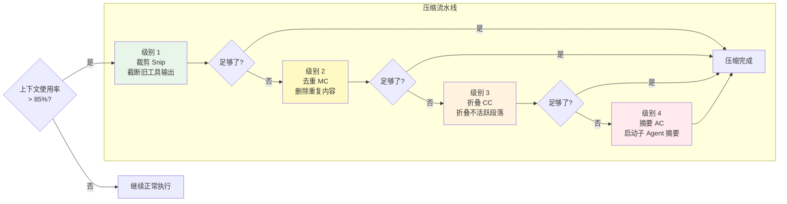

# 第 5 章：上下文工程与压缩

> **本章目标**：理解 Claude Code 如何管理有限的「记忆空间」，以及四级压缩流水线的工作原理。

---

## 先用大白话理解

想象你在和一个助理合作，但这个助理有个限制：**他的工作台只能放 200 张纸**。

你们合作了很久，工作台上的纸越来越多。当快满的时候，助理需要整理一下：

- **第一步**：把那些超长的报告裁剪一下，只保留关键部分（裁剪）
- **第二步**：把重复的内容删掉（去重）
- **第三步**：把很久没用到的文件折叠起来放到抽屉里（折叠，需要时可以取回）
- **第四步**：如果还是太多，请一个专门的整理员来把所有内容写成摘要（摘要）

这就是 Claude Code 的四级压缩流水线。

---

## 为什么需要压缩？

AI 的「记忆」叫做**上下文窗口（Context Window）**，是有大小限制的（以 Token 计量，大约是字数的 1.5 倍）。

当对话历史 + 工具结果 + 系统提示词的总量接近这个限制时，就需要压缩。不压缩的后果：API 报错，对话中断。

Claude Code 的上下文管理策略：在达到限制的 **85%** 时触发自动压缩，留出足够的缓冲空间。

---

## 四级压缩流水线



每一级压缩都会检查「现在够了吗」，够了就停止，不会做多余的压缩。

---

## 四级详解

### 级别 1：裁剪（Snip）

**成本：极低**。直接截断旧的工具输出，只保留前 N 行。

工具输出（比如 `cat` 一个大文件的结果）往往很长，但 AI 通常只需要开头部分来理解内容。裁剪把这些长输出截断，释放大量空间。

```typescript
// 把超过 50 行的工具输出截断
function snipToolOutput(content: string, maxLines = 50): string {
  const lines = content.split('\n');
  if (lines.length <= maxLines) return content;
  return lines.slice(0, maxLines).join('\n') + '\n[... 内容已截断 ...]';
}
```

### 级别 2：去重（Message Consolidation）

**成本：极低**。删除对话历史中重复的内容。

比如你多次问「这个函数做什么」，AI 多次给出相似的解释，这些重复内容会被合并。

### 级别 3：折叠（Context Collapse）

**成本：低**。把不活跃的对话段落折叠成占位符，但保留恢复能力。

「不活跃」的判断标准：这段对话涉及的文件最近没有被修改过。折叠后，如果后续对话又涉及到这些文件，可以自动恢复。

```typescript
// 折叠不活跃段落
function collapseInactiveSegments(messages: Message[]): Message[] {
  return messages.map(msg => {
    if (isInactive(msg)) {
      return {
        ...msg,
        content: '[已折叠：关于 ' + msg.topic + ' 的讨论]',
        collapsed: true,
        original: msg.content, // 保留原始内容，可恢复
      };
    }
    return msg;
  });
}
```

### 级别 4：摘要（Auto Compact）

**成本：高**（需要额外的 API 调用）。启动一个专门的子 Agent，把整个对话历史压缩成结构化摘要。

这个摘要 Agent 的任务不是简单地缩短文字，而是提取「对继续工作最重要的信息」：当前任务状态、已完成的工作、关键决策和原因、待处理的问题。

---

## 压缩后的恢复机制

压缩可能会让 AI 忘记「刚才在编辑哪个文件」。为了防止这个问题，压缩后会自动恢复最近编辑的 5 个文件的完整内容：

```typescript
// 压缩后自动恢复最近编辑的文件
async function restoreRecentFiles(
  messages: Message[],
  recentFiles: string[]
): Promise<Message[]> {
  const filesToRestore = recentFiles.slice(0, 5); // 最多恢复 5 个文件

  const restoredContent = await Promise.all(
    filesToRestore.map(async (file) => ({
      file,
      content: await readFile(file),
    }))
  );

  // 在压缩后的历史末尾注入文件内容
  return [
    ...messages,
    {
      role: 'tool',
      content: `[自动恢复] 以下是最近编辑的文件内容：\n${
        restoredContent.map(f => `\n## ${f.file}\n${f.content}`).join('\n')
      }`,
    },
  ];
}
```

---

## 上下文利用率监控

Claude Code 实时监控上下文使用情况，并在 UI 上显示：

| 使用率 | 状态 | 行动 |
|--------|------|------|
| 0-70% | 正常 | 无操作 |
| 70-85% | 警告 | 显示警告颜色 |
| 85-95% | 触发压缩 | 自动运行压缩流水线 |
| 95%+ | 紧急 | 强制摘要，可能中断当前操作 |

---

## 你学到了什么

上下文压缩是 AI Agent 工程中的核心挑战之一。Claude Code 的四级流水线设计体现了「渐进式降级」原则：先用低成本方案，不够再升级，避免不必要的开销。压缩后自动恢复最近文件的设计，则体现了对「AI 工作连续性」的细致考虑。

---

> 下一章：[工具系统与权限安全 →](#/docs/06-tools-permissions)
