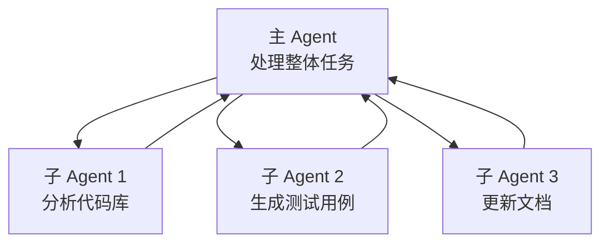

# 第 7 章：多 Agent 协作架构

> **本章目标**：理解 Claude Code 如何让多个 AI Agent 协同工作，以及三种协作模式的设计思路。

---

## 先用大白话理解

想象一个大型软件项目需要同时做三件事：写后端 API、写前端界面、写测试用例。

如果只有一个程序员，他得一件一件做，很慢。如果有三个程序员，他们可以同时做，但需要一个项目经理来协调，防止他们改同一个文件产生冲突。

Claude Code 的多 Agent 系统就是这样：**多个 AI 同时工作，一个协调者负责分配任务和防止冲突**。

---

## 三种协作模式

### 模式一：子 Agent（AgentTool）

主 Agent 在执行任务时，发现某个子任务可以独立完成，就启动一个子 Agent 来处理。



子 Agent 完成后把结果返回给主 Agent，主 Agent 继续整体任务。

### 模式二：协调器（Coordinator）

协调器是一个「纯指挥官」——它自己不动手，只负责分配任务、监控进度、汇总结果。

```typescript
// coordinator/coordinator.ts（简化）
class Coordinator {
  async execute(task: string, agents: Agent[]) {
    // 1. 把任务拆分成子任务
    const subtasks = await this.planTasks(task);

    // 2. 分配给各个 Agent
    const assignments = this.assignTasks(subtasks, agents);

    // 3. 并行执行
    const results = await Promise.all(
      assignments.map(({ agent, task }) => agent.execute(task))
    );

    // 4. 汇总结果
    return this.synthesize(results);
  }
}
```

### 模式三：Swarm（点对点通信）

多个 Agent 之间可以直接通信，不需要中央协调者。适合需要 Agent 之间相互审查、协商的场景。

---

## Git Worktree：防止文件冲突

多个 Agent 同时工作，最大的风险是「两个 Agent 同时修改同一个文件」。

Claude Code 的解法：用 **Git Worktree** 给每个 Agent 一份独立的代码副本。

```bash
# 主 Agent 在 main 分支工作
git worktree add ../agent-1-workspace feature/api
git worktree add ../agent-2-workspace feature/frontend
git worktree add ../agent-3-workspace feature/tests
```

每个 Agent 在自己的 Worktree 里工作，互不干扰。完成后，协调器负责把各个分支合并回主分支，处理可能的冲突。

---

## 任务分配策略

协调器用以下策略决定把任务分给哪个 Agent：

| 策略 | 说明 | 适用场景 |
|------|------|---------|
| 能力匹配 | 根据 Agent 的工具权限分配 | 有些 Agent 只有读权限 |
| 负载均衡 | 把任务分给最空闲的 Agent | 大量相似任务 |
| 专业化分工 | 不同 Agent 专注不同领域 | 前端/后端/测试分离 |
| 验证分离 | 实现和验证由不同 Agent 完成 | 防止自我验证偏差 |

---

## 验证 Agent：专门找问题的角色

这是 Claude Code 最有价值的设计之一。在多 Agent 系统中，有一个专门的**验证 Agent**，它的系统提示词只有一句话：

> **你的任务不是确认东西能用，而是尽量找出问题。**

它还有一套预写的反驳话术，专门对付 AI 的「确认偏差」（倾向于认为自己的工作是对的）：

| AI 的借口 | 验证 Agent 的反驳 |
|-----------|-----------------|
| 「代码看起来是对的」 | 读代码不是验证，运行它 |
| 「实现者的测试已经通过了」 | 实现者也是 AI，你得独立检查 |
| 「这大概没问题」 | 大概不等于验证过，运行它 |
| 「这会花太长时间」 | 花不花时间不是你该操心的 |

最后一句总结：**如果你发现自己在写解释而不是在行动，停下来，去行动。**

---

## 你学到了什么

多 Agent 协作的核心挑战是「协调」和「隔离」。Git Worktree 解决了文件冲突问题，验证 Agent 解决了自我验证偏差问题。「实现者和验证者分离」这个原则，不只适用于 AI——在人类团队中，代码审查也是同样的道理。

---

> 下一章：[MCP 集成与扩展 →](docs/08-mcp-integration.md)
