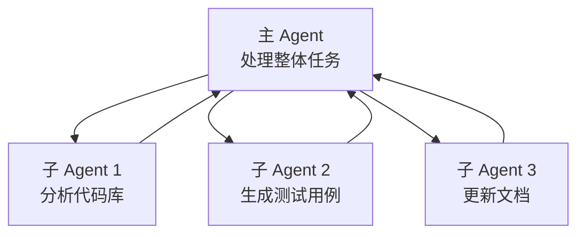
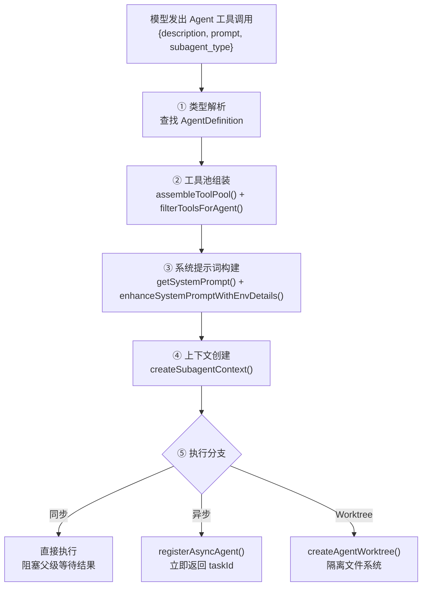
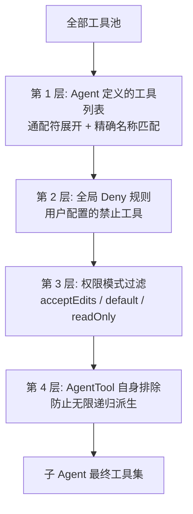
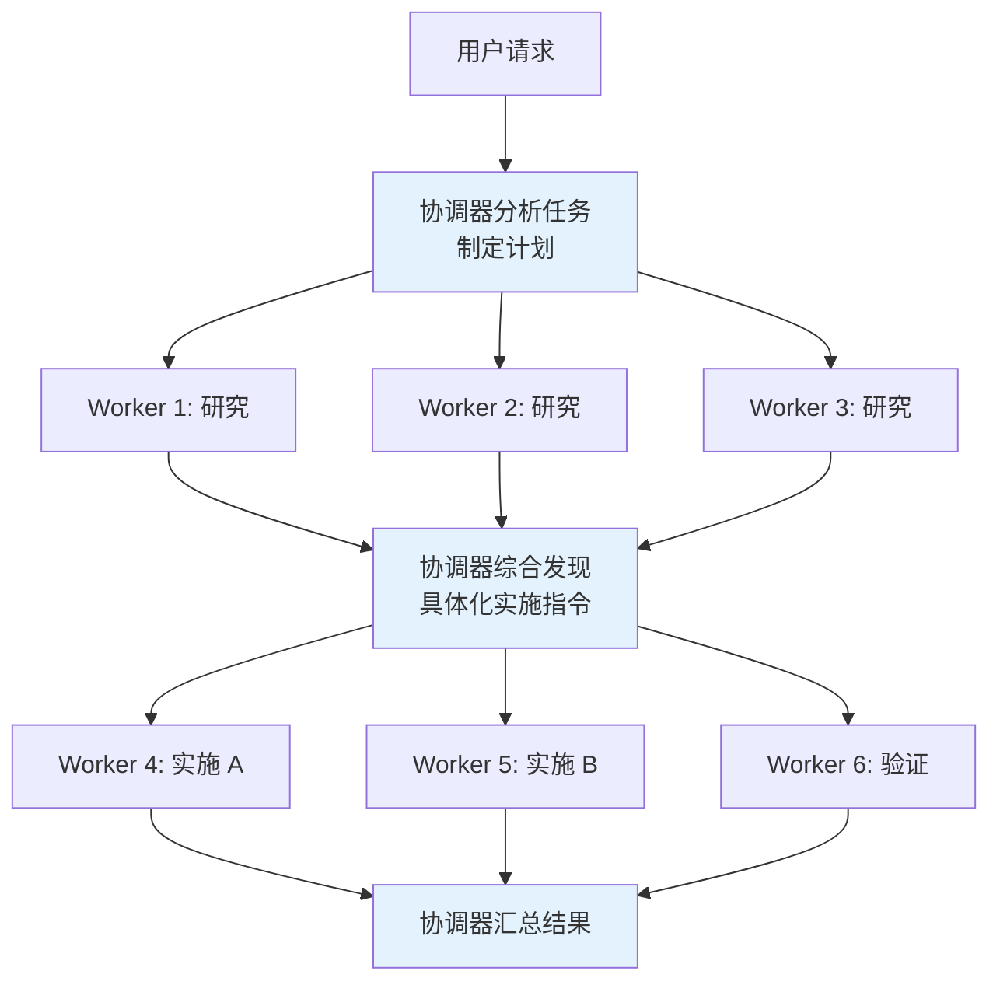

# 第 7 章：多 Agent 协作架构

> **本章目标**：理解 Claude Code 如何让多个 AI Agent 协同工作，以及三种协作模式的设计思路。

---

## 先用大白话理解

想象一个大型软件项目需要同时做三件事：写后端 API、写前端界面、写测试用例。

如果只有一个程序员，他得一件一件做，很慢。如果有三个程序员，他们可以同时做，但需要一个项目经理来协调，防止他们改同一个文件产生冲突。

Claude Code 的多 Agent 系统就是这样：**多个 AI 同时工作，一个协调者负责分配任务和防止冲突**。

---

## 7.1 三种协作模式

### 模式一：子 Agent（AgentTool）

主 Agent 在执行任务时，发现某个子任务可以独立完成，就启动一个子 Agent 来处理。



子 Agent 完成后把结果返回给主 Agent，主 Agent 继续整体任务。

### 模式二：协调器（Coordinator）

协调器是一个「纯指挥官」——它自己不动手，只负责分配任务、监控进度、汇总结果。

```typescript
// coordinator/coordinator.ts（简化）
class Coordinator {
  async execute(task: string, agents: Agent[]) {
    // 1. 把任务拆分成子任务
    const subtasks = await this.planTasks(task);

    // 2. 分配给各个 Agent
    const assignments = this.assignTasks(subtasks, agents);

    // 3. 并行执行
    const results = await Promise.all(
      assignments.map(({ agent, task }) => agent.execute(task))
    );

    // 4. 汇总结果
    return this.synthesize(results);
  }
}
```

### 模式三：Swarm（点对点通信）

多个 Agent 之间可以直接通信，不需要中央协调者。适合需要 Agent 之间相互审查、协商的场景。

---

## 7.2 内置 Agent 类型

Claude Code 内置了三种预定义的 Agent 类型，每种都有精心设计的工具集和系统提示词：

### Explore Agent

Explore Agent（`src/tools/AgentTool/built-in/exploreAgent.ts`）是一个**只读搜索 Agent**，设计目标是快速探索代码库。

**工具限制**：只有 `GlobTool`、`GrepTool`、`FileReadTool`、`WebFetchTool`——不包含任何写入工具。这不只是安全考虑，也是防止 Explore Agent 「越权行事」。如果赋予写入能力，模型可能会在探索过程中顺手修改文件，而不是把修改建议留给父 Agent 决策。

**Haiku 模型选择**：外部用户使用 Haiku（速度优先），内部用户继承父级模型。这个选择基于 Explore 的任务特性——搜索和读取文件不需要强推理能力，速度更重要：

```typescript
// Ants get inherit to use the main agent's model; external users get haiku for speed
model: process.env.USER_TYPE === 'ant' ? 'inherit' : 'haiku',
```

**`omitClaudeMd: true` 的成本优化**：Explore Agent 不需要知道项目的 commit 规范、PR 模板等 CLAUDE.md 中的规则——它只读代码，由父 Agent 解读结果：

```typescript
// Explore is a fast read-only search agent — it doesn't need commit/PR/lint
// rules from CLAUDE.md. The main agent has full context and interprets results.
omitClaudeMd: true,
```

> 在 34M+ 次 Explore 调用/周的规模下，省略 CLAUDE.md 可节省约 5-15 Gtok/周。

### Plan Agent

Plan Agent（`src/tools/AgentTool/built-in/planAgent.ts`）与 Explore 共享只读工具限制，但有不同的设计目标：

**结构化输出要求**：系统提示词要求 Plan Agent 在输出末尾必须包含「Critical Files for Implementation」列表（3-5 个文件）。这不是可选建议——它确保规划结果是可操作的，父 Agent 能根据这些关键文件路径开始执行。

**继承父级模型**：与 Explore 使用 Haiku 不同，Plan 使用 `model: 'inherit'`，因为架构设计和方案规划需要更强的推理能力。

### General-purpose Agent

General-purpose Agent 的设计哲学是「最小约束」：

- `tools: ['*']` 赋予全部工具能力
- 不设置 `omitClaudeMd`——因为通用 Agent 可能需要遵守项目的 commit 规范等规则
- 不指定 `model`——使用 `getDefaultSubagentModel()` 获取默认子 Agent 模型
- 系统提示词简洁：只要求「完成任务，简洁汇报」

---

## 7.3 AgentTool 调用完整流程

当模型发出一次 Agent 工具调用时，系统经历以下 5 个阶段：



**阶段 1：类型解析**：显式指定类型时直接使用，「explicit wins」；省略类型 + fork 实验开启时走 fork 路径（继承完整上下文）；省略类型 + fork 实验关闭时回退到 general-purpose。

**阶段 2：工具池组装**：子 Agent 的工具池**独立于父级**构建，`permissionMode` 默认是 `'acceptEdits'`——子 Agent 默认可以自动执行编辑操作，无需逐个确认。

**阶段 3：系统提示词构建**：Fork 路径直接复用父级已渲染的系统提示词字节，不重新计算——因为 A/B 测试系统的状态可能在父级 turn 开始和 fork 生成之间发生变化，重新计算会产生不同的字节序列，导致 Prompt Cache 失效。

---

## 7.4 Git Worktree：防止文件冲突

多个 Agent 同时工作，最大的风险是「两个 Agent 同时修改同一个文件」。

Claude Code 的解法：用 **Git Worktree** 给每个 Agent 一份独立的代码副本。

```bash
# 主 Agent 在 main 分支工作
git worktree add ../agent-1-workspace feature/api
git worktree add ../agent-2-workspace feature/frontend
git worktree add ../agent-3-workspace feature/tests
```

每个 Agent 在自己的 Worktree 里工作，互不干扰。完成后，协调器负责把各个分支合并回主分支，处理可能的冲突。

---

## 7.5 任务分配策略

协调器用以下策略决定把任务分给哪个 Agent：

| 策略 | 说明 | 适用场景 |
|------|------|---------|
| 能力匹配 | 根据 Agent 的工具权限分配 | 有些 Agent 只有读权限 |
| 负载均衡 | 把任务分给最空闲的 Agent | 大量相似任务 |
| 专业化分工 | 不同 Agent 专注不同领域 | 前端/后端/测试分离 |
| 验证分离 | 实现和验证由不同 Agent 完成 | 防止自我验证偏差 |

---

## 7.6 验证 Agent：专门找问题的角色

这是 Claude Code 最有价值的设计之一。在多 Agent 系统中，有一个专门的**验证 Agent**，它的系统提示词只有一句话：

> **你的任务不是确认东西能用，而是尽量找出问题。**

它还有一套预写的反驳话术，专门对付 AI 的「确认偏差」（倾向于认为自己的工作是对的）：

| AI 的借口 | 验证 Agent 的反驳 |
|-----------|-----------------|
| 「代码看起来是对的」 | 读代码不是验证，运行它 |
| 「实现者的测试已经通过了」 | 实现者也是 AI，你得独立检查 |
| 「这大概没问题」 | 大概不等于验证过，运行它 |
| 「这会花太长时间」 | 花不花时间不是你该操心的 |

最后一句总结：**如果你发现自己在写解释而不是在行动，停下来，去行动。**

---

## 7.7 工具过滤流水线

子 Agent 的工具不是简单地「给什么用什么」——而是经过一条精心设计的四层过滤流水线：



**第 4 层的防无限递归设计**：如果子 Agent 可以调用 AgentTool 再派生子 Agent，理论上可以无限递归。`filterToolsForAgent()` 默认从子 Agent 的工具集中移除 AgentTool 本身（除非 Agent 定义显式允许）。这是一个简单但有效的防护机制。

---

## 7.8 设计洞察

1. **最小权限原则**：Explore Agent 只有读取工具，不是因为「不信任 AI」，而是因为它的任务不需要写入能力。赋予不必要的权限是风险，即使从未被滥用。

2. **成本感知的架构设计**：`omitClaudeMd` 这个小小的布尔值，在 34M+ 次/周的调用规模下，每周节省数十亿 Token。架构决策在大规模下会被放大——好的决策省錢，坏的决策烧錢。

3. **实现者和验证者分离**：这个原则不只适用于 AI——在人类团队中，代码审查也是同样的道理。让同一个人既实现又验证，会产生「确认偏差」。

4. **Fork 路径的缓存感知**：Fork 子 Agent 直接复用父级的系统提示词字节，而不是重新计算。这个设计决策看似微小，但在高频调用场景下，避免缓存失效意味着显著的延迟和成本节省。

5. **异步执行的统一交互模型**：协调器模式和 fork 实验都强制使用异步执行 + `<task-notification>` 交互模型。这种统一性简化了编排逻辑——调用者不需要区分「这个 Agent 是同步的还是异步的」。

---

> 下一章：[MCP 集成与扩展 →](#/docs/08-mcp-integration)

---

## 7.9 协调器模式深度解析

协调器模式将主 Agent 转变为**纯编排者**——只负责分析任务、分配 Worker、综合结果，永远不直接操作文件。

### 协调器的核心约束

协调器的工具集被严格限制：

| 工具 | 用途 |
|------|------|
| `Agent` | 派生新 Worker |
| `SendMessage` | 继续已有 Worker（利用其加载的上下文） |
| `TaskStop` | 终止 Worker（方向错误时的止损） |

协调器**不能**使用 Bash、Edit、Read 等工具——这确保它只做编排，不做执行。

**为什么协调器不能执行？** 如果协调器既做决策又做执行，它会倾向于「自己动手比委托更快」，从而退化为一个普通的单 Agent。工具集的硬限制强制它必须通过 Worker 完成所有实际操作。

### 协调器的标准工作流



四个阶段的并发管理规则：

| 阶段 | 并发策略 | 原因 |
|------|---------|------|
| 研究 | 自由并行 | 只读操作，无冲突风险 |
| 综合 | 协调器串行 | 必须理解所有发现后才能下发指令 |
| 实施 | 按文件集串行 | 同文件写入必须串行化，防止冲突 |
| 验证 | 可与不同文件区域的实施并行 | 验证不修改被测代码 |

### 协调器提示词设计精要

**原则一：「Never write 'based on your findings'」**

协调器必须自己理解研究结果，然后写出包含具体文件路径、行号和修改内容的实施指令：

```
// 反模式 — 懒惰委托
Agent({ prompt: "Based on your findings, fix the auth bug" })

// 正确 — 综合后的具体指令
Agent({ prompt: "Fix the null pointer in src/auth/validate.ts:42.
  The user field on Session is undefined when sessions expire but
  the token remains cached. Add a null check before user.id access." })
```

**原则二：Continue vs Spawn 决策**

| 场景 | 决策 | 原因 |
|------|------|------|
| 研究探索了需要编辑的文件 | **Continue** | Worker 已有文件上下文 |
| 研究范围广但实施范围窄 | **Spawn** | 避免探索噪声，聚焦上下文更干净 |
| 纠正失败或扩展最近工作 | **Continue** | Worker 有错误上下文 |
| 验证其他 Worker 刚写的代码 | **Spawn** | 验证者应以新鲜视角审视 |

---

## 7.10 Swarm 通信：Agent 间的信箱系统

Swarm 模式允许多个 Agent 之间直接通信，不需要中央协调者。

### 命名信箱机制

每个 Agent 可以有一个名字（通过 `name` 参数设置），其他 Agent 可以通过 `SendMessage` 工具向它发送消息：

```typescript
// Agent A 启动 Agent B，并给它命名
AgentTool({
  name: "code-reviewer",
  prompt: "你是代码审查专家，等待其他 Agent 发来需要审查的代码",
  run_in_background: true
})

// Agent C 向 Agent B 发送消息
SendMessage({
  to: "code-reviewer",
  message: "请审查这段代码：\n" + codeSnippet
})
```

### task-notification 机制

当一个 Agent 完成任务时，它通过 `<task-notification>` XML 标签通知父 Agent：

```xml
<task-notification>
  <task-id>abc123</task-id>
  <status>completed</status>
  <result>
    已完成文件分析，发现 3 处潜在问题：
    1. src/auth.ts:42 - 空指针风险
    2. src/db.ts:88 - SQL 注入风险
    3. src/api.ts:156 - 未处理的异步错误
  </result>
</task-notification>
```

父 Agent 扫描对话历史，找到这些通知，决定下一步行动。

---

## 7.11 Fork Agent：继承完整上下文

Fork Agent 是一种特殊的子 Agent 类型——它不是从零开始，而是**继承父 Agent 的完整对话历史**。

```typescript
export const FORK_AGENT = {
  agentType: 'fork',
  tools: ['*'],              // 全部工具，保持与父级缓存一致
  maxTurns: 200,
  model: 'inherit',          // 继承父级模型
  permissionMode: 'bubble',  // 权限请求冒泡到父级终端
  getSystemPrompt: () => '', // 未使用——fork 直接使用父级已渲染的系统提示词
}
```

**为什么 `getSystemPrompt: () => ''`？** 这看起来像 bug，但实际上是刻意设计——fork 路径从不调用这个函数，而是直接传入父级的 `renderedSystemPrompt` 字节。如果不小心调用了它，空字符串会导致明显的异常，而不是一个微妙的缓存失效。

**`permissionMode: 'bubble'`**：当 fork 子级需要权限确认时，请求会「冒泡」到父级的终端显示，而不是被静默拒绝。这是因为 fork 子级被设计为「父级的延伸」，它的操作在概念上仍然由用户控制。

---

## 7.12 设计洞察（扩展）

**协调器的「不可委托职责」**：综合理解是协调器的核心价值。如果协调器只是转发消息（「Worker A 发现了一些东西，Worker B 你去处理」），它就退化成了一个消息路由器。强制协调器在综合阶段「理解并具体化」，是保持编排质量的关键。

**验证者的独立性**：验证 Agent 必须用 Spawn 而不是 Continue——因为验证者应该以「新鲜视角」审视代码，而不是带着实现者的上下文偏见。这和人类代码审查的最佳实践完全一致。

**并发的边界在文件**：多 Agent 并行的安全边界是「不同文件」。同一文件的修改必须串行化，不同文件的修改可以并行。这个规则简单、可验证、有效。

---

> 下一章：[MCP 集成与扩展 →](#/docs/08-mcp-integration)
