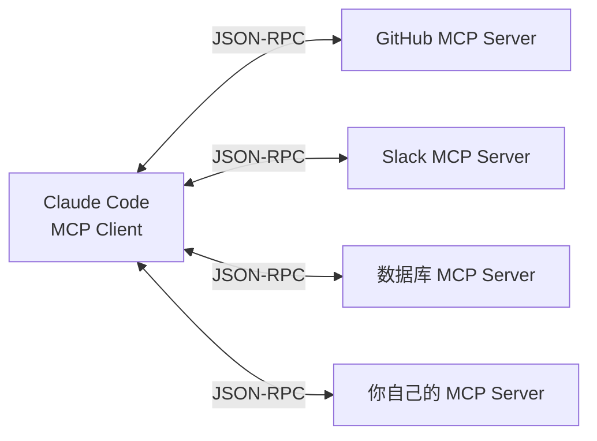
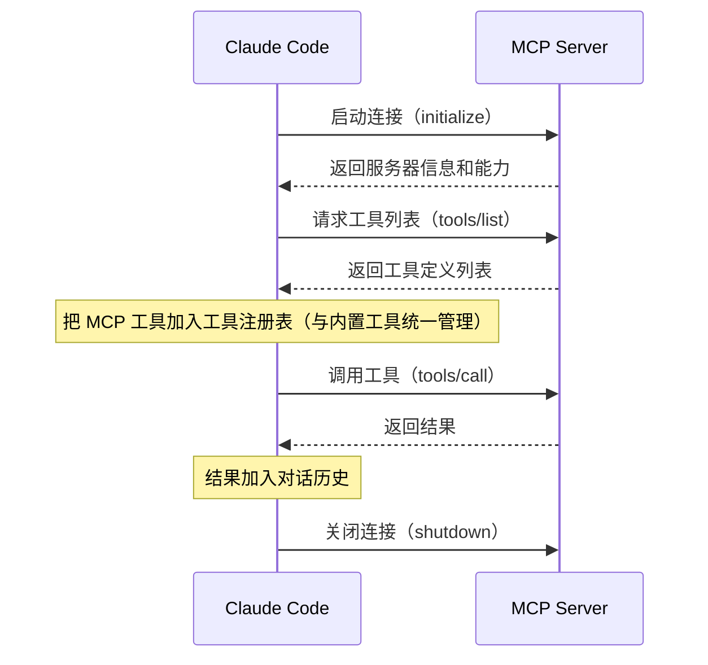

# 第 8 章：MCP 集成与扩展

> **本章目标**：理解 MCP（Model Context Protocol）是什么，以及 Claude Code 如何通过它实现无限扩展。

---

## 先用大白话理解

想象你的手机。手机本身只有基础功能，但通过「应用商店」，你可以安装无数 App，让手机能做任何事。

MCP 就是 Claude Code 的「应用商店协议」。它定义了一套标准接口，任何人都可以按照这个标准开发「工具插件」，让 Claude Code 能连接任何外部系统——数据库、Slack、GitHub、Figma、你自己的内部系统……

---

## 8.2 MCP 是什么？

**MCP（Model Context Protocol）** 是 Anthropic 制定的开放标准，定义了 AI 模型和外部工具之间的通信方式。

核心思想：**工具提供者（MCP Server）和工具使用者（Claude Code）之间，通过标准化的 JSON-RPC 协议通信**。



MCP 的设计哲学是**关注点分离**：Claude Code 不需要知道每个工具的实现细节，只需要知道工具的名字、描述和参数格式。工具提供者也不需要了解 Claude Code 的内部实现，只需要遵循 MCP 协议。

这种解耦带来了巨大的生态优势：任何人都可以为 Claude Code 开发工具，Claude Code 也可以使用任何遵循 MCP 协议的工具。这类似于 USB 协议：USB 定义了接口标准，任何厂商都可以生产 USB 设备，任何电脑都可以使用任何 USB 设备。

---

## 8.3 连接方式

MCP Server 支持两种连接方式：

| 方式 | 说明 | 适用场景 |
|------|------|---------|
| `stdio` | 通过标准输入输出通信 | 本地进程，最常用 |
| `SSE` | 通过 HTTP Server-Sent Events | 远程服务器 |

配置示例（`.claude/settings.json`）：

```json
{
  "mcpServers": {
    "github": {
      "command": "npx",
      "args": ["-y", "@modelcontextprotocol/server-github"],
      "env": {
        "GITHUB_TOKEN": "your_token"
      }
    },
    "my-database": {
      "command": "python",
      "args": ["./mcp-server.py"],
      "type": "stdio"
    }
  }
}
```

---

## 8.4 MCP 工具的生命周期



**关键细节：工具列表缓存**。Claude Code 在启动时获取工具列表后会缓存它，不会在每次调用前重新请求。这意味着如果 MCP Server 动态添加了新工具，需要重启 Claude Code 才能生效。

**关键细节：并行初始化**。如果配置了多个 MCP Server，Claude Code 会并行初始化它们，而不是串行等待。这是 9 阶段并行启动的一部分（详见第 1 章）。

---

## 8.5 MCP 工具 vs 内置工具

MCP 工具和内置工具走完全相同的执行流水线：

| 特性 | 内置工具 | MCP 工具 |
|------|---------|---------|
| 安全检查 | ✓ 完整 5 层 | ✓ 完整 5 层 |
| 权限控制 | ✓ | ✓ |
| Hook 支持 | ✓ | ✓ |
| 并行执行 | ✓（只读工具） | ✓（只读工具） |
| 审计日志 | ✓ | ✓ |

这是统一工具接口设计的核心价値：**扩展不需要特殊处理**。

从 Claude Code 的角度看，MCP 工具和内置工具没有任何区别——它们都是实现了 `Tool` 接口的对象，都通过同一个工具调度器执行，都经过同样的权限检查和安全验证。

---

## 8.6 MCP 工具的权限控制

MCP 工具默认需要用户确认才能执行（因为它们是未知的外部工具）。但你可以在配置中明确授权：

```json
{
  "mcpServers": {
    "github": {
      "command": "npx",
      "args": ["-y", "@modelcontextprotocol/server-github"],
      "allowedTools": [
        "github_list_repos",
        "github_read_file"
      ]
    }
  }
}
```

`allowedTools` 列表中的工具会被自动授权，不需要每次确认。未在列表中的工具仍然需要用户确认。

**安全建议**：只把你信任的、只读的工具加入 `allowedTools`。写操作（如创建 PR、推送代码）建议保留确认步骤。

---

## 8.7 写一个最简单的 MCP Server

```python
# 一个最简单的 MCP Server（Python）
from mcp.server import Server
from mcp.types import Tool, TextContent

app = Server("my-tools")

@app.list_tools()
async def list_tools():
    return [
        Tool(
            name="get_weather",
            description="获取指定城市的天气",
            inputSchema={
                "type": "object",
                "properties": {
                    "city": {"type": "string", "description": "城市名"}
                },
                "required": ["city"]
            }
        )
    ]

@app.call_tool()
async def call_tool(name: str, arguments: dict):
    if name == "get_weather":
        city = arguments["city"]
        # 调用天气 API
        weather = fetch_weather(city)
        return [TextContent(type="text", text=f"{city}今天{weather}")]

if __name__ == "__main__":
    import asyncio
    asyncio.run(app.run())
```

---

## 8.8 MCP 生态系统

截至 2025 年，MCP 生态已经相当丰富：

| 类别 | 代表工具 | 功能 |
|------|---------|------|
| 代码托管 | GitHub MCP | 读写仓库、PR、Issue |
| 数据库 | PostgreSQL MCP | 查询数据库 |
| 通讯 | Slack MCP | 发消息、读频道 |
| 设计 | Figma MCP | 读取设计稿 |
| 浏览器 | Playwright MCP | 控制浏览器 |
| 文件系统 | Filesystem MCP | 读写本地文件 |
| 搜索 | Brave Search MCP | 网络搜索 |

**官方工具列表**：[https://github.com/modelcontextprotocol/servers](https://github.com/modelcontextprotocol/servers)

---

## 8.9 架构洞察

**为什么不直接用 HTTP API？** 很多人会问：为什么需要 MCP，直接让 Claude Code 调用 HTTP API 不就行了？

答案是：**MCP 解决的不是技术问题，而是生态问题**。

如果每个工具都需要 Claude Code 为其写特殊的集成代码，那么工具生态的扩展就完全依赖 Anthropic 团队。而 MCP 把这个权力交给了工具开发者——任何人都可以按照标准协议开发工具，不需要 Anthropic 的参与。

**MCP 的局限性**：MCP 工具目前不支持流式输出（工具必须一次性返回结果）。对于需要长时间运行的工具（如运行测试套件），这可能导致较长的等待时间。Anthropic 正在开发流式 MCP 工具支持。

---

> 下一章：[10 种运行模式 →](#/docs/09-running-modes)
