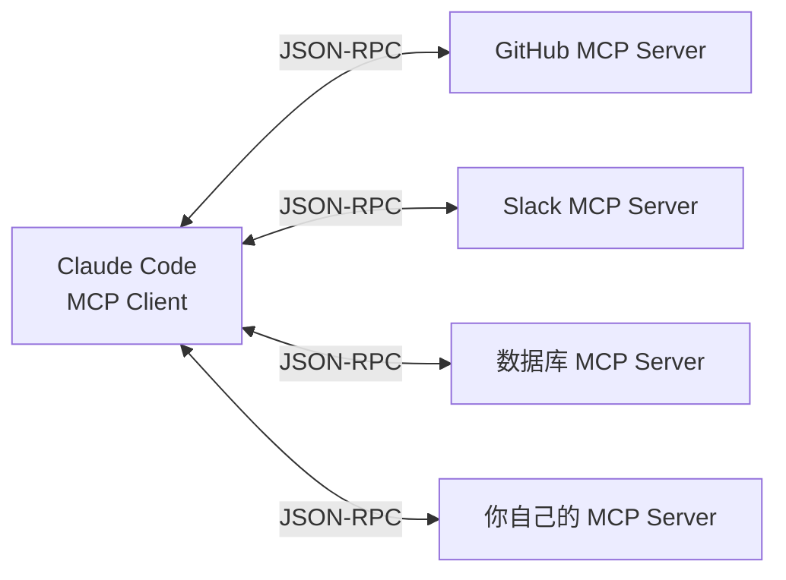
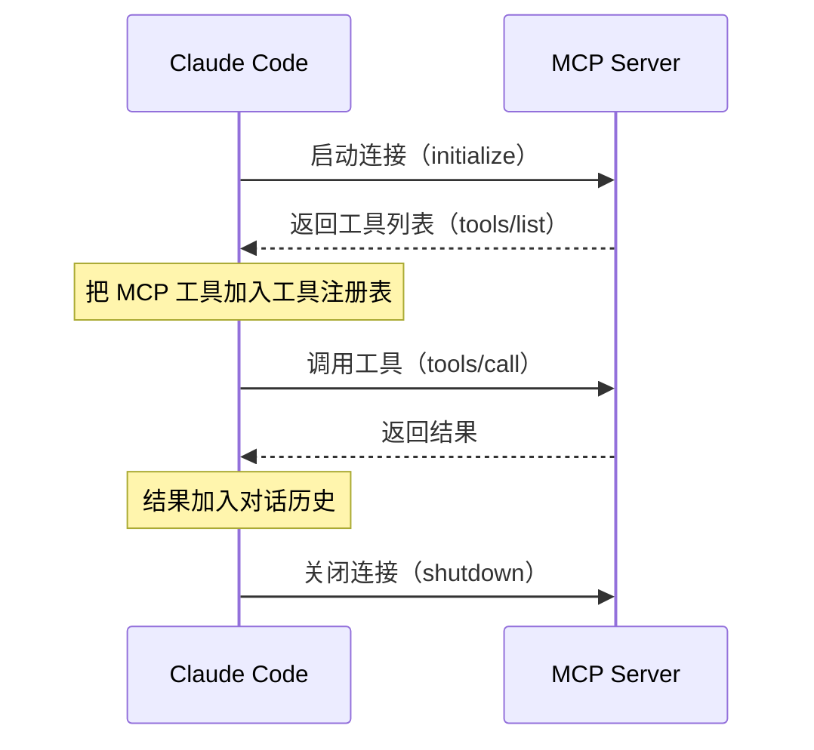

# 第 8 章：MCP 集成与扩展

> **本章目标**：理解 MCP（Model Context Protocol）是什么，以及 Claude Code 如何通过它实现无限扩展。

---

## 先用大白话理解

想象你的手机。手机本身只有基础功能，但通过「应用商店」，你可以安装无数 App，让手机能做任何事。

MCP 就是 Claude Code 的「应用商店协议」。它定义了一套标准接口，任何人都可以按照这个标准开发「工具插件」，让 Claude Code 能连接任何外部系统——数据库、Slack、GitHub、Figma、你自己的内部系统……

---

## MCP 是什么？

**MCP（Model Context Protocol）** 是 Anthropic 制定的开放标准，定义了 AI 模型和外部工具之间的通信方式。

核心思想：**工具提供者（MCP Server）和工具使用者（Claude Code）之间，通过标准化的 JSON-RPC 协议通信**。



---

## 连接方式

MCP Server 支持两种连接方式：

| 方式 | 说明 | 适用场景 |
|------|------|---------|
| `stdio` | 通过标准输入输出通信 | 本地进程，最常用 |
| `SSE` | 通过 HTTP Server-Sent Events | 远程服务器 |

配置示例（`.claude/settings.json`）：

```json
{
  "mcpServers": {
    "github": {
      "command": "npx",
      "args": ["-y", "@modelcontextprotocol/server-github"],
      "env": {
        "GITHUB_TOKEN": "your_token"
      }
    },
    "my-database": {
      "command": "python",
      "args": ["./mcp-server.py"],
      "type": "stdio"
    }
  }
}
```

---

## MCP 工具的生命周期



---

## MCP 工具 vs 内置工具

MCP 工具和内置工具走完全相同的执行流水线：

| 特性 | 内置工具 | MCP 工具 |
|------|---------|---------|
| 安全检查 | ✓ 完整 5 层 | ✓ 完整 5 层 |
| 权限控制 | ✓ | ✓ |
| Hook 支持 | ✓ | ✓ |
| 并行执行 | ✓（只读工具） | ✓（只读工具） |
| 审计日志 | ✓ | ✓ |

这是统一工具接口设计的核心价值：扩展不需要特殊处理。

---

## 写一个最简单的 MCP Server

```python
# 一个最简单的 MCP Server（Python）
from mcp.server import Server
from mcp.types import Tool, TextContent

app = Server("my-tools")

@app.list_tools()
async def list_tools():
    return [
        Tool(
            name="get_weather",
            description="获取指定城市的天气",
            inputSchema={
                "type": "object",
                "properties": {
                    "city": {"type": "string", "description": "城市名"}
                },
                "required": ["city"]
            }
        )
    ]

@app.call_tool()
async def call_tool(name: str, arguments: dict):
    if name == "get_weather":
        city = arguments["city"]
        # 调用天气 API
        weather = fetch_weather(city)
        return [TextContent(type="text", text=f"{city}今天{weather}")]

if __name__ == "__main__":
    import asyncio
    asyncio.run(app.run())
```

---

> 下一章：[10 种运行模式 →](docs/09-running-modes.md)
