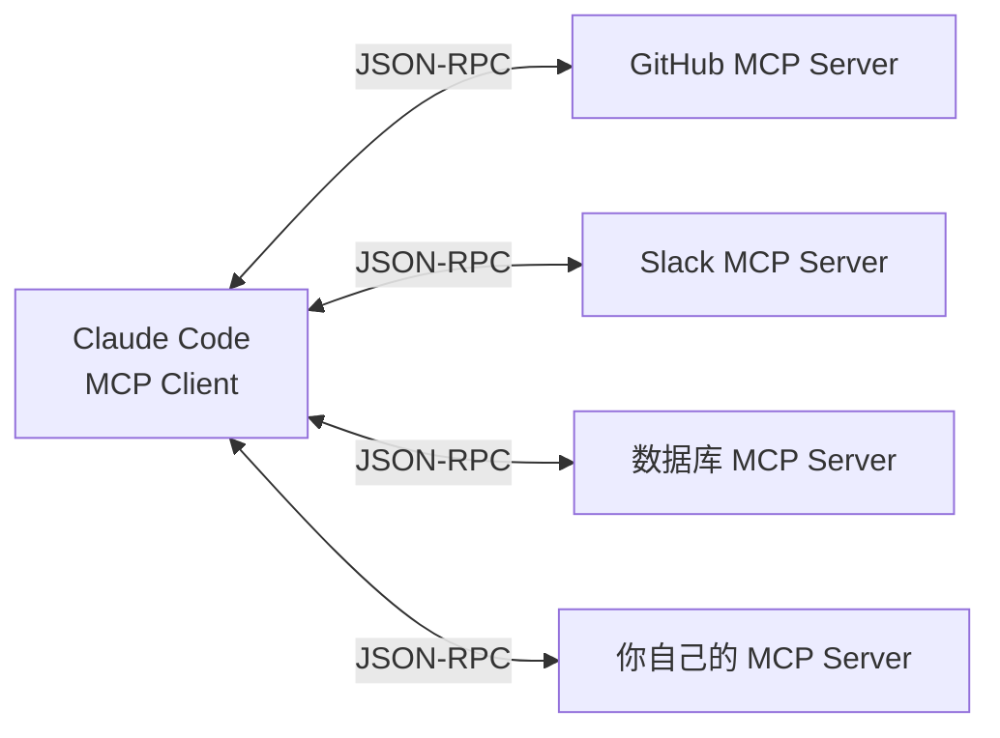
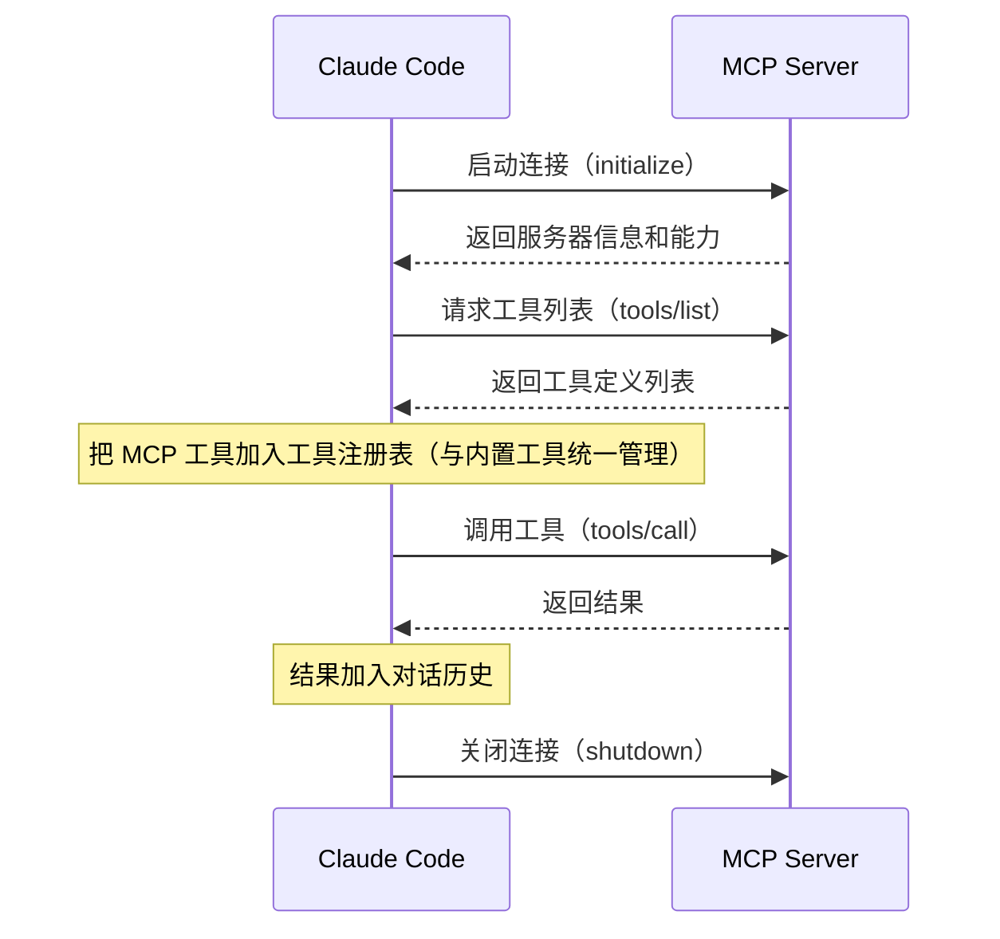
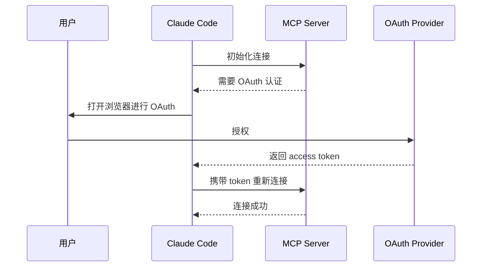

# 第 8 章：MCP 集成与扩展

> **本章目标**：理解 MCP（Model Context Protocol）是什么，以及 Claude Code 如何通过它实现无限扩展。

---

## 先用大白话理解

想象你的手机。手机本身只有基础功能，但通过「应用商店」，你可以安装无数 App，让手机能做任何事。

MCP 就是 Claude Code 的「应用商店协议」。它定义了一套标准接口，任何人都可以按照这个标准开发「工具插件」，让 Claude Code 能连接任何外部系统——数据库、Slack、GitHub、Figma、你自己的内部系统……

---

## 8.2 MCP 是什么？

**MCP（Model Context Protocol）** 是 Anthropic 制定的开放标准，定义了 AI 模型和外部工具之间的通信方式。

核心思想：**工具提供者（MCP Server）和工具使用者（Claude Code）之间，通过标准化的 JSON-RPC 协议通信**。



MCP 的设计哲学是**关注点分离**：Claude Code 不需要知道每个工具的实现细节，只需要知道工具的名字、描述和参数格式。工具提供者也不需要了解 Claude Code 的内部实现，只需要遵循 MCP 协议。

这种解耦带来了巨大的生态优势：任何人都可以为 Claude Code 开发工具，Claude Code 也可以使用任何遵循 MCP 协议的工具。这类似于 USB 协议：USB 定义了接口标准，任何厂商都可以生产 USB 设备，任何电脑都可以使用任何 USB 设备。

---

## 8.3 连接方式

MCP Server 支持两种连接方式：

| 方式 | 说明 | 适用场景 |
|------|------|---------|
| `stdio` | 通过标准输入输出通信 | 本地进程，最常用 |
| `SSE` | 通过 HTTP Server-Sent Events | 远程服务器 |

配置示例（`.claude/settings.json`）：

```json
{
  "mcpServers": {
    "github": {
      "command": "npx",
      "args": ["-y", "@modelcontextprotocol/server-github"],
      "env": {
        "GITHUB_TOKEN": "your_token"
      }
    },
    "my-database": {
      "command": "python",
      "args": ["./mcp-server.py"],
      "type": "stdio"
    }
  }
}
```

---

## 8.4 MCP 工具的生命周期



**关键细节：工具列表缓存**。Claude Code 在启动时获取工具列表后会缓存它，不会在每次调用前重新请求。这意味着如果 MCP Server 动态添加了新工具，需要重启 Claude Code 才能生效。

**关键细节：并行初始化**。如果配置了多个 MCP Server，Claude Code 会并行初始化它们，而不是串行等待。这是 9 阶段并行启动的一部分（详见第 1 章）。

---

## 8.5 MCP 工具 vs 内置工具

MCP 工具和内置工具走完全相同的执行流水线：

| 特性 | 内置工具 | MCP 工具 |
|------|---------|---------|
| 安全检查 | ✓ 完整 5 层 | ✓ 完整 5 层 |
| 权限控制 | ✓ | ✓ |
| Hook 支持 | ✓ | ✓ |
| 并行执行 | ✓（只读工具） | ✓（只读工具） |
| 审计日志 | ✓ | ✓ |

这是统一工具接口设计的核心价値：**扩展不需要特殊处理**。

从 Claude Code 的角度看，MCP 工具和内置工具没有任何区别——它们都是实现了 `Tool` 接口的对象，都通过同一个工具调度器执行，都经过同样的权限检查和安全验证。

---

## 8.6 MCP 工具的权限控制

MCP 工具默认需要用户确认才能执行（因为它们是未知的外部工具）。但你可以在配置中明确授权：

```json
{
  "mcpServers": {
    "github": {
      "command": "npx",
      "args": ["-y", "@modelcontextprotocol/server-github"],
      "allowedTools": [
        "github_list_repos",
        "github_read_file"
      ]
    }
  }
}
```

`allowedTools` 列表中的工具会被自动授权，不需要每次确认。未在列表中的工具仍然需要用户确认。

**安全建议**：只把你信任的、只读的工具加入 `allowedTools`。写操作（如创建 PR、推送代码）建议保留确认步骤。

---

## 8.7 写一个最简单的 MCP Server

```python
# 一个最简单的 MCP Server（Python）
from mcp.server import Server
from mcp.types import Tool, TextContent

app = Server("my-tools")

@app.list_tools()
async def list_tools():
    return [
        Tool(
            name="get_weather",
            description="获取指定城市的天气",
            inputSchema={
                "type": "object",
                "properties": {
                    "city": {"type": "string", "description": "城市名"}
                },
                "required": ["city"]
            }
        )
    ]

@app.call_tool()
async def call_tool(name: str, arguments: dict):
    if name == "get_weather":
        city = arguments["city"]
        # 调用天气 API
        weather = fetch_weather(city)
        return [TextContent(type="text", text=f"{city}今天{weather}")]

if __name__ == "__main__":
    import asyncio
    asyncio.run(app.run())
```

---

## 8.8 MCP 生态系统

截至 2025 年，MCP 生态已经相当丰富：

| 类别 | 代表工具 | 功能 |
|------|---------|------|
| 代码托管 | GitHub MCP | 读写仓库、PR、Issue |
| 数据库 | PostgreSQL MCP | 查询数据库 |
| 通讯 | Slack MCP | 发消息、读频道 |
| 设计 | Figma MCP | 读取设计稿 |
| 浏览器 | Playwright MCP | 控制浏览器 |
| 文件系统 | Filesystem MCP | 读写本地文件 |
| 搜索 | Brave Search MCP | 网络搜索 |

**官方工具列表**：[https://github.com/modelcontextprotocol/servers](https://github.com/modelcontextprotocol/servers)

---

## 8.9 架构洞察

**为什么不直接用 HTTP API？** 很多人会问：为什么需要 MCP，直接让 Claude Code 调用 HTTP API 不就行了？

答案是：**MCP 解决的不是技术问题，而是生态问题**。

如果每个工具都需要 Claude Code 为其写特殊的集成代码，那么工具生态的扩展就完全依赖 Anthropic 团队。而 MCP 把这个权力交给了工具开发者——任何人都可以按照标准协议开发工具，不需要 Anthropic 的参与。

**MCP 的局限性**：MCP 工具目前不支持流式输出（工具必须一次性返回结果）。对于需要长时间运行的工具（如运行测试套件），这可能导致较长的等待时间。Anthropic 正在开发流式 MCP 工具支持。

---

> 下一章：[10 种运行模式 →](#/docs/09-running-modes)

---

## 8.10 七种传输类型

Claude Code 的 MCP 客户端支持 7 种传输类型，覆盖了从本地进程到远程云服务的各种场景：

| 传输类型 | 通信方式 | 典型用途 |
|---------|---------|---------|
| `stdio` | 标准输入输出 | 本地命令行工具（最常用） |
| `sse` | HTTP Server-Sent Events | 远程 HTTP 服务器 |
| `http` | HTTP 长轮询 | 远程 HTTP 服务器（备选） |
| `websocket` | WebSocket 双向通信 | 需要实时推送的服务 |
| `ipc` | 进程间通信 | 同机器的其他进程 |
| `docker` | Docker 容器内运行 | 隔离环境的工具 |
| `npx` | 通过 npx 运行 | npm 包形式的 MCP Server |

`stdio` 是最常用的传输类型，因为它最简单——只需要一个可执行文件，不需要网络配置。`docker` 传输类型特别有意思：它允许在 Docker 容器内运行 MCP Server，提供了额外的安全隔离层。

### Docker 传输类型示例

```json
{
  "mcpServers": {
    "isolated-tool": {
      "type": "docker",
      "image": "my-mcp-server:latest",
      "env": {
        "API_KEY": "secret"
      },
      "volumes": [
        "/home/user/data:/data:ro"
      ]
    }
  }
}
```

Docker 传输类型的优势：
- **安全隔离**：工具在容器内运行，无法访问主机文件系统（除非显式挂载）
- **依赖隔离**：工具的依赖不会污染主机环境
- **版本锁定**：通过镜像标签锁定工具版本，避免意外升级

---

## 8.11 MCP 桥接工具架构

Claude Code 将 MCP 工具桥接为内置工具的方式值得深入理解。关键文件：`src/tools/MCPTool.ts`。

### 工具命名空间

MCP 工具在 Claude Code 内部使用 `mcp__{serverName}__{toolName}` 格式命名：

```
mcp__github__list_repos
mcp__github__create_pr
mcp__slack__send_message
mcp__my-database__query
```

这个命名格式有三个作用：
1. **避免命名冲突**：不同 MCP Server 的同名工具不会互相覆盖
2. **来源可追溯**：从工具名就能知道它来自哪个 MCP Server
3. **权限粒度**：`allowedTools` 可以精确到单个工具，而不只是整个 Server

### 工具 Schema 转换

MCP Server 返回的工具定义（JSON Schema 格式）被转换为 Claude Code 的内部工具格式：

```typescript
// MCP 工具定义（来自 Server）
{
  name: "list_repos",
  description: "列出 GitHub 仓库",
  inputSchema: {
    type: "object",
    properties: {
      owner: { type: "string" }
    }
  }
}

// 转换后的内部工具格式
{
  name: "mcp__github__list_repos",
  description: "[GitHub MCP] 列出 GitHub 仓库",
  inputSchema: { ... },  // 保持原始 Schema
  execute: async (params) => {
    return await mcpClient.callTool("list_repos", params)
  }
}
```

`description` 前缀 `[GitHub MCP]` 是自动添加的，帮助模型理解工具来源。

---

## 8.12 MCP 权限模型

MCP 工具的权限控制比内置工具更复杂，因为 MCP Server 可能来自不可信的来源。Claude Code 实现了三层 MCP 权限控制：

### 第一层：Server 级别信任

```json
{
  "mcpServers": {
    "github": {
      "trust": "full"    // 完全信任，所有工具自动授权
    },
    "external-api": {
      "trust": "none"    // 不信任，所有工具需要确认（默认）
    }
  }
}
```

### 第二层：工具级别白名单

```json
{
  "mcpServers": {
    "github": {
      "allowedTools": [
        "mcp__github__list_repos",
        "mcp__github__read_file"
      ]
    }
  }
}
```

### 第三层：动态权限请求

当模型调用一个未在白名单中的 MCP 工具时，Claude Code 会向用户显示权限确认对话框：

```
Claude 想要使用工具：mcp__github__create_pr
来自：GitHub MCP Server
描述：创建一个 Pull Request

参数：
  title: "Fix authentication bug"
  body: "..."
  base: "main"
  head: "fix/auth"

[允许一次] [总是允许] [拒绝]
```

「总是允许」会将该工具添加到 `allowedTools` 列表，持久化到配置文件。

---

## 8.13 MCP OAuth 支持

对于需要用户认证的 MCP Server（如 GitHub、Slack），Claude Code 支持 OAuth 2.0 流程：



OAuth 流程在 `src/services/mcp/oauth.ts` 中实现。Claude Code 会在本地启动一个临时 HTTP 服务器来接收 OAuth 回调（`localhost:PORT/callback`），完成授权后立即关闭。Token 被安全存储在系统 Keychain 中，下次启动时自动使用。

---

## 8.14 MCP 资源（Resources）

除了工具（Tools），MCP 协议还支持「资源」（Resources）——可以被读取的数据源，如文件、数据库记录、API 响应等。

```typescript
// MCP Server 声明资源
{
  uri: "github://repos/owner/repo/README.md",
  name: "README.md",
  mimeType: "text/markdown"
}
```

Claude Code 通过 `mcp__read_resource` 内置工具访问 MCP 资源：

```
mcp__read_resource({
  serverName: "github",
  uri: "github://repos/owner/repo/README.md"
})
```

资源和工具的区别：工具是「动作」（执行某个操作），资源是「数据」（读取某个内容）。资源更适合表示静态或半静态的数据，工具更适合表示有副作用的操作。

---

## 8.15 MCP Prompts（提示词模板）

MCP 协议还支持「提示词模板」（Prompts）——预定义的提示词，可以带参数：

```typescript
// MCP Server 声明提示词模板
{
  name: "code_review",
  description: "对代码进行专业的代码审查",
  arguments: [
    { name: "language", description: "编程语言", required: true },
    { name: "focus", description: "关注点", required: false }
  ]
}
```

用户可以通过斜杠命令调用 MCP 提示词：

```
/mcp__github__code_review language=TypeScript focus=security
```

这个功能让 MCP Server 可以提供「最佳实践提示词」，而不仅仅是工具。例如，一个 Python MCP Server 可以提供针对 Python 代码审查的专业提示词模板。

---

## 8.16 MCP 连接健康检查

Claude Code 实现了 MCP 连接的健康检查和自动重连机制：

```typescript
// 连接状态监控
enum MCPConnectionState {
  Connecting = 'connecting',
  Connected = 'connected',
  Reconnecting = 'reconnecting',
  Failed = 'failed',
  Disabled = 'disabled'
}
```

当 MCP Server 意外断开时（如进程崩溃、网络中断），Claude Code 会：
1. 将该 Server 的工具标记为「不可用」
2. 尝试指数退避重连（最多 3 次）
3. 如果重连失败，在 UI 中显示警告
4. 如果模型尝试调用不可用工具，返回错误信息而不是崩溃

这个设计确保了单个 MCP Server 的故障不会影响整个 Claude Code 的运行。

---

## 8.17 设计洞察

**「统一工具接口」的扩展性价值**：MCP 工具和内置工具走完全相同的执行流水线，这不是偶然的——这是「开放/封闭原则」（Open/Closed Principle）的体现。系统对扩展开放（任何人可以添加 MCP 工具），对修改封闭（添加新工具不需要修改核心代码）。这种设计让 Claude Code 的工具生态可以无限扩展，而不需要 Anthropic 的参与。

**「命名空间」的防冲突设计**：`mcp__{serverName}__{toolName}` 命名格式是一种「命名空间」设计。当工具数量达到数百个时，命名冲突是一个真实的问题。命名空间确保了即使两个不同的 MCP Server 都有名为 `list_files` 的工具，它们也不会冲突（`mcp__github__list_files` vs `mcp__filesystem__list_files`）。

**「Docker 传输」的安全哲学**：Docker 传输类型体现了「最小权限」和「默认安全」的设计哲学。在没有显式挂载的情况下，Docker 容器内的 MCP Server 无法访问主机文件系统。这是一种「默认拒绝」的安全模型——不需要用户主动配置安全限制，安全是默认的。

**「OAuth 流程」的用户体验设计**：OAuth 流程在 Claude Code 中是完全自动化的——用户只需要在浏览器中点击「授权」，Claude Code 会自动处理 token 的获取、存储和刷新。这体现了「用户体验优先」的设计理念：复杂的技术细节（OAuth 2.0 流程）被封装在系统内部，用户看到的只是一个简单的「授权」操作。

---

> 下一章：[10 种运行模式 →](#/docs/09-running-modes)
