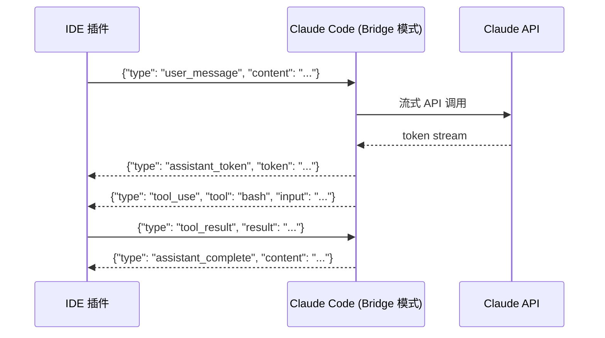

# 第 9 章：10 种运行模式

> **本章目标**：了解 Claude Code 的 10 种运行模式，以及 89 个 Feature Flag 背后的工程哲学。

---

## 9.1 先用大白话理解

同一个人，在不同场合会有不同的工作方式：在会议室里是「讨论模式」，在工位上是「专注模式」，在紧急情况下是「救火模式」。

Claude Code 也一样——根据不同的使用场景，它有 10 种不同的运行模式，每种模式下的行为、权限、工具集都不一样。

---

## 9.2 10 种运行模式

| 模式 | 触发方式 | 核心特征 |
|------|---------|---------|
| **Interactive** | 默认启动 | 交互式对话，每步可确认 |
| **Task** | `--print` 标志 | 非交互式，执行完退出 |
| **KAIROS** | Feature Flag | 完全自主，最小化人工干预 |
| **Coordinator** | `--coordinator` | 纯指挥官，只分配任务 |
| **Subagent** | 被父 Agent 启动 | 执行单一子任务 |
| **Swarm Member** | Swarm 初始化 | 点对点协作网络中的节点 |
| **Headless** | `--headless` | 无 UI，适合 CI/CD |
| **Pipe** | stdin 输入 | 管道模式，接收流式输入 |
| **Review** | `--review` | 只读模式，只分析不修改 |
| **Doctor** | `/doctor` 命令 | 诊断模式，检查环境问题 |

---

## 9.3 最重要的两种模式对比

### Interactive 模式（日常使用）

```
用户输入 → AI 思考 → 执行工具（危险操作需确认）→ 显示结果 → 等待用户
```

特点：
- 每个危险操作都会弹出确认框
- 用户可以随时中断（Ctrl+C）
- 对话历史在会话内持久化
- 支持 `/` 斜杠命令

Interactive 模式是大多数用户日常使用的模式。它的核心设计原则是**人类始终在控制循环中**：AI 可以自主读文件、搜索代码，但在写文件、执行命令等危险操作前，必须获得用户确认。

### KAIROS 模式（自主执行）

```
用户设定目标 → AI 自主规划 → 批量执行 → 完成后汇报
```

特点：
- 最小化人工干预（只在真正必要时才问用户）
- 有内置的自我检查机制
- 会生成详细的执行日志
- 适合长时间运行的复杂任务

KAIROS 模式是 Claude Code 最强大也最危险的模式。它的设计目标是让 AI 能够**完成需要数小时人工操作的复杂任务**，比如重构整个代码库、迁移数据库 schema、修复所有测试失败。

> **注意**：KAIROS 模式在公开版本中通过编译时 Feature Gate 被移除。这不是运行时隐藏，而是物理删除——即使你拿到了源码，也需要特定的构建配置才能启用它。

### Task 模式（CI/CD 集成）

```bash
# 在 CI/CD 流水线中使用
claude --print "检查这个 PR 是否有安全漏洞" --output json
```

Task 模式专为程序化调用设计：
- 接受单次查询，执行完毕后退出
- 支持 JSON 输出格式，方便脚本解析
- 不需要终端 UI，适合无头环境
- 可以通过 `--max-turns` 限制最大循环次数

---

## 9.4 89 个 Feature Flag

Claude Code 有 89 个 Feature Flag，控制各种功能的开关。这些 Flag 分为几类：

| 类别 | 数量 | 示例 |
|------|------|------|
| 实验性功能 | ~30 | `experimental_multi_file_edit` |
| 内部功能 | ~20 | `coordinator_mode`、`swarm_enabled` |
| 性能优化 | ~15 | `parallel_tool_execution` |
| UI 功能 | ~10 | `buddy_system`（宠物系统）|
| 安全控制 | ~14 | `strict_bash_validation` |

**编译时 Feature Gate**：内部功能（如协调器、Swarm）在公开版本的构建过程中被**物理删除**，而不是运行时隐藏。这意味着即使你拿到了二进制文件，也无法通过修改配置来启用这些功能。

---

## 9.5 模式切换的实现

```typescript
// 根据启动参数和 Feature Flag 决定运行模式
function determineRunMode(args: Args, flags: FeatureFlags): RunMode {
  if (args.headless) return RunMode.Headless;
  if (args.coordinator && flags.coordinator_mode) return RunMode.Coordinator;
  if (args.print) return RunMode.Task;
  if (flags.kairos_mode) return RunMode.KAIROS;
  return RunMode.Interactive; // 默认
}
```

模式切换不仅仅是改变一个变量——它会影响整个系统的行为：

```typescript
// 不同模式下的权限策略
const permissionPolicy = {
  [RunMode.Interactive]: 'confirm-dangerous',    // 危险操作需确认
  [RunMode.KAIROS]:      'auto-approve-all',     // 全部自动批准
  [RunMode.Task]:        'confirm-destructive',  // 只有破坏性操作需确认
  [RunMode.Review]:      'read-only',            // 只读，不允许任何写操作
  [RunMode.Headless]:    'inherit-from-config',  // 从配置文件读取
};
```

---

## 9.6 编译时 Feature Gate 的工程哲学

89 个 Feature Flag 中，有一类特殊的——**编译时 Feature Gate**。这些 Flag 不是运行时开关，而是在构建时就决定代码是否存在。

```typescript
// Bun 的编译时 Feature Flag
import { feature } from 'bun';

// 如果构建时 coordinator_mode = false
// 这整个 if 块将被物理删除
if (feature('coordinator_mode')) {
  // 协调器相关代码
  // 在外部发布版本中，这里的代码完全不存在
}
```

这种设计的好处：

1. **安全性**：即使用户反编译了二进制文件，也看不到内部功能的代码
2. **性能**：删除的代码不占用任何运行时内存，也不会影响启动速度
3. **代码库统一**：内部功能和外部功能共用同一个代码库，不需要维护两个分支

这也解释了为什么 Claude Code 的公开版本和内部版本看起来很不一样——它们从同一个源码库构建，但使用了不同的 Feature Flag 组合。

---

## 9.7 Headless 模式与 CI/CD 集成

Headless 模式是 Claude Code 在自动化场景中的主要使用方式：

```yaml
# GitHub Actions 示例
- name: Claude Code Review
  run: |
    claude --headless \
      --print "Review this PR for security issues and code quality" \
      --output json \
      --max-turns 10 \
      > review.json
    
    # 解析 JSON 输出
    python3 parse_review.py review.json
```

Headless 模式的特点：
- 无终端 UI，所有输出通过 stdout/stderr
- 支持 JSON 格式输出，方便脚本解析
- 可以设置超时时间（`--timeout`）
- 可以限制最大工具调用次数（`--max-turns`）
- 退出码反映任务状态（0=成功，非0=失败）

---

> 下一章：[记忆系统与 CLAUDE.md →](#/docs/10-memory-claude-md)

---

## 9.8 SDK 模式与 Bridge 协议

SDK 模式是 Claude Code 最重要的扩展点之一，它允许第三方程序（IDE 插件、Web 应用、自动化脚本）以编程方式控制 Claude Code。

### Bridge 协议

SDK 模式通过 **Bridge 协议**实现——一种基于 stdin/stdout 的 JSON-RPC 协议：



Bridge 协议的关键设计：
- **双向流式**：IDE 可以实时接收 token，不需要等待完整响应
- **工具代理**：IDE 可以选择自己处理某些工具调用（如文件操作），而不是让 Claude Code 处理
- **会话管理**：IDE 可以创建、恢复、销毁会话

### SDK 的实际用途

VS Code 的 Claude Code 插件就是通过 Bridge 协议实现的：

```typescript
// VS Code 插件中的 Bridge 客户端（简化版）
class ClaudeCodeBridge {
  private process: ChildProcess;
  
  async sendMessage(content: string): Promise<AsyncIterator<Event>> {
    this.process.stdin.write(JSON.stringify({
      type: 'user_message',
      content,
      sessionId: this.sessionId
    }) + '\n');
    
    return this.createEventStream();
  }
  
  private async *createEventStream(): AsyncIterator<Event> {
    for await (const line of this.process.stdout) {
      const event = JSON.parse(line);
      yield event;
      if (event.type === 'assistant_complete') break;
    }
  }
}
```

---

## 9.9 Print 模式详解

Print 模式（`--print` 或 `-p`）是 Claude Code 最简单的非交互模式，但它的实现比看起来复杂。

### 三种输出格式

```bash
# 纯文本输出（默认）
claude -p "解释这个函数" src/utils.ts

# JSON 输出（包含完整元数据）
claude -p "检查安全漏洞" --output-format json

# 流式 JSON 输出（逐行输出，适合实时处理）
claude -p "重构这个文件" --output-format stream-json
```

JSON 输出格式示例：

```json
{
  "type": "result",
  "subtype": "success",
  "content": "分析完成...",
  "session_id": "sess_abc123",
  "usage": {
    "input_tokens": 1234,
    "output_tokens": 567,
    "cache_read_tokens": 890
  },
  "cost_usd": 0.0023,
  "turns": 3,
  "tools_used": ["bash", "read_file", "grep"]
}
```

### 退出码语义

Print 模式的退出码有明确的语义：

| 退出码 | 含义 |
|--------|------|
| 0 | 成功完成 |
| 1 | 任务失败（模型报告无法完成） |
| 2 | 参数错误 |
| 3 | 认证失败 |
| 4 | 超出 Token 预算 |
| 5 | 超出最大轮次 |
| 130 | 用户中断（Ctrl+C） |

这些退出码让 CI/CD 脚本可以精确地处理不同的失败情况：

```bash
claude -p "运行测试并修复失败" --max-turns 20
EXIT_CODE=$?

if [ $EXIT_CODE -eq 5 ]; then
  echo "任务太复杂，超出最大轮次限制"
  # 分解任务，重试
elif [ $EXIT_CODE -eq 4 ]; then
  echo "Token 预算不足"
  # 增加预算或简化任务
elif [ $EXIT_CODE -ne 0 ]; then
  echo "任务失败，退出码: $EXIT_CODE"
  exit 1
fi
```

---

## 9.10 Review 模式（只读模式）

Review 模式是一个特殊的只读模式，专为代码审查场景设计：

```bash
# 对 PR 进行代码审查
claude --review "审查这个 PR 的安全性和代码质量"

# 对特定文件进行审查
claude --review "检查 src/auth/ 目录的权限控制是否正确"
```

Review 模式的特点：
- **完全只读**：无法执行任何写操作（写文件、运行命令等）
- **深度分析**：可以读取所有文件、运行只读命令（如 `git log`、`grep`）
- **结构化输出**：输出格式针对代码审查优化（问题列表、严重程度、建议修复）

Review 模式的权限策略：

```typescript
// Review 模式的工具过滤
const reviewModeAllowedTools = [
  'read_file',
  'list_files',
  'grep',
  'glob',
  'bash_readonly',  // 只读 bash 命令（git log, cat, ls 等）
  // 注意：bash（写操作）、write_file、edit_file 等都被移除
];
```

---

## 9.11 Pipe 模式

Pipe 模式允许 Claude Code 接收来自 stdin 的输入，与其他命令行工具无缝集成：

```bash
# 从文件读取任务
cat task.txt | claude --pipe

# 从 git diff 读取，进行代码审查
git diff HEAD~1 | claude --pipe "审查这些改动"

# 从另一个命令的输出读取
grep -r "TODO" src/ | claude --pipe "整理这些 TODO，按优先级排序"
```

Pipe 模式的实现细节：
- 检测 stdin 是否是管道（`!process.stdin.isTTY`）
- 如果是管道，读取所有 stdin 内容作为上下文
- 如果同时提供了 `--print` 参数，将 stdin 内容和 prompt 合并

---

## 9.12 Doctor 模式

Doctor 模式（`/doctor` 命令）是一个内置的诊断工具，检查 Claude Code 的运行环境：

```
$ claude /doctor

🔍 Claude Code 环境诊断

✅ Node.js 版本: v22.13.0 (需要 >= 18.0.0)
✅ 认证状态: 已登录 (user@example.com)
✅ API 连接: 正常 (延迟: 234ms)
✅ Git 集成: 正常 (当前仓库: my-project)
⚠️  MCP 服务器: github (连接失败)
   错误: GITHUB_TOKEN 环境变量未设置
✅ 磁盘空间: 充足 (可用: 45.2GB)
✅ 记忆系统: 正常 (23 条记忆)

建议修复:
1. 设置 GITHUB_TOKEN 环境变量以启用 GitHub MCP 服务器
   export GITHUB_TOKEN="your_token_here"
```

Doctor 模式检查的项目：
- Node.js 版本兼容性
- 认证状态和 Token 有效性
- API 连接延迟和可用性
- Git 集成状态
- MCP Server 连接状态
- 磁盘空间
- 记忆系统状态
- 配置文件格式有效性

---

## 9.13 Feature Flag 分类详解

89 个 Feature Flag 按功能分为 6 大类：

### 1. 实验性功能（~30 个）

这些 Flag 控制尚在测试中的功能，可能在未来版本中改变或移除：

```json
{
  "experimental_multi_file_edit": true,    // 多文件同步编辑
  "experimental_streaming_tools": true,    // 工具流式输出
  "experimental_context_prediction": true  // 预测性上下文加载
}
```

### 2. 内部功能（~20 个，编译时删除）

这些 Flag 在公开版本中被物理删除：

- `coordinator_mode`：多 Agent 协调器
- `swarm_enabled`：Swarm 点对点网络
- `kairos_mode`：完全自主模式
- `teammem_enabled`：团队记忆共享
- `agent_memory_enabled`：子 Agent 记忆系统

### 3. 性能优化（~15 个）

```json
{
  "parallel_tool_execution": true,    // 并行工具执行
  "streaming_tool_preexec": true,     // 流式工具预执行
  "prompt_cache_aggressive": true,    // 激进的提示词缓存
  "lazy_skill_loading": true          // 技能懒加载
}
```

### 4. UI 功能（~10 个）

```json
{
  "buddy_system": true,               // 宠物系统（彩蛋）
  "vim_mode": true,                   // Vim 键绑定
  "syntax_highlighting": true,        // 代码语法高亮
  "progress_indicators": true         // 进度指示器
}
```

### 5. 安全控制（~14 个）

```json
{
  "strict_bash_validation": true,     // 严格的 Bash 安全验证
  "path_traversal_protection": true,  // 路径遍历保护
  "env_var_redaction": true,          // 环境变量脱敏
  "audit_logging": true               // 审计日志
}
```

### 6. 模型行为（~10 个）

```json
{
  "extended_thinking": true,          // 扩展思考模式
  "tool_use_streaming": true,         // 工具调用流式传输
  "structured_output": true,          // 结构化输出
  "context_collapse_v2": true         // 新版上下文折叠算法
}
```

---

## 9.14 模式切换对系统的影响

不同运行模式不仅影响权限策略，还影响整个系统的多个维度：

| 维度 | Interactive | Task/Print | KAIROS | Review |
|------|-------------|------------|--------|--------|
| 权限策略 | 确认危险操作 | 确认破坏性操作 | 全部自动批准 | 只读 |
| 工具集 | 完整 66+ | 完整 66+ | 完整 66+ | 只读子集 |
| 上下文压缩 | 自动 | 自动 | 自动 | 自动 |
| 记忆系统 | 启用 | 禁用 | 启用（日志模式）| 禁用 |
| Hook 系统 | 启用 | 启用 | 启用 | 禁用 |
| 对话持久化 | 启用 | 禁用 | 启用 | 禁用 |
| Token 预算 | 无限制 | 可配置 | 可配置 | 可配置 |
| 最大轮次 | 无限制 | 可配置 | 无限制 | 可配置 |
| 遥测 | 完整 | 完整 | 完整 | 完整 |

---

## 9.15 设计洞察

**「编译时 Feature Gate」的安全哲学**：将内部功能从公开版本中物理删除，而不是运行时隐藏，体现了「深度防御」（Defense in Depth）的安全哲学。即使攻击者拿到了二进制文件并进行逆向工程，也无法找到被删除的代码。这比「运行时检查 + 隐藏」更安全，因为运行时检查总是可以被绕过的。

**「退出码语义化」的 Unix 哲学**：Print 模式的退出码设计遵循了 Unix 的「一切皆文件、工具可组合」哲学。通过精确的退出码，Claude Code 可以成为 shell 脚本和 CI/CD 流水线中的标准工具，与 `grep`、`awk`、`sed` 等工具无缝组合。这是「工具可组合性」（Composability）的体现。

**「Review 模式」的最小权限原则**：Review 模式通过移除所有写操作工具，实现了「最小权限」（Principle of Least Privilege）。代码审查任务不需要写权限——强制只读不仅更安全，还让审查者更专注于分析而不是修改。这是「通过设计强制约束」（Constraints by Design）的体现。

---

> 下一章：[记忆系统与 CLAUDE.md →](#/docs/10-memory-claude-md)
