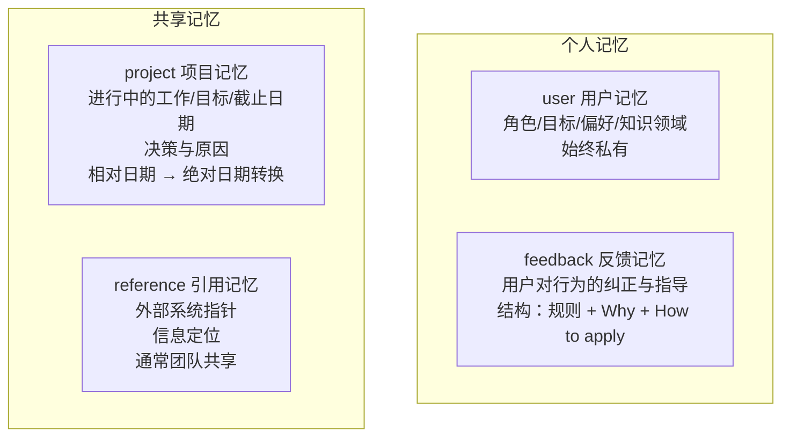
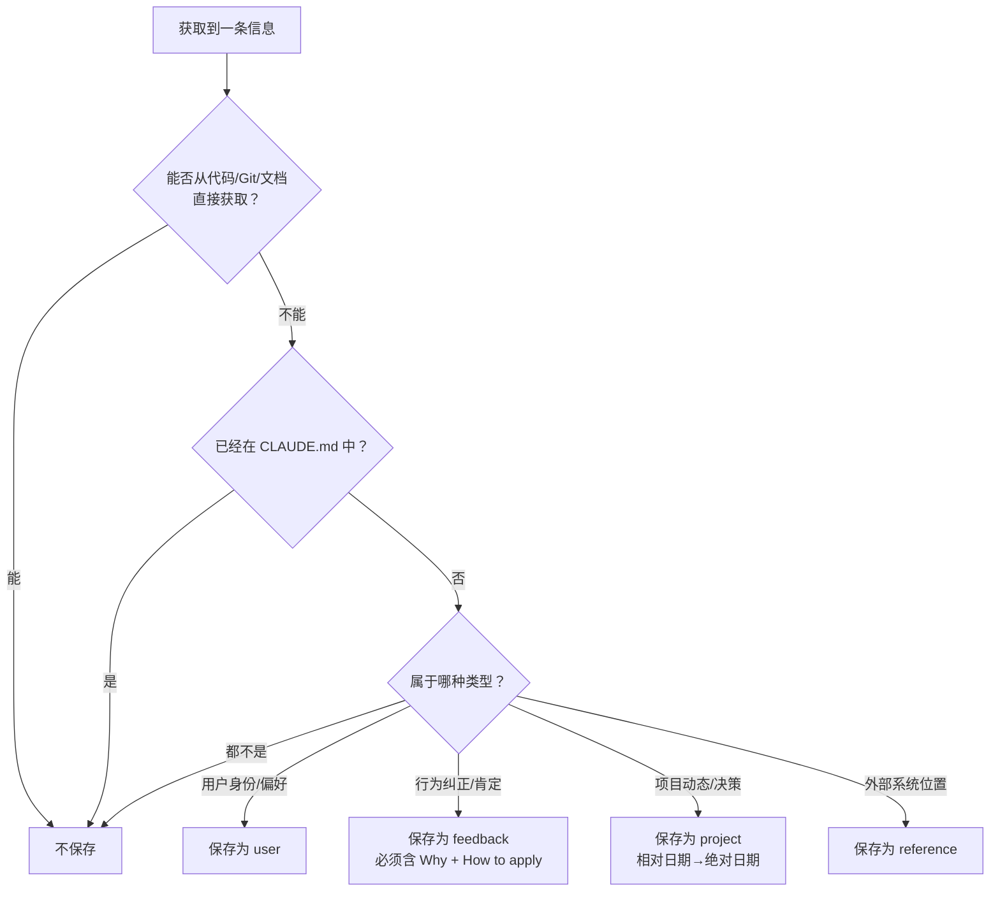
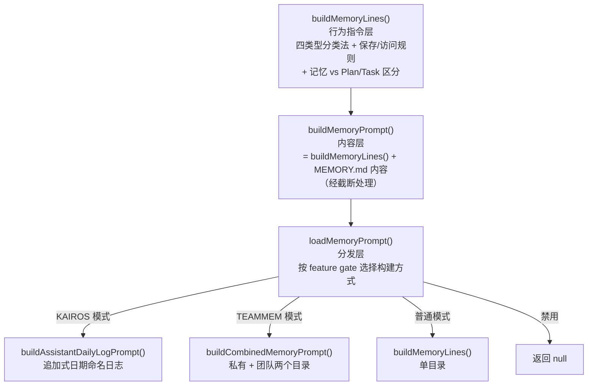

# 第 10 章：记忆系统与 CLAUDE.md

> **本章目标**：理解 Claude Code 的记忆机制，以及如何用 CLAUDE.md 构建「永久记忆」。

---

## 10.1 先用大白话理解

Claude Code 有个根本性的限制：**每次新开一个会话，它就「失忆」了**。之前教过它的规则、讨论过的决策、约定好的风格——全部清零。

CLAUDE.md 就是解决这个问题的方案。它是一个纯文本文件，Claude Code 每次启动时都会读取它，把里面的内容当作「长期记忆」加载进来。

---

## 10.2 四种记忆类型

| 类型 | 存储位置 | 生命周期 | 说明 |
|------|---------|---------|------|
| **上下文记忆** | 当前对话历史 | 会话内 | 本次对话的所有内容 |
| **项目记忆** | `CLAUDE.md` | 永久 | 项目规则和约定 |
| **全局记忆** | `~/.claude/CLAUDE.md` | 永久 | 跨项目的个人偏好 |
| **工具记忆** | 文件系统 | 永久 | AI 主动写入的笔记文件 |

---

## 10.3 CLAUDE.md 的加载优先级

```
~/.claude/CLAUDE.md          ← 全局规则（对所有项目生效）
    ↓ 被覆盖
~/projects/CLAUDE.md         ← 父目录规则
    ↓ 被覆盖
~/projects/myapp/CLAUDE.md   ← 项目根目录规则（最常用）
    ↓ 被覆盖
~/projects/myapp/src/CLAUDE.md ← 子目录规则（最高优先级）
```

---

## 10.4 什么应该写进 CLAUDE.md？

**写这些：**

```markdown
# 项目约定

## 技术栈
- 后端：FastAPI（不要推荐 Flask）
- 数据库：PostgreSQL + SQLAlchemy
- 测试：pytest，覆盖率要求 80%+

## 代码风格
- 明确优于聪明（不要写过于「聪明」的代码）
- 函数不超过 50 行
- 所有公共函数必须有类型注解

## 禁止事项
- 不要用 print 调试，用 logging
- 不要直接修改 main 分支，总是创建 feature 分支
- 不要在没有测试的情况下重构

## 历史决策
- 2024-03：选择 FastAPI 而不是 Django，原因是团队更熟悉异步编程
- 2024-06：放弃 Redis 缓存，因为数据量不够大，增加了不必要的复杂度
```

**不要写这些：**

```markdown
# ❌ 错误示例

## 技术栈
- 我用 React（Claude 读 package.json 就知道了）
- 我的项目叫 myapp（Claude 看目录名就知道了）

## 风格
- 我通常更倾向于写明确易懂的代码而不是过于聪明的代码
  （改成「明确优于聪明」，省 7 倍 Token，效果一样）
```

**核心原则：只记录文件里看不见的东西。** AI 能从代码中读出来的，不需要写进 CLAUDE.md。

---

## 10.5 CLAUDE.md 的加载机制

CLAUDE.md 在技术上是如何加载的？它不是简单地把文件内容拼接到系统提示词前面。

**加载时机**：Claude Code 在每次会话开始时加载 CLAUDE.md，而不是每次工具调用时。这意味着 CLAUDE.md 的内容会被加入到第一条消息之前的系统提示词中。

**Prompt Cache 优化**：CLAUDE.md 的内容会被标记为可缓存（`cache_control: ephemeral`）。这意味着在同一个会话中，CLAUDE.md 的 Token 只需计算一次，后续每次调用 API 都会命中缓存。这对于内容较多的 CLAUDE.md 来说，可以显著降低成本。

**内容大小建议**：虽然没有硬性限制，但建议将 CLAUDE.md 控制在 2,000 Token 以内。过长的 CLAUDE.md 会占用寝贵的上下文窗口，可能导致其他重要信息被压缩或截断。

---

## 10.6 AI 的自动洞察机制

Claude Code 源码 `insights.ts` 里有一个主动学习机制：**定期分析用户的历史会话，找出「你在重复告诉 Claude 同一件事」的模式**。

比如你在三次不同的会话里都说过「记得跑测试」，系统就会检测到这个模式，然后建议你：把「修改代码后自动跑测试」写进 CLAUDE.md。

这个设计的价值：**用户不需要知道怎么配置，AI 自己会发现并提出来**。

---

## 10.7 团队 CLAUDE.md 模板

```markdown
# [项目名] Claude Code 配置

## 项目概述
[一句话描述项目做什么]

## 技术栈
[列出核心技术，以及为什么选择它们而不是替代品]

## 代码规范
[团队约定的规范，特别是「为什么不用另一种方式」]

## 禁止事项
[明确列出不允许做的事，比「应该做什么」更重要]

## 历史决策
[重要的架构决策和原因，防止 AI 重新「发明」已经放弃的方案]

## 常用命令
[项目特有的命令，比如 `npm run dev:mock` 启动 mock 模式]
```

---

## 10.8 memdir：AI 的主动记忆

除了 CLAUDE.md，Claude Code 还有一个更动态的记忆系统：**memdir**。

`memdir/` 是一个目录，AI 可以在这里主动写入笔记文件。与 CLAUDE.md 不同，memdir 的内容是 AI 自己生成和管理的，而不是用户写的。

```
~/.claude/memdir/
├── user-preferences.md      ← AI 学到的用户偏好
├── project-insights.md      ← 对当前项目的洞察
├── common-patterns.md       ← 观察到的代码模式
└── lessons-learned.md       ← 历史错误和教训
```

**语义召回**：memdir 不是每次全量加载，而是根据当前任务的相关性进行语义搜索，只加载最相关的片段。这解决了记忆内容过多时占用上下文窗口的问题。

---

> 下一章：[宠物系统与彩蛋 →](#/docs/11-buddy-system)

---

## 10.9 四种记忆类型的深度分析

Claude Code 的 memdir 系统使用**封闭的四类型分类法**（closed taxonomy），每种类型有明确的职责边界和结构要求：



| 类型 | 记什么 | 示例 | 触发时机 |
|------|--------|------|---------|
| **user** | 用户身份、偏好、知识背景 | "用户是数据科学家，专注可观测性" | 了解到用户角色/偏好时 |
| **feedback** | 对 Agent 行为的纠正 | "不要在响应末尾总结，用户能自己看 diff" | 用户纠正行为时（"不要..."、"别再..."） |
| **project** | 项目进展、决策、截止日期 | "2026-03-05 合并冻结，移动端发布" | 了解到谁在做什么、为什么、截止日期时 |
| **reference** | 外部系统的定位信息 | "管道 Bug 追踪在 Linear INGEST 项目" | 了解到外部系统中信息位置时 |

**为什么是四种类型而非自由标签？** 封闭分类法强制 Agent 做出明确的语义分类，避免标签膨胀导致召回时的模糊匹配。每种类型有不同的保存结构和使用方式——这让模型在写入和读取时都有明确的行为指引。

---

## 10.10 feedback 类型：不只记录失败

feedback 不仅记录用户的纠正，还记录用户的肯定：

> 如果你只保存纠正，你会避免过去的错误，但会偏离用户已经验证过的好方法，并可能变得过于谨慎。

这是一个深刻的观察。假设用户说「这次的代码风格很好，以后就这样写」，如果不记录这个正面反馈，Agent 可能在下次会话中「改进」代码风格——结果反而偏离了用户满意的方向。

### feedback 和 project 的结构化要求

这两种类型要求特定的正文结构：

```markdown
规则或事实本身。

**Why:** 用户给出这个反馈的原因——通常是一个过去的事故或强烈偏好。
**How to apply:** 什么时候/在哪里应用这条指导。
```

**为什么需要 Why？** 知道「为什么」让 Agent 能够判断边界情况，而不是盲目遵守规则。

举个例子：如果记忆只记录「不要 mock 数据库」，Agent 会在所有测试中避免 mock。但如果记忆还包含「Why: 上季度 mock 测试通过但生产环境迁移失败」，Agent 就能判断——这条规则适用于集成测试，单元测试中的轻量级 mock 可能没问题。

---

## 10.11 存储架构

### 存储格式

每条记忆是独立的 Markdown 文件，带 YAML frontmatter：

```markdown
---
name: 简洁回复偏好
description: 用户不希望在响应末尾看到总结
type: feedback
---

不要在每次响应末尾总结已完成的操作。

**Why:** 用户明确表示可以自己阅读 diff。
**How to apply:** 所有响应保持简洁，省略尾部总结。
```

关键设计：`description` 字段不仅是元数据，它是**召回系统的核心依据**。当模型在选择相关记忆时，主要依赖 description 判断相关性，因此 description 必须足够具体——「用户偏好」太泛，「用户不希望在响应末尾看到总结」才够精确。

### 目录结构

```
~/.claude/projects/{project-hash}/memory/
├── MEMORY.md              ← 索引文件（每次会话自动加载）
├── user_role.md            ← 用户记忆
├── feedback_terse.md       ← 反馈记忆
├── project_freeze.md       ← 项目记忆
└── reference_linear.md     ← 引用记忆
```

### 路径解析：三级优先

记忆目录的位置通过三级优先级链确定：

| 优先级 | 来源 | 用途 |
|--------|------|------|
| 1 | `CLAUDE_COWORK_MEMORY_PATH_OVERRIDE` 环境变量 | Cowork/SDK 集成，完全绕过标准路径 |
| 2 | `autoMemoryDirectory` in settings.json | 用户自定义记忆存储位置（支持 `~/` 展开） |
| 3 | `~/.claude/projects/{sanitized-git-root}/memory/` | 默认路径 |

**安全决策：为什么 projectSettings 被排除？**

`getAutoMemPathSetting()` 只从 user/managed settings 读取，**不**从 projectSettings 读取。原因是安全：projectSettings 来自项目的 `.claude/settings.json` 文件，它是被签入代码仓库的。一个恶意的仓库可以设置 `autoMemoryDirectory: "~/.ssh"`，让 Claude Code 的记忆写入操作获得对用户 SSH 密钥目录的写访问权限。

---

## 10.12 MEMORY.md：索引而非容器

`MEMORY.md` 是记忆系统的**索引文件**，不是记忆容器。每个条目应为一行链接：

```markdown
# 记忆索引

- [简洁回复偏好](feedback_terse.md)
- [用户角色：数据科学家](user_role.md)
- [项目：2026-03-05 合并冻结](project_freeze.md)
- [Linear 项目追踪位置](reference_linear.md)
```

**为什么用索引而不是直接存内容？**

1. **按需加载**：每次会话只加载 MEMORY.md（索引），完整记忆内容在需要时才读取
2. **语义召回**：系统根据当前任务的相关性，从索引中选择最相关的记忆文件加载
3. **独立更新**：每条记忆独立存储，更新一条记忆不影响其他记忆

---

## 10.13 什么不该保存

记忆系统有一个明确的排除列表：

- **代码模式、约定、架构、文件路径、项目结构**——读当前代码即可获得
- **Git 历史、最近的改动、谁改了什么**——git log / git blame 是权威来源
- **调试方案或修复步骤**——修复在代码里，上下文在 commit 消息中
- **已经记录在 CLAUDE.md 中的内容**
- **临时任务细节**：进行中的工作、临时状态、当前对话上下文

关键设计点：这些排除规则**即使用户明确要求保存也生效**。如果用户说「记住这个 PR 列表」，Agent 应该引导用户思考「这个列表中有什么是不可推导的？是关于它的某个决策、某个意外发现，还是某个截止日期？」

---

## 10.14 记忆决策流程



---

## 10.15 设计洞察

**CLAUDE.md 和 memdir 的互补性**：CLAUDE.md 存「项目是什么」（静态规则），memdir 存「和这个人协作时要注意什么」（动态学习）。两者互补：CLAUDE.md 是用户主动配置的，memdir 是 AI 主动学习的。

**封闭分类法的价值**：四种类型的封闭分类法强制 Agent 做出明确的语义分类。相比自由标签，封闭分类法让召回更精确——系统知道「feedback 类型的记忆应该在行为决策时加载」，而不需要对每条记忆进行语义推断。

**「目录预创建」消除低效行为**：系统在会话开始时预创建记忆目录，并在系统提示词中明确告知模型「目录已存在，直接写入」。这是一个「用系统设计消除模型低效行为」的典型例子——与其期望模型学会不检查目录，不如直接预创建并明确告知。

---

> 下一章：[宠物系统与彩蛋 →](#/docs/11-buddy-system)

---

## 10.16 记忆提示词构建层级

记忆系统的提示词构建分为三个层级，每层叠加不同的内容：



### buildMemoryLines() 的八个子节

`buildMemoryLines()` 构建的指令包含八个子节：

1. **持久化记忆介绍**：告知模型记忆目录路径，说明目录已存在
2. **显式保存/遗忘**：用户说「记住」→ 立即保存，说「忘记」→ 查找并删除
3. **四类型分类法**：user / feedback / project / reference 的完整定义、示例、保存时机
4. **什么不该保存**：代码模式、git 历史、CLAUDE.md 已有内容等排除列表
5. **如何保存**：两步流程（写文件 + 更新 MEMORY.md）或单步（skipIndex 模式）
6. **何时访问**：三条规则 + 「用户说忽略则忽略」
7. **信任召回**：验证记忆中的引用，不盲信
8. **记忆 vs 其他持久化**：Plan 用于对齐实施方案，Task 用于追踪当前会话进度，记忆用于跨会话信息

第 8 点的区分特别重要——模型容易混淆何时用记忆、何时用 Plan、何时用 Task：

> - **Plan**：非平凡实现任务的方案对齐，变更应更新 Plan 而非保存记忆
> - **Task**：当前会话中的步骤分解和进度追踪
> - **记忆**：跨会话有价值的信息

---

## 10.17 KAIROS 模式

KAIROS 是一个实验性的「助手模式」，为长期运行的会话设计。与普通模式维护 MEMORY.md 实时索引不同，KAIROS 模式将信息追加到**日期命名的日志文件**中：

```
~/.claude/projects/{hash}/logs/
└── 2026/
    └── 04/
        └── 2026-04-01.md    ← 今天的日志
```

每天的日志是追加式的，避免了频繁更新 MEMORY.md 索引的开销。定期通过 `/dream` 技能将日志**蒸馏**为结构化的主题记忆文件。这种「先追加、后整理」的模式适合高频交互场景。

---

## 10.18 团队记忆

当启用团队记忆（`TEAMMEM` feature gate）时，系统管理两个记忆目录：

```
~/.claude/projects/{hash}/memory/          ← 私有记忆（仅自己可见）
~/.claude/projects/{hash}/memory/team/     ← 团队记忆（项目成员共享）
```

### 作用域指导

| 类型 | 默认作用域 | 原因 |
|------|-----------|------|
| **user** | 始终私有 | 个人偏好不应强加给团队 |
| **feedback** | 偏向私有，项目约定可团队共享 | 「不要总结」是个人偏好；「测试必须用真实数据库」是团队约定 |
| **project** | 偏向团队 | 里程碑、决策对所有成员有价值 |
| **reference** | 偏向团队 | 外部系统位置是共享知识 |

**敏感数据防护**：团队记忆的提示词中明确要求「MUST NOT save sensitive data (API keys, credentials) in team memories」。私有记忆也不建议存储敏感信息，但团队记忆中这是强制要求——因为团队记忆会被其他成员的 Agent 读取。

---

## 10.19 Agent 记忆

除了主 Agent 的记忆系统，Claude Code 还为**子 Agent**（通过 Agent 工具创建的）提供了独立的记忆系统（`src/tools/AgentTool/agentMemory.ts`）。

### 三个作用域

```
user 作用域:    ~/.claude/agent-memory/{agentType}/
project 作用域: .claude/agent-memory/{agentType}/
local 作用域:   .claude/agent-memory-local/{agentType}/
```

- **user**：跨所有项目的 Agent 级知识（如「这种类型的探索 Agent 应该如何工作」）
- **project**：项目特定的 Agent 知识（如「这个项目的测试 Agent 应该使用哪个测试框架」）
- **local**：本地机器特定，不会签入版本控制

### 为什么与主记忆分离？

子 Agent 的知识类型与主 Agent 不同。一个「explorer」Agent 学到的代码导航技巧、一个「test-runner」Agent 学到的测试模式——这些是 Agent 类型特有的操作知识，与用户偏好和项目决策没有关系。分离存储避免了主记忆被 Agent 操作细节污染。

---

## 10.20 记忆注入对话的方式

### MEMORY.md：系统提示词注入

MEMORY.md 内容通过 `systemPromptSection('memory', () => loadMemoryPrompt())` 注入系统提示词。这意味着：

- 每次会话自动加载
- 经过截断处理（两层截断防御长索引）
- 位于系统提示词的动态部分

### 召回的记忆：用户消息注入

通过 Sonnet 选中的记忆作为 **user message**（带 `isMeta: true`）注入对话：

```typescript
case 'relevant_memories': {
  return wrapMessagesInSystemReminder(
    attachment.memories.map(m => createUserMessage({
      content: `${memoryHeader(m.path, m.mtimeMs)}\n\n${m.content}`,
      isMeta: true
    }))
  )
}
```

`memoryHeader()` 包含文件路径、修改时间的人类可读距离（如「3 days ago」）、和新鲜度警告。记忆被包裹在 `<system-reminder>` 标签中，与其他上下文信息归为同一组。

`isMeta: true` 标记确保这些消息在 UI 中不作为用户消息显示，但模型能看到它们。

---

## 10.21 后台提取 Agent 模式

记忆提取通过 `runForkedAgent()` 创建的后台 Agent 完成。这个模式的关键优势：

- **共享父级的 prompt cache**：系统提示词不需要重新计算和传输，大幅降低提取的 token 消耗
- **互斥机制**：避免多个提取 Agent 同时运行，防止重复提取
- **最小权限**：提取 Agent 只有写入记忆目录的权限，无法执行其他操作
- **范围限制**：`MUST only use content from last ~${newMessageCount} messages`——只从最新的消息中提取，不重新处理已处理过的历史

这个模式可推广到任何「后台智能」场景——需要在主对话流之外运行智能处理任务时，forked agent + 共享 cache + 最小权限是标准模式。

---

## 10.22 设计洞察（深度扩展）

**「eval 驱动的提示词工程」**：记忆系统的每个提示词节都经过测评验证，不是凭直觉添加的。TRUSTING_RECALL_SECTION 的加入直接由 eval 数据驱动（0/2 → 3/3）。这体现了一个重要原则：**提示词工程应该是数据驱动的，而不是直觉驱动的**。在没有 eval 数据的情况下，很难判断某个提示词节是否真的有效。

**「frontmatter 作为统一接口」**：记忆和技能使用相同的 Markdown + YAML frontmatter 格式，降低了模型的认知负担——只需学习一种文件格式就能操作两个系统。这体现了「最小化认知负担」的设计原则：当两个系统的数据格式相似时，统一格式比各自优化更有价值。

**「两层截断防御」的数据驱动设计**：行截断捕捉正常增长，字节截断捕捉异常长行（实际观察到 197KB 在 200 行内）。这不是理论上的防御，而是基于真实观察的防御——面向实际数据设计，而非理论场景。

**「团队记忆的信任边界」**：团队记忆实现了一种「有限信任共享」模型——项目知识（决策、里程碑）可以共享，个人偏好（工作方式、反馈）保持私有。这个边界的设计反映了团队协作的真实需求：我需要知道「这个项目用哪个测试框架」，但不需要知道「我的同事喜欢怎样的代码风格」。

---

> 下一章：[宠物系统与彩蛋 →](#/docs/11-buddy-system)
