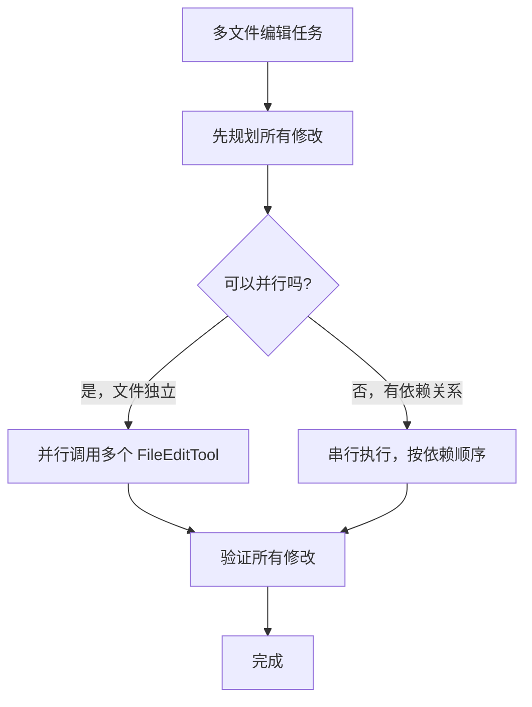

# 第 13 章：代码编辑策略

> **本章目标**：理解 Claude Code 为什么用 Search-and-Replace 而不是行号编辑，以及这个设计决策背后的工程逻辑。

---

## 13.1 先用大白话理解

想象你要修改一份合同文件。有两种方式：

**方式一（行号编辑）**：「把第 42 行改成这个」。问题是，如果你之前在第 10 行插入了新内容，所有行号都变了，第 42 行现在已经不是你想改的那行了。

**方式二（Search-and-Replace）**：「找到这段文字，把它改成那段文字」。无论文件怎么变化，只要目标文字还在，就能找到并修改它。

Claude Code 选择了方式二——这不是偶然，而是经过深思熟虑的工程决策。

---

## 13.2 两种编辑工具

Claude Code 提供两种文件编辑工具，各有其适用场景：

| 工具 | 策略 | 适用场景 | 破坏性 |
|------|------|---------|--------|
| **FileEditTool** | search-and-replace | 修改已有文件中的特定部分 | 低 |
| **FileWriteTool** | 全文件覆盖写入 | 创建新文件或完整重写 | 高 |

系统提示词明确指引模型：**优先使用 FileEditTool**。只有在创建全新文件或需要完整重写时，才使用 FileWriteTool。

---

## 13.3 FileEditTool：Search-and-Replace 方法

FileEditTool 是 Claude Code 代码编辑的核心工具，采用精确字符串替换策略。

### 输入 Schema

```typescript
{
  file_path: string    // 要编辑的文件绝对路径
  old_string: string   // 要替换的精确字符串
  new_string: string   // 替换后的新字符串
  replace_all?: boolean // 是否替换所有出现位置（默认 false）
}
```

### 工作原理

FileEditTool 不需要行号、不需要正则表达式。它的工作方式极其简单：

1. 在文件中精确查找 `old_string`
2. 确保 `old_string` 在文件中**唯一出现**（除非 `replace_all=true`）
3. 将其替换为 `new_string`
4. 如果 `old_string` 不唯一，返回错误，要求提供更多上下文

### 为什么 Search-and-Replace 优于其他方案

这个设计选择背后有深刻的工程考量：

**低破坏性**：Search-and-replace 只修改目标文本，文件的其余部分完全不变。相比之下，全文件写入可能意外丢失未预期的内容、引入格式变化（缩进、空行）、在大文件上因 Token 限制截断内容。

**可验证性**：每次编辑都有明确的「before」和「after」。用户可以精确看到什么被改了——这比看一个完整的新文件要容易得多。

**抗幻觉**：模型需要提供文件中**实际存在**的精确字符串。如果模型「幻觉」了不存在的代码，编辑会直接失败并返回错误，而不是静默地写入错误内容。

**Token 效率**：对大文件的小修改，search-and-replace 只需要发送修改点附近的上下文，而不是整个文件内容。

**Git 友好**：Search-and-replace 产生的 diff 最小化、最精确。自动化 PR 创建时，reviewer 看到的是干净的、有针对性的变更。

---

## 13.4 为什么不用行号编辑？

基于行号的编辑（如 `edit line 42-45`）是最直觉的方案，但也是最脆弱的。

**行号偏移问题**：当模型在一个对话 turn 中需要对同一文件做多处修改时，第一个编辑（比如在第 10 行插入 3 行代码）会导致后续所有行号偏移。模型要么需要一个复杂的行号重算逻辑，要么只能保证每次只编辑一处。

而 search-and-replace 是**位置无关**的：不管文件上方插入了多少行，目标字符串的内容不会变，匹配始终有效。

---

## 13.5 为什么不用 AST 编辑？

基于 AST 的编辑（如 `rename function foo to bar`）在理论上很优雅，但实际不可行：

1. Claude Code 需要支持几十种编程语言，为每种语言维护一个完整的 AST 解析器成本极高
2. **语法错误的文件恰恰是最需要编辑的文件**，但 AST 解析器在遇到语法错误时会直接报错拒绝解析——在最需要编辑工具的场景下，工具反而不可用

---

## 13.6 为什么不用 Unified Diff？

让模型直接输出 `@@ -1,3 +1,4 @@` 格式的 diff 看起来很专业，但 LLM 在生成这种严格格式时表现很差。

Unified diff 要求：
- 精确的 hunk header（起始行号和行数）
- 每一行都正确使用 `+`/`-`/空格 前缀
- 上下文行数必须与 header 声明一致

任何一个字符的偏差都会导致整个 patch 无法应用。相比之下，search-and-replace 只需要模型提供两段自然语言级别的字符串——这正是 LLM 最擅长的任务形式。

---

## 13.7 幻觉安全：最被低估的优势

考虑这个场景：模型「记得」文件中有一个 `handleError()` 函数，但实际上这个函数在上一次重构中已经被重命名为 `processError()`。

**使用 search-and-replace**：模型提供 `old_string: "function handleError()"` 会直接失败（error: "String to replace not found in file"），模型看到错误后会重新读取文件，发现正确的函数名。

**使用全文件重写**：模型可能会写出包含 `handleError()` 的完整文件，覆盖掉正确的 `processError()`——而且这个错误完全是静默的，不会有任何报错。

这就是为什么 search-and-replace 是**自我纠错**的：错误会立即显现，而不是悄悄地被写入文件。

---

## 13.8 多文件编辑策略

当需要同时修改多个文件时，Claude Code 的策略是：



**并行编辑的条件**：两个文件的修改互不依赖——修改 A 文件不会影响 B 文件的内容。在这种情况下，Claude Code 会同时发出多个 FileEditTool 调用，显著提升速度。

**串行编辑的情况**：当 A 文件的修改会影响 B 文件的内容时（比如重命名一个被多处引用的函数），需要先修改 A，再根据 A 的修改结果来修改 B。

---

## 13.9 设计洞察

**工具设计的核心原则：让错误显现，而不是隐藏**。FileEditTool 在找不到目标字符串时立即报错，这看起来是「失败」，但实际上是「安全失败」——它阻止了错误的修改被静默写入。

相比之下，「宽容」的工具（比如模糊匹配、自动推断行号）看起来更智能，但它们把错误隐藏了起来，让问题在更难发现的地方爆发。

这个原则在软件工程中被称为「快速失败（Fail Fast）」——越早发现问题，修复成本越低。

---

> 下一章：[Hooks 与可扩展性 →](#/docs/14-hooks-extensibility)
