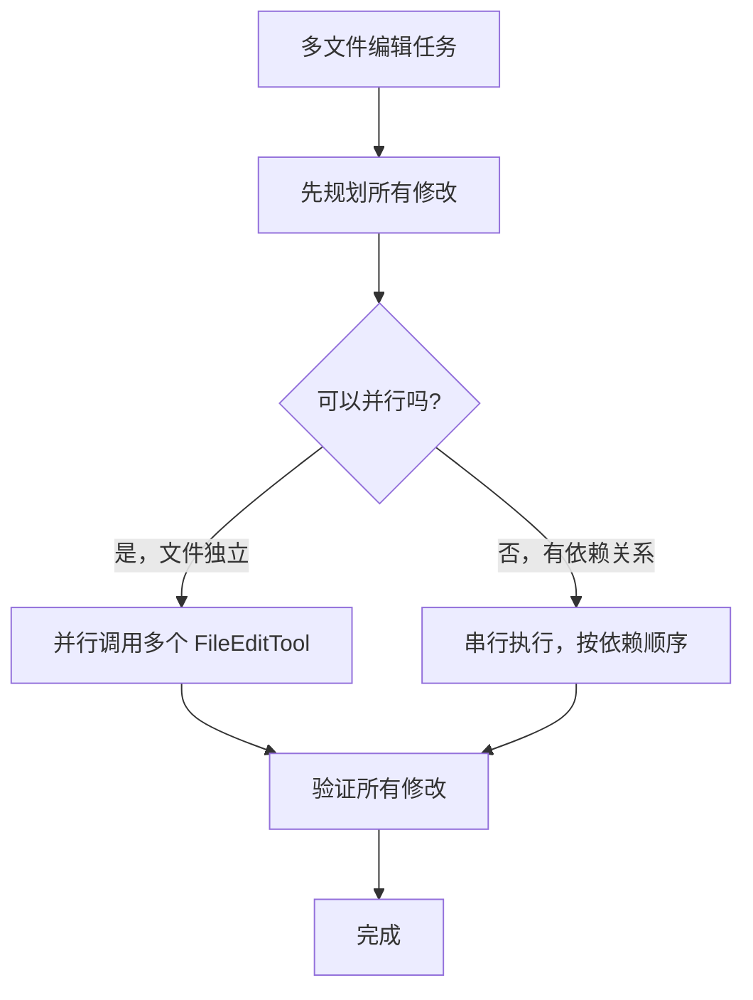

# 第 13 章：代码编辑策略

> **本章目标**：理解 Claude Code 为什么用 Search-and-Replace 而不是行号编辑，以及这个设计决策背后的工程逻辑。

---

## 13.1 先用大白话理解

想象你要修改一份合同文件。有两种方式：

**方式一（行号编辑）**：「把第 42 行改成这个」。问题是，如果你之前在第 10 行插入了新内容，所有行号都变了，第 42 行现在已经不是你想改的那行了。

**方式二（Search-and-Replace）**：「找到这段文字，把它改成那段文字」。无论文件怎么变化，只要目标文字还在，就能找到并修改它。

Claude Code 选择了方式二——这不是偶然，而是经过深思熟虑的工程决策。

---

## 13.2 两种编辑工具

Claude Code 提供两种文件编辑工具，各有其适用场景：

| 工具 | 策略 | 适用场景 | 破坏性 |
|------|------|---------|--------|
| **FileEditTool** | search-and-replace | 修改已有文件中的特定部分 | 低 |
| **FileWriteTool** | 全文件覆盖写入 | 创建新文件或完整重写 | 高 |

系统提示词明确指引模型：**优先使用 FileEditTool**。只有在创建全新文件或需要完整重写时，才使用 FileWriteTool。

---

## 13.3 FileEditTool：Search-and-Replace 方法

FileEditTool 是 Claude Code 代码编辑的核心工具，采用精确字符串替换策略。

### 输入 Schema

```typescript
{
  file_path: string    // 要编辑的文件绝对路径
  old_string: string   // 要替换的精确字符串
  new_string: string   // 替换后的新字符串
  replace_all?: boolean // 是否替换所有出现位置（默认 false）
}
```

### 工作原理

FileEditTool 不需要行号、不需要正则表达式。它的工作方式极其简单：

1. 在文件中精确查找 `old_string`
2. 确保 `old_string` 在文件中**唯一出现**（除非 `replace_all=true`）
3. 将其替换为 `new_string`
4. 如果 `old_string` 不唯一，返回错误，要求提供更多上下文

### 为什么 Search-and-Replace 优于其他方案

这个设计选择背后有深刻的工程考量：

**低破坏性**：Search-and-replace 只修改目标文本，文件的其余部分完全不变。相比之下，全文件写入可能意外丢失未预期的内容、引入格式变化（缩进、空行）、在大文件上因 Token 限制截断内容。

**可验证性**：每次编辑都有明确的「before」和「after」。用户可以精确看到什么被改了——这比看一个完整的新文件要容易得多。

**抗幻觉**：模型需要提供文件中**实际存在**的精确字符串。如果模型「幻觉」了不存在的代码，编辑会直接失败并返回错误，而不是静默地写入错误内容。

**Token 效率**：对大文件的小修改，search-and-replace 只需要发送修改点附近的上下文，而不是整个文件内容。

**Git 友好**：Search-and-replace 产生的 diff 最小化、最精确。自动化 PR 创建时，reviewer 看到的是干净的、有针对性的变更。

---

## 13.4 为什么不用行号编辑？

基于行号的编辑（如 `edit line 42-45`）是最直觉的方案，但也是最脆弱的。

**行号偏移问题**：当模型在一个对话 turn 中需要对同一文件做多处修改时，第一个编辑（比如在第 10 行插入 3 行代码）会导致后续所有行号偏移。模型要么需要一个复杂的行号重算逻辑，要么只能保证每次只编辑一处。

而 search-and-replace 是**位置无关**的：不管文件上方插入了多少行，目标字符串的内容不会变，匹配始终有效。

---

## 13.5 为什么不用 AST 编辑？

基于 AST 的编辑（如 `rename function foo to bar`）在理论上很优雅，但实际不可行：

1. Claude Code 需要支持几十种编程语言，为每种语言维护一个完整的 AST 解析器成本极高
2. **语法错误的文件恰恰是最需要编辑的文件**，但 AST 解析器在遇到语法错误时会直接报错拒绝解析——在最需要编辑工具的场景下，工具反而不可用

---

## 13.6 为什么不用 Unified Diff？

让模型直接输出 `@@ -1,3 +1,4 @@` 格式的 diff 看起来很专业，但 LLM 在生成这种严格格式时表现很差。

Unified diff 要求：
- 精确的 hunk header（起始行号和行数）
- 每一行都正确使用 `+`/`-`/空格 前缀
- 上下文行数必须与 header 声明一致

任何一个字符的偏差都会导致整个 patch 无法应用。相比之下，search-and-replace 只需要模型提供两段自然语言级别的字符串——这正是 LLM 最擅长的任务形式。

---

## 13.7 幻觉安全：最被低估的优势

考虑这个场景：模型「记得」文件中有一个 `handleError()` 函数，但实际上这个函数在上一次重构中已经被重命名为 `processError()`。

**使用 search-and-replace**：模型提供 `old_string: "function handleError()"` 会直接失败（error: "String to replace not found in file"），模型看到错误后会重新读取文件，发现正确的函数名。

**使用全文件重写**：模型可能会写出包含 `handleError()` 的完整文件，覆盖掉正确的 `processError()`——而且这个错误完全是静默的，不会有任何报错。

这就是为什么 search-and-replace 是**自我纠错**的：错误会立即显现，而不是悄悄地被写入文件。

---

## 13.8 多文件编辑策略

当需要同时修改多个文件时，Claude Code 的策略是：



**并行编辑的条件**：两个文件的修改互不依赖——修改 A 文件不会影响 B 文件的内容。在这种情况下，Claude Code 会同时发出多个 FileEditTool 调用，显著提升速度。

**串行编辑的情况**：当 A 文件的修改会影响 B 文件的内容时（比如重命名一个被多处引用的函数），需要先修改 A，再根据 A 的修改结果来修改 B。

---

## 13.9 设计洞察

**工具设计的核心原则：让错误显现，而不是隐藏**。FileEditTool 在找不到目标字符串时立即报错，这看起来是「失败」，但实际上是「安全失败」——它阻止了错误的修改被静默写入。

相比之下，「宽容」的工具（比如模糊匹配、自动推断行号）看起来更智能，但它们把错误隐藏了起来，让问题在更难发现的地方爆发。

这个原则在软件工程中被称为「快速失败（Fail Fast）」——越早发现问题，修复成本越低。

---

> 下一章：[Hooks 与可扩展性 →](#/docs/14-hooks-extensibility)

---

## 13.10 输入预处理管线

在进入核心的验证和执行流程之前，模型的输入会先经过一个预处理阶段。`normalizeFileEditInput()` 负责清洗模型输出中常见的瑕疵：

### 尾部空白裁剪

模型生成代码时经常在行尾添加多余的空格或 tab。`stripTrailingWhitespace()` 会对 `new_string` 的每一行去除尾部空白字符。但这个规则有一个重要的例外：**`.md` 和 `.mdx` 文件不做尾部空白裁剪**。这是因为在 Markdown 语法中，行尾的两个空格表示硬换行（`<br>`），裁剪掉会改变文档的语义。

```typescript
// Markdown 使用两个尾部空格作为硬换行——裁剪会改变语义
const isMarkdown = /\.(md|mdx)$/i.test(file_path)
const normalizedNewString = isMarkdown
  ? new_string
  : stripTrailingWhitespace(new_string)
```

### API 反消毒（Desanitization）

Claude API 出于安全考虑，会将某些 XML 标签「消毒」（sanitize）为短形式，防止模型输出被误解析为 API 控制标签。例如：

| 消毒后（模型看到的） | 原始形式（文件中的） |
|---|---|
| `<fnr>` | `<function_results>` |
| `<n>` / `</n>` | `<name>` / `</name>` |
| `<s>` / `</s>` | `<system>` / `</system>` |
| `\n\nH:` | `\n\nHuman:` |
| `\n\nA:` | `\n\nAssistant:` |

当模型输出的 `old_string` 无法精确匹配文件内容时，`desanitizeMatchString()` 会尝试将这些消毒后的短形式还原为原始标签。如果还原后能匹配成功，同样的替换也会应用到 `new_string`，确保编辑的一致性。

这个预处理阶段对用户完全透明——大多数情况下用户不会意识到它的存在。但对于编辑包含 XML 标签或 `Human:`/`Assistant:` 等特殊字符串的文件（例如 prompt 模板文件），它是编辑能否成功的关键。

---

## 13.11 完整验证管线

FileEditTool 的 `validateInput()` 方法实现了一个多层验证管线，在真正执行编辑之前拦截各种问题。验证的顺序是刻意设计的：**低成本的检查在前，需要文件 I/O 的检查在中，依赖文件内容的检查在后**。这样在早期阶段就能拦截的问题不会浪费后续的磁盘读取开销。

完整的验证步骤和对应的错误码：

| 步骤 | 错误码 | 检查内容 | 目的 |
|------|--------|---------|------|
| 1 | 0 | `checkTeamMemSecrets()` | 防止将密钥写入团队记忆文件 |
| 2 | 1 | `old_string === new_string` | 拒绝无意义的空操作 |
| 3 | 2 | 权限 deny 规则匹配 | 尊重用户配置的路径排除规则 |
| 4 | — | UNC 路径检测 | 安全：防止 Windows NTLM 凭据泄露 |
| 5 | 10 | 文件大小 > 1 GiB | 防止 V8 字符串长度限制导致 OOM |
| 6 | — | 文件编码检测 | 通过 BOM 判断 UTF-16LE 还是 UTF-8 |
| 7 | 4 | 文件不存在 + `old_string` 非空 | 找不到目标文件，尝试给出相似文件建议 |
| 8 | 3 | `old_string` 为空 + 文件已有内容 | 阻止用「创建新文件」的方式覆盖已有文件 |
| 9 | 5 | `.ipynb` 扩展名检测 | 重定向到 NotebookEditTool |
| 10 | 6 | `readFileState` 缺失或 `isPartialView` | 文件未被读取——必须先读 |
| 11 | 7 | `mtime > readTimestamp.timestamp` | 文件被外部修改——需要重新读取 |
| 12 | 8 | `findActualString()` 返回 null | `old_string` 在文件中不存在 |
| 13 | 9 | 匹配数 > 1 且 `replace_all=false` | 多个匹配但未指定全局替换 |
| 14 | 10 | `validateInputForSettingsFileEdit()` | Claude 配置文件的 JSON Schema 校验 |

**步骤 7-8：文件创建的双重门控**。`old_string` 为空有特殊语义——它表示「创建新文件」。当 `old_string` 为空且文件不存在时，验证直接通过；当 `old_string` 为空但文件已存在且有内容时（error code 3），会阻止操作，防止模型误用创建语义覆盖已有文件。但如果文件存在且内容为空（`fileContent.trim() === ''`），则允许通过——这处理了「空文件等同于不存在」的边界情况。

**步骤 11：文件被外部修改检测**。这是一个精妙的设计：FileEditTool 要求在编辑前必须先读取文件（步骤 10），并记录读取时的 `mtime`（文件修改时间）。如果在读取和编辑之间，文件被外部程序修改了（`mtime` 变了），编辑会被拒绝，要求模型重新读取。这防止了「基于过期信息的编辑」——一个常见的并发修改问题。

**步骤 14：配置文件保护**。对 `.claude/settings.json` 等配置文件，验证不仅检查 `old_string` 是否存在，还会**模拟执行编辑**并验证结果是否符合 JSON Schema。这防止了一个危险场景：一次看似合理的编辑可能导致配置文件格式损坏，使 Claude Code 无法正常启动。

---

## 13.12 唯一性约束的哲学

FileEditTool 要求 `old_string` 在文件中唯一出现。如果不唯一，编辑失败并提示：

```
Found N matches of the string to replace, but replace_all is false.
To replace all occurrences, set replace_all to true.
To replace only one occurrence, please provide more context to uniquely identify the instance.
```

这个约束的设计哲学是「宁可失败也不猜测」：

**防止歧义**：如果 `old_string` 是 `return null`，文件中可能有 5 处 `return null`。没有唯一性约束，工具只会替换第一个匹配——但模型想替换的可能是第三个。失败并要求模型提供更多上下文（比如包含周围的函数签名），远比猜测性地替换第一个更安全。

**要求理解上下文**：这迫使模型在编辑前真正理解代码结构。模型不能偷懒只提供一个关键词，而是需要提供足够的上下文片段来唯一标识修改点。

**`replace_all` 作为显式逃逸阀**：当需要重命名变量等批量操作时，模型必须显式设置 `replace_all: true`。这个设计让批量替换成为一个「明确的选择」而非「意外的后果」。

---

## 13.13 引号标准化：处理弯引号

文件中可能包含弯引号（curly quotes），这种情况在从 Word、Google Docs 或网页复制过来的代码中很常见。但模型输出的始终是直引号（straight quotes）。如果不做处理，`old_string` 会因为引号不匹配而查找失败。

Claude Code 实现了引号标准化机制：

```typescript
// normalizeQuotes() 将所有弯引号转为直引号进行匹配
function normalizeQuotes(str: string): string {
  return str
    .replaceAll('\u201C', '"')   // "left double curly → straight
    .replaceAll('\u201D', '"')   // "right double curly → straight
    .replaceAll('\u2018', "'")   // 'left single curly → straight
    .replaceAll('\u2019', "'")   // 'right single curly → straight
}
```

`findActualString()` 实现了两阶段匹配策略：

```typescript
function findActualString(fileContent: string, searchString: string): string | null {
  // 第一阶段：精确匹配
  if (fileContent.includes(searchString)) {
    return searchString
  }
  // 第二阶段：标准化引号后重试
  const normalizedSearch = normalizeQuotes(searchString)
  const normalizedFile = normalizeQuotes(fileContent)
  const searchIndex = normalizedFile.indexOf(normalizedSearch)
  if (searchIndex !== -1) {
    // 返回文件中的原始字符串（保留弯引号）
    return fileContent.substring(searchIndex, searchIndex + searchString.length)
  }
  return null
}
```

---

## 13.14 NotebookEditTool：Jupyter 的特殊处理

`.ipynb` 文件（Jupyter Notebook）不能用普通的文本编辑策略处理——它们是 JSON 格式，每个 cell 有独立的 `source` 字段。

Claude Code 提供了专门的 `NotebookEditTool`，它：

1. 解析 notebook 的 JSON 结构
2. 定位目标 cell（通过 cell 索引或内容匹配）
3. 只修改目标 cell 的 `source` 字段
4. 保持其他字段（`outputs`、`metadata`、`cell_type`）不变

这种「结构感知」的编辑策略防止了一个常见问题：如果用 FileEditTool 编辑 `.ipynb` 文件，很容易意外破坏 JSON 结构（比如修改了 `outputs` 中的内容，而不是 `source`）。

---

## 13.15 设计洞察（扩展）

**「先读后写」强制要求的深意**：FileEditTool 要求在编辑前必须先读取文件（步骤 10 的 `readFileState` 检查）。这不仅是为了获取文件内容，更是为了建立「读取时间戳」。这个时间戳是并发安全的基础——它让工具能够检测到「我读取之后，有人修改了文件」的情况。

**错误码的设计哲学**：14 个验证步骤对应不同的错误码（0-10），每个错误码都有明确的含义和对应的修复建议。这不是为了「好看」，而是为了让模型能够根据错误码理解失败原因并自动修复。错误码 8（`old_string` 不存在）会触发模型重新读取文件；错误码 7（文件被外部修改）会触发模型重新读取并重新规划编辑。

**工具设计的核心原则：让错误显现，而不是隐藏**：FileEditTool 在找不到目标字符串时立即报错，这看起来是「失败」，但实际上是「安全失败」——它阻止了错误的修改被静默写入。相比之下，「宽容」的工具（比如模糊匹配、自动推断行号）看起来更智能，但它们把错误隐藏了起来，让问题在更难发现的地方爆发。这个原则在软件工程中被称为「快速失败（Fail Fast）」——越早发现问题，修复成本越低。

---

> 下一章：[Hooks 与可扩展性 →](#/docs/14-hooks-extensibility)

---

## 13.16 编辑前的读取前置要求

系统提示词强制要求：**编辑文件前必须先读取**。

```
You MUST use your Read tool at least once in the conversation
before editing. This tool will error if you attempt an edit
without reading the file.
```

这不仅是提示词层面的约束——FileEditTool 的实现中实际检查 `readFileState` 缓存，如果文件未被读取过，会返回错误（error code 6）。

### 没有这个约束会怎样？

**场景 1：过期记忆**。用户在对话的第 3 轮让 Claude 修改 `utils.ts` 中的 `formatDate()` 函数。Claude 在第 1 轮读取过这个文件，知道函数签名是 `function formatDate(date: Date)`。但在第 2 轮中，用户在 IDE 中手动将签名改为 `function formatDate(date: Date, locale?: string)`。如果没有读取前置约束，Claude 会基于对话历史中的旧版本生成 `old_string`——这个字符串在当前文件中已经不存在了，编辑会失败。

**场景 2：`isPartialView` 的陷阱**。某些文件在 Read 时会被注入额外内容（如 HTML 文件的注释会被剥离，`MEMORY.md` 会被截断）。这些文件的 `readFileState` 会被标记为 `isPartialView: true`。如果允许基于部分视图进行编辑，模型看到的内容与文件真实内容不一致，`old_string` 极有可能匹配失败。

读取前置约束的实现区分了「完全没读」和「读了但是部分视图」两种情况，对两者都拒绝编辑：

```typescript
const readTimestamp = toolUseContext.readFileState.get(fullFilePath)
if (!readTimestamp || readTimestamp.isPartialView) {
  return {
    result: false,
    message: 'File has not been read yet. Read it first before writing to it.',
    errorCode: 6,
  }
}
```

---

## 13.17 并发安全：文件状态缓存

`readFileState` 是工具上下文中的一个缓存，记录每个文件的读取状态：

```typescript
interface FileStateEntry {
  content: string       // 文件内容（用于匹配验证和内容比较）
  timestamp: number     // 读取时的 mtime（用于外部修改检测）
  offset?: number       // 读取起始行（部分读取时记录）
  limit?: number        // 读取行数（部分读取时记录）
  isPartialView?: boolean // 是否为部分视图
}
```

编辑前的并发检测流程：

```
1. 读取文件当前 mtime（通过 fs.stat）
2. 对比 readFileState 中缓存的 timestamp
3. 如果 mtime > timestamp → 文件被外部修改 → 返回警告
4. Windows 回退：mtime 不可靠时，使用内容哈希作为二次确认
```

这解决了一个常见的竞争条件：用户在 IDE 中编辑文件的同时，Claude Code 也在编辑同一个文件。mtime 检查能捕获这种并发修改，避免覆盖用户的手动改动。

**Windows 特殊处理**：Windows 上的云同步（OneDrive）、杀毒软件等可能在不修改文件内容的情况下更新 mtime，所以当检测到 mtime 变化时，如果是完整读取（非 offset/limit 的部分读取），会额外比较文件内容——内容相同则认为安全，可以继续编辑：

```typescript
const isFullRead = lastRead.offset === undefined && lastRead.limit === undefined
const contentUnchanged = isFullRead && currentContent === lastRead.content
if (!contentUnchanged) {
  throw new Error('File unexpectedly modified')
}
```

编辑成功后，`readFileState` 会立即更新为新的内容和时间戳，防止后续编辑触发误报。

---

## 13.18 原子写入与 LSP 集成

FileEditTool 的 `call()` 方法实现了一个完整的编辑执行管线：

```typescript
async call(input, context) {
  // 写入前准备（可异步）
  const newSkillDirs = await discoverSkillDirsForPaths([absoluteFilePath], cwd)
  addSkillDirectories(newSkillDirs).catch(() => {})  // 不等待
  await fs.mkdir(dirname(absoluteFilePath))
  await fileHistoryTrackEdit(updateFileHistoryState, absoluteFilePath, messageId)

  // 临界区：避免异步操作以保持原子性
  const { content, encoding, lineEndings } = readFileSyncWithMetadata(filePath)
  // ... 执行编辑 ...
  writeFileSyncWithMetadata(filePath, newContent, encoding, lineEndings)

  // 写入后副作用
  await lspNotifyFileChanged(absoluteFilePath)  // 通知 LSP 服务器
  updateReadFileState(absoluteFilePath, newContent)  // 更新缓存
}
```

**LSP 集成**：写入后立即通知 Language Server Protocol 服务器文件已更改。这让 IDE 的语言服务（如 TypeScript 类型检查、Go 语言服务器）能够立即感知文件变化，提供准确的代码补全和错误提示。

**文件历史备份**：`fileHistoryTrackEdit` 在编辑前备份文件内容，按内容哈希去重，支持 `/undo` 命令回滚。

---

## 13.19 NotebookEditTool 深度分析

Jupyter Notebook（`.ipynb` 文件）本质上是一个 JSON 文件，核心结构是 `cells` 数组。每个 cell 包含 `cell_type`、`source`、`metadata`，以及 code cell 特有的 `outputs` 和 `execution_count`。

### 三种编辑模式

```typescript
{
  notebook_path: string     // .ipynb 文件的绝对路径
  cell_id?: string          // 目标 cell 的 ID（或 cell-N 格式的索引）
  new_source: string        // 新的 cell 内容
  cell_type?: 'code' | 'markdown'  // cell 类型（insert 时必须指定）
  edit_mode?: 'replace' | 'insert' | 'delete'  // 编辑模式（默认 replace）
}
```

- **replace**：替换指定 cell 的 `source` 内容。对 code cell，会同时重置 `execution_count` 为 `null` 并清空 `outputs`——因为源代码已变，旧的输出不再有效
- **insert**：在指定 cell 之后插入新 cell。如果不指定 `cell_id`，则在开头插入。对于 nbformat >= 4.5 的 notebook，会自动生成随机 cell ID
- **delete**：删除指定 cell，通过 `cells.splice(cellIndex, 1)` 实现

### Cell 定位

Cell 的定位支持两种方式：

1. **原生 cell ID**：直接使用 notebook 中每个 cell 的 `id` 字段
2. **索引格式**：`cell-N` 格式（如 `cell-0`、`cell-3`），由 `parseCellId()` 解析为数字索引

### 为什么需要专门的工具？

如果用 FileEditTool 编辑 `.ipynb` 文件，很容易意外破坏 JSON 结构（比如修改了 `outputs` 中的内容，而不是 `source`）。NotebookEditTool 的「结构感知」编辑策略防止了这类问题，同时自动处理了 `outputs` 清空等 Notebook 特有的语义。

---

## 13.20 缩进保持

系统提示词中有关于缩进的明确指引：

```
When editing text from Read tool output, ensure you preserve
the exact indentation (tabs/spaces) as it appears AFTER the
line number prefix.
```

这特别重要，因为 Read 工具的输出带有行号前缀（`cat -n` 格式），模型需要正确区分行号前缀和实际文件内容中的缩进。

---

## 13.21 设计洞察（深度扩展）

**「先读后写」的深意**：FileEditTool 要求在编辑前必须先读取文件，不仅是为了获取文件内容，更是为了建立「读取时间戳」。这个时间戳是并发安全的基础——它让工具能够检测到「我读取之后，有人修改了文件」的情况。这是「乐观锁」（Optimistic Locking）在文件系统层面的应用。

**「快速失败」的工程哲学**：FileEditTool 在找不到目标字符串时立即报错，这看起来是「失败」，但实际上是「安全失败」——它阻止了错误的修改被静默写入。相比之下，「宽容」的工具（比如模糊匹配、自动推断行号）看起来更智能，但它们把错误隐藏了起来，让问题在更难发现的地方爆发。越早发现问题，修复成本越低。

**「结构感知」工具的必要性**：NotebookEditTool 的存在提醒我们：不是所有文件都是纯文本。对于有内部结构的文件（JSON、XML、YAML、Jupyter Notebook），「结构感知」的编辑工具比「文本替换」工具更安全、更可靠。这是「领域特定工具」vs「通用工具」的权衡——通用工具灵活，但领域特定工具更安全。

---

> 下一章：[Hooks 与可扩展性 →](#/docs/14-hooks-extensibility)
