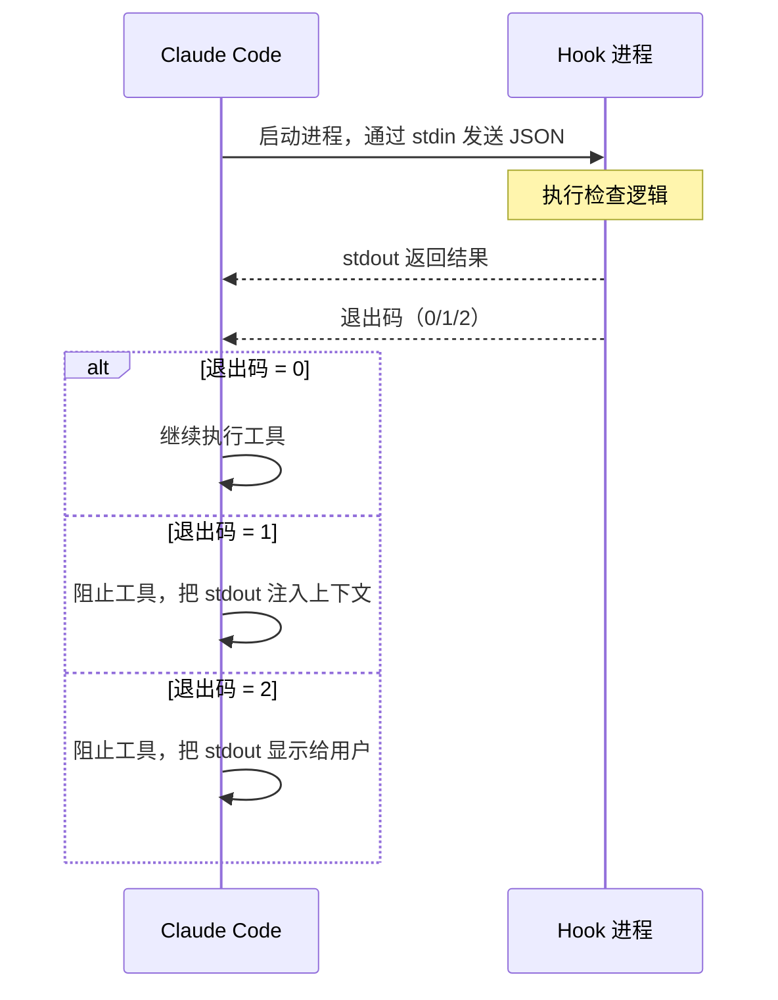
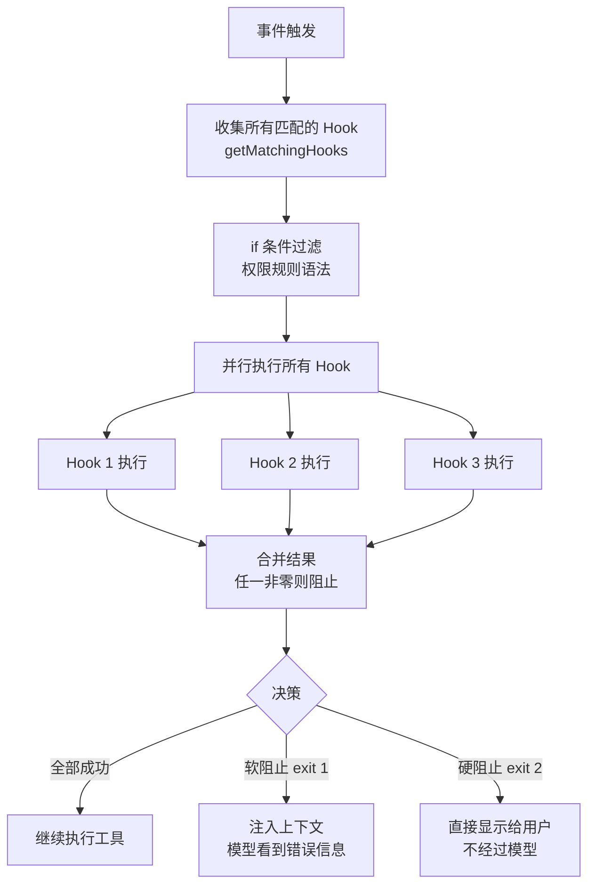
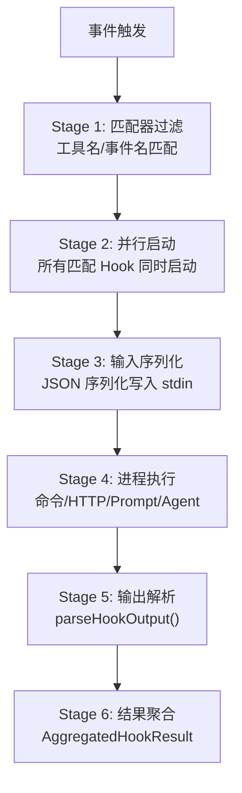

# 第 14 章：Hooks 与可扩展性

> **本章目标**：理解 Claude Code 的事件驱动扩展机制，以及如何用 Hooks 在不修改源码的前提下注入自定义逻辑。

---

## 14.1 先用大白话理解

想象你在一家餐厅工作。每次顾客点菜（工具调用），厨房开始做菜（执行），菜做好了（工具完成）。

现在老板想加一个规则：**每次顾客点酒之前，先检查他的年龄**。

有两种方式实现这个规则：
1. 修改厨房的整个工作流程（修改源码）
2. 在「顾客点菜」这个事件上挂一个检查钩子（Hook）

Claude Code 选择了方式二——**Hooks 是事件驱动的扩展机制**，让你在不修改 Claude Code 源码的前提下，在关键节点注入自定义逻辑。

---

## 14.2 Hooks 能做什么？

几个典型的使用场景：

- **每次 `git push` 之前自动运行 lint 检查**（PreToolUse + Bash 工具）
- **每次编辑文件后在后台跑测试**（PostToolUse + FileEdit 工具）
- **把所有工具调用发送到公司审计系统**（PostToolUse + 所有工具）
- **阻止 AI 删除某些重要文件**（PreToolUse + FileDelete 工具）
- **会话开始时自动加载环境变量**（SessionStart）

---

## 14.3 25 种 Hook 事件

Claude Code 定义了 25 种 Hook 事件，覆盖 Agent Loop 的完整生命周期：

```typescript
// src/entrypoints/agentSdkTypes.ts
export const HOOK_EVENTS = [
  'PreToolUse', 'PostToolUse', 'PostToolUseFailure',
  'Notification', 'UserPromptSubmit', 'SessionStart', 'SessionEnd',
  'Stop', 'StopFailure', 'SubagentStart', 'SubagentStop',
  'PreCompact', 'PostCompact', 'PermissionRequest', 'PermissionDenied',
  'Setup', 'TeammateIdle', 'TaskCreated', 'TaskCompleted',
  'Elicitation', 'ElicitationResult', 'ConfigChange',
  'WorktreeCreate', 'WorktreeRemove', 'InstructionsLoaded',
  'CwdChanged', 'FileChanged'
] as const
```

按功能分类：

| 类别 | 事件 | 触发时机 |
|------|------|---------|
| **工具生命周期** | PreToolUse | 工具执行前 |
| | PostToolUse | 工具执行成功后 |
| | PostToolUseFailure | 工具执行失败后 |
| **权限系统** | PermissionRequest | 权限判定时 |
| | PermissionDenied | 自动分类器拒绝时 |
| **会话生命周期** | SessionStart | 会话开始 |
| | SessionEnd | 会话结束 |
| | UserPromptSubmit | 用户提交输入时 |
| **模型响应** | Stop | 模型决定停止时 |
| | StopFailure | API 调用失败时 |
| **Agent 协调** | SubagentStart | 子 Agent 启动 |
| | SubagentStop | 子 Agent 停止 |
| **压缩** | PreCompact | 上下文压缩前 |
| | PostCompact | 上下文压缩后 |
| **环境变化** | ConfigChange | 配置文件变更 |
| | CwdChanged | 工作目录变更 |
| | FileChanged | 被监听文件变更 |

---

## 14.4 Hook 配置格式

Hooks 在 `.claude/settings.json` 中配置：

```json
{
  "hooks": {
    "PreToolUse": [
      {
        "matcher": "Bash",
        "hooks": [
          {
            "type": "command",
            "command": "python3 /path/to/safety-check.py"
          }
        ]
      }
    ],
    "PostToolUse": [
      {
        "matcher": "FileEdit",
        "hooks": [
          {
            "type": "command",
            "command": "npm run lint --fix"
          }
        ]
      }
    ],
    "SessionStart": [
      {
        "hooks": [
          {
            "type": "command",
            "command": "source ~/.env.local"
          }
        ]
      }
    ]
  }
}
```

---

## 14.5 Hook 的三种响应方式

Hook 通过退出码和 stdout 来控制行为：

| 退出码 | 含义 | 效果 |
|--------|------|------|
| `0` | 成功 | 继续执行，stdout 内容作为上下文注入 |
| `1` | 软阻止 | 阻止工具执行，stdout 内容作为错误信息显示给模型 |
| `2` | 硬阻止 | 阻止工具执行，stdout 内容直接显示给用户（不经过模型） |

```python
# 一个简单的安全检查 Hook（Python）
import json
import sys

# 从 stdin 读取工具调用信息
tool_call = json.loads(sys.stdin.read())

tool_name = tool_call.get('tool_name', '')
tool_input = tool_call.get('tool_input', {})

# 检查是否要删除重要文件
if tool_name == 'Bash':
    command = tool_input.get('command', '')
    if 'rm -rf' in command and '/production' in command:
        print("❌ 禁止在生产目录执行 rm -rf")
        sys.exit(2)  # 硬阻止，直接显示给用户

# 检查通过
sys.exit(0)
```

---

## 14.6 PreToolUse Hook：阻止和修改

PreToolUse 是最强大的 Hook 类型——它可以在工具执行前**阻止**或**修改**工具调用。

**阻止示例**：防止 AI 修改 `.env` 文件

```bash
#!/bin/bash
# pre-tool-use-hook.sh

TOOL_INPUT=$(cat)
TOOL_NAME=$(echo "$TOOL_INPUT" | python3 -c "import sys,json; print(json.load(sys.stdin)['tool_name'])")
FILE_PATH=$(echo "$TOOL_INPUT" | python3 -c "import sys,json; d=json.load(sys.stdin); print(d.get('tool_input', {}).get('file_path', ''))")

if [[ "$TOOL_NAME" == "FileEdit" || "$TOOL_NAME" == "FileWrite" ]]; then
    if [[ "$FILE_PATH" == *".env"* ]]; then
        echo "禁止修改 .env 文件，请手动编辑敏感配置"
        exit 2
    fi
fi

exit 0
```

**修改示例**：自动在 Bash 命令前加 `timeout`

```python
import json, sys

tool_call = json.loads(sys.stdin.read())

if tool_call['tool_name'] == 'Bash':
    command = tool_call['tool_input']['command']
    # 如果命令没有 timeout，自动添加
    if not command.startswith('timeout '):
        tool_call['tool_input']['command'] = f'timeout 30 {command}'
    
    # 返回修改后的工具调用
    print(json.dumps({"modified_tool_input": tool_call['tool_input']}))

sys.exit(0)
```

---

## 14.7 PostToolUse Hook：审计和后处理

PostToolUse 在工具执行成功后触发，适合审计日志、自动化后处理等场景：

```python
# audit-logger.py - 记录所有工具调用到审计日志
import json, sys, datetime

tool_result = json.loads(sys.stdin.read())

log_entry = {
    "timestamp": datetime.datetime.utcnow().isoformat(),
    "tool_name": tool_result.get("tool_name"),
    "tool_input": tool_result.get("tool_input"),
    "success": True
}

with open("/var/log/claude-audit.jsonl", "a") as f:
    f.write(json.dumps(log_entry) + "\n")

sys.exit(0)
```

---

## 14.8 FileChanged Hook：响应外部变化

FileChanged 是一个特殊的 Hook——它不是响应 Claude Code 的行为，而是响应**外部文件系统的变化**：

```json
{
  "hooks": {
    "FileChanged": [
      {
        "matcher": "*.test.ts",
        "hooks": [
          {
            "type": "command",
            "command": "npx jest --testPathPattern=$CHANGED_FILE"
          }
        ]
      }
    ]
  }
}
```

当你（或其他工具）修改了 `*.test.ts` 文件时，Claude Code 会自动运行对应的测试。这实现了「文件保存后自动测试」的工作流，而不需要 Claude Code 主动执行测试命令。

---

## 14.9 Hook 的执行模型



**超时机制**：每个 Hook 进程有默认 30 秒的超时时间。超时后，Hook 被强制终止，工具调用继续执行（不阻止）。这防止了 Hook 卡死导致整个 Agent 无响应。

**并行执行**：同一事件上的多个 Hook 会并行执行，而不是串行。如果任何一个 Hook 返回非零退出码，工具调用被阻止。

---

## 14.10 设计洞察

**Hooks 是「控制反转」的体现**。传统的扩展方式是「调用方控制」——你调用一个函数，决定是否传入回调。Hooks 是「被调用方控制」——你注册一个监听器，等待事件发生时被调用。

这种设计让扩展者不需要了解 Claude Code 的内部实现，只需要知道「在什么事件上注册什么行为」。Claude Code 的核心逻辑不需要为每种扩展场景添加特殊代码——扩展者自己处理自己的逻辑。

**25 种事件的设计哲学**：覆盖 Agent Loop 完整生命周期的所有关键决策点。每个可能需要外部干预的节点，都暴露一个事件。这不是「越多越好」，而是「恰好足够」——每个事件都有明确的使用场景。

---

> 下一章：[技能系统 →](#/docs/15-skills-system)

---

## 14.11 四种 Hook 类型详解

### 类型一：命令 Hook（Command）

**最常用的类型**。执行一条 Shell 命令，通过 stdin 接收 JSON 输入，通过 stdout 返回 JSON 结果。

```typescript
{
  type: 'command',
  command: string,           // Shell 命令
  if?: string,               // 权限规则语法的二次过滤
  shell?: 'bash' | 'powershell',  // Shell 类型，默认 bash
  timeout?: number,          // 超时（秒）
  statusMessage?: string,    // 执行时的 spinner 提示
  once?: boolean,            // 执行一次后自动移除
  async?: boolean,           // 异步执行，不阻塞
  asyncRewake?: boolean      // 异步执行 + 退出码 2 时唤醒模型
}
```

**工作原理（`execCommandHook`）**：

1. **进程创建**：调用 `spawn()` 创建子进程。Shell 的选择逻辑：如果指定了 `shell: 'powershell'`，使用 `pwsh`；否则使用用户的 `$SHELL`（bash/zsh/sh）。
2. **输入传递**：将 Hook 的结构化输入（包含 session_id、tool_name、tool_input 等）序列化为 JSON，通过 **stdin** 传入子进程。
3. **环境变量**：子进程继承当前环境变量。如果是插件 Hook，额外注入 `CLAUDE_PLUGIN_ROOT` 和 `CLAUDE_PLUGIN_DATA`。
4. **输出收集**：等待进程退出，收集 stdout 和 stderr。
5. **结果解析**：根据退出码和 stdout 内容决定 Hook 结果。

### 类型二：提示词 Hook（Prompt）

调用 LLM 进行语义评估。适用于需要「理解」而非简单模式匹配的判断场景。

```typescript
{
  type: 'prompt',
  prompt: string,            // 提示词（$ARGUMENTS 占位符会被替换为 JSON 输入）
  if?: string,
  model?: string,            // 指定模型（默认使用 Haiku）
  timeout?: number,          // 超时（秒，默认 30）
  statusMessage?: string,
  once?: boolean
}
```

**工作原理（`execPromptHook`）**：

1. 将 `$ARGUMENTS` 占位符替换为 Hook 输入的 JSON 字符串
2. 构建消息数组，调用 `queryModelWithoutStreaming`（单轮、无流式）
3. 系统提示词要求模型返回 `{"ok": true}` 或 `{"ok": false, "reason": "..."}`
4. 解析模型返回，`ok: false` 映射为阻塞错误

**关键设计细节**：Prompt Hook 直接调用 `createUserMessage` 而不经过 `processUserInput`——因为后者会触发 `UserPromptSubmit` Hook，导致无限递归。

**适用场景**：语义安全检查（「这个 SQL 查询是否可能删除数据？」）、代码审查（「这个修改是否符合项目规范？」）。

### 类型三：Agent Hook

与 Prompt Hook 类似，但以**多轮 Agent 模式**运行——它可以调用工具来验证条件，不仅仅是「想一想」。

```typescript
{
  type: 'agent',
  prompt: string,            // 验证指令（$ARGUMENTS 占位符）
  if?: string,
  model?: string,            // 默认使用 Haiku
  timeout?: number,          // 超时（秒，默认 60）
  statusMessage?: string,
  once?: boolean
}
```

**与 Prompt Hook 的关键区别**：

| | Prompt Hook | Agent Hook |
|--|-------------|------------|
| 调用方式 | 单轮 LLM 推理 | 多轮 Agent Loop |
| 能否调用工具 | 不能 | 能（可以读文件、运行命令来验证） |
| 默认超时 | 30 秒 | 60 秒 |
| 输出格式 | 强制 `{ok, reason}` JSON | 通过注册结构化输出工具返回 |

Agent Hook 使用 `registerStructuredOutputEnforcement` 注册一个函数 Hook，确保 Agent 在结束时必须调用结构化输出工具返回结果。这是一个「Hook 嵌套 Hook」的设计——Agent Hook 本身在执行过程中注册临时的 Function Hook 来约束 Agent 行为。

**适用场景**：复杂验证流程——例如「运行测试并确认全部通过」、「检查编辑的文件是否能通过类型检查」。

### 类型四：HTTP Hook

向外部服务发送 POST 请求，适合与企业基础设施集成。

```typescript
{
  type: 'http',
  url: string,               // POST 端点
  if?: string,
  timeout?: number,          // 超时（秒，默认 10 分钟）
  headers?: Record<string, string>,  // 支持 $VAR 环境变量插值
  allowedEnvVars?: string[], // 允许插值的环境变量白名单
  statusMessage?: string,
  once?: boolean
}
```

**安全设计**：

1. **URL 白名单检查**：如果配置了 `allowedHttpHookUrls` 策略，先检查 URL 是否匹配允许的模式。
2. **Header 环境变量插值**：只有在 `allowedEnvVars` 中列出的变量才会被替换，防止恶意 Hook 窃取 `$AWS_SECRET_ACCESS_KEY` 等敏感变量。
3. **CRLF 注入防护**：插值后的 header 值会被去除 `\r`、`\n`、`\x00` 字符。
4. **SSRF 防护**：不通过代理时，使用 `ssrfGuardedLookup` 防止请求发往内网地址。

**重要限制**：HTTP Hook 不支持 `SessionStart` 和 `Setup` 事件——在 headless 模式下，这两个事件触发时 sandbox 的消费者尚未启动，HTTP 请求会死锁。

---

## 14.12 Hook 执行流水线

每次事件触发时，Hook 系统经历以下流水线：



**`if` 条件的权限规则语法**：Hook 的 `if` 字段使用与权限系统相同的规则语法（`Bash(git:*)`、`FileEdit(src/**)`），实现事件级别的精细过滤。这意味着你可以在同一个 `PreToolUse` 事件上注册多个 Hook，每个 Hook 只处理特定工具或特定路径的调用。

---

## 14.13 上下文注入：Hook 的隐藏超能力

当 Hook 退出码为 0（成功）时，它的 stdout 内容不会被丢弃——而是作为**额外上下文**注入到模型的下一次 API 调用中。

这意味着 Hook 可以在不阻止工具执行的情况下，向模型提供额外信息：

```python
# 一个「信息注入」Hook：告诉模型当前的 git 状态
import json, sys, subprocess

tool_call = json.loads(sys.stdin.read())

if tool_call['tool_name'] == 'FileEdit':
    # 获取当前 git 状态
    git_status = subprocess.run(['git', 'status', '--short'], 
                                capture_output=True, text=True).stdout
    
    # 注入到上下文（不阻止工具执行）
    print(f"[Hook 提示] 当前 git 状态：\n{git_status}")

sys.exit(0)  # 成功，但 stdout 内容会被注入
```

这种「信息注入」模式非常强大：你可以在每次文件编辑前，自动告诉模型「当前有哪些文件被修改了」、「测试覆盖率是多少」、「最近的 CI 状态」等信息，而不需要模型主动去查询。

---

## 14.14 asyncRewake：异步 Hook 的唤醒机制

`asyncRewake: true` 是一个精妙的设计：Hook 异步执行（不阻塞工具调用），但如果 Hook 最终返回退出码 2，它会「唤醒」模型重新处理。

**使用场景**：长时间运行的 CI 检查。

```json
{
  "PostToolUse": [
    {
      "matcher": "FileEdit",
      "hooks": [
        {
          "type": "command",
          "command": "python3 /path/to/run-ci.py",
          "async": true,
          "asyncRewake": true,
          "statusMessage": "等待 CI 检查..."
        }
      ]
    }
  ]
}
```

工作流程：
1. 模型编辑文件，工具执行完成
2. CI 检查 Hook 异步启动（不阻塞模型继续工作）
3. 模型继续做其他任务
4. CI 检查完成，如果失败，退出码 2 触发「唤醒」
5. 模型被唤醒，看到 CI 失败信息，开始修复

这实现了「非阻塞等待 + 结果感知」的工作流，既不让模型干等 CI，又能在 CI 失败时及时响应。

---

## 14.15 PermissionRequest Hook：自定义权限逻辑

`PermissionRequest` Hook 是一个特殊的扩展点——它允许你完全自定义权限判断逻辑，绕过内置的权限系统：

```python
# custom-permission.py
import json, sys

request = json.loads(sys.stdin.read())

tool_name = request.get('tool_name')
tool_input = request.get('tool_input', {})

# 自定义规则：只允许在 src/ 目录下编辑文件
if tool_name == 'FileEdit':
    file_path = tool_input.get('file_path', '')
    if not file_path.startswith('src/'):
        print(json.dumps({
            "decision": "deny",
            "reason": f"只允许编辑 src/ 目录下的文件，拒绝：{file_path}"
        }))
        sys.exit(0)

# 允许
print(json.dumps({"decision": "allow"}))
sys.exit(0)
```

`PermissionRequest` Hook 的返回值是一个 JSON 对象，包含 `decision`（`allow`/`deny`/`ask`）和可选的 `reason`。这个 Hook 的优先级高于内置权限规则——如果 Hook 返回 `allow`，即使内置规则会拒绝，操作也会被允许。

---

## 14.16 设计洞察（扩展）

**Hook 是「可观测性」的基础设施**：在企业环境中，合规要求往往需要记录所有 AI 操作。通过 PostToolUse Hook，你可以在不修改 Claude Code 的情况下，将所有工具调用发送到 SIEM 系统、审计数据库或合规平台。这是「可观测性即扩展」的体现。

**`once` 标志的哲学**：`once: true` 的 Hook 执行一次后自动从配置中移除。这支持「一次性初始化」场景——例如在会话开始时执行一次环境检查，确认通过后不再重复。这个设计避免了「我需要检查这个 Hook 是否已经执行过」的状态管理问题。

**四种 Hook 类型的选择矩阵**：

| 场景 | 推荐类型 | 原因 |
|------|---------|------|
| Shell 脚本集成 | Command | 最灵活，可以调用任何工具 |
| 语义判断 | Prompt | LLM 理解意图，不需要精确规则 |
| 需要验证的复杂检查 | Agent | 可以运行测试、读文件来验证 |
| 企业系统集成 | HTTP | 标准化接口，支持认证 |

---

> 下一章：[技能系统 →](#/docs/15-skills-system)

---

## 14.17 退出码语义详解

Hook 的退出码是与 Claude Code 通信的核心机制：

| 退出码 | 含义 | 对用户的影响 | 对模型的影响 |
|--------|------|-------------|-------------|
| **0** | 成功 | stdout 显示在 transcript 中 | 不影响 |
| **1** | 一般错误 | stderr 显示给用户 | **不**传递给模型 |
| **2** | 阻塞性错误 | stderr 显示给用户 | stderr 传递给模型（阻止操作） |
| **其他** | 一般错误（同 1） | stderr 显示给用户 | 不传递给模型 |

**退出码 1 和 2 的关键区别**：退出码 1 只是「告诉用户出了点问题」（non-blocking），模型不知道也不关心；退出码 2 是「告诉模型这里有问题，必须处理」（blocking），会阻止当前工具的执行或模型的停止。

这个区分非常实用：
- Linter 警告用退出码 1 → 用户看到但不打断工作流
- 安全检查失败用退出码 2 → 模型必须知道并处理

---

## 14.18 Hook JSON 输出 Schema

Hook 通过 stdout 输出 JSON 来控制 Claude Code 的行为。

### 通用字段

```typescript
{
  // 流程控制
  continue?: boolean,          // false → 阻止 Claude 继续
  suppressOutput?: boolean,    // 隐藏 stdout 输出
  stopReason?: string,         // continue=false 时的停止原因消息
  // 决策字段
  decision?: 'approve' | 'block',  // approve → 允许, block → 阻止 + 错误
  reason?: string,                  // 决策原因
  // 反馈
  systemMessage?: string,      // 警告消息（显示给用户）
}
```

### PreToolUse 专用字段

```typescript
{
  hookEventName: 'PreToolUse',
  permissionDecision?: 'allow' | 'deny' | 'ask',  // 权限决策
  permissionDecisionReason?: string,               // 决策原因
  updatedInput?: Record<string, unknown>,           // 修改工具输入
  additionalContext?: string                        // 附加上下文
}
```

**`updatedInput` 的强大之处**：PreToolUse Hook 可以修改工具的输入参数。例如，你可以在模型尝试编辑文件时，自动将相对路径转换为绝对路径，或者在 Bash 命令中注入环境变量。

### PermissionRequest 专用字段

```typescript
{
  hookEventName: 'PermissionRequest',
  decision: {
    behavior: 'allow',
    updatedInput?: Record<string, unknown>,          // 修改输入
    updatedPermissions?: PermissionUpdate[]          // 注入新权限规则
  } | {
    behavior: 'deny',
    message?: string,                                // 拒绝原因
    interrupt?: boolean                              // 中断操作
  }
}
```

---

## 14.19 超时配置

| 场景 | 默认超时 | 说明 |
|------|---------|------|
| 一般 Hook | 10 分钟 | 适合长时间运行的 CI 检查 |
| SessionEnd Hook | 1.5 秒 | 用户正在退出，不应被 Hook 阻塞 |
| Prompt Hook | 30 秒 | 适合快速的上下文注入 |
| Agent Hook | 60 秒 | 适合需要工具调用的验证 |
| HTTP Hook | 10 分钟 | 适合外部服务调用 |
| 异步 Hook | 15 秒（默认） | 可通过 `timeout` 字段自定义 |

SessionEnd 超时极短（1.5 秒），因为用户正在退出，不应被 Hook 阻塞。可通过环境变量 `CLAUDE_CODE_SESSIONEND_HOOKS_TIMEOUT_MS` 覆盖。

---

## 14.20 Hook 执行流水线（6 个阶段）

每次 Hook 触发都经历完整的 6 阶段流水线：



**Stage 2 的并行设计**：所有匹配的 Hook 同时启动，不是串行等待。这意味着如果你有 3 个 PostToolUse Hook，它们会并发执行，总时间取决于最慢的那个，而不是三者之和。

**Stage 6 的流式聚合**：多个并行 Hook 的结果通过流式聚合——每个 Hook 完成就立即处理结果，不等所有 Hook 完成。这意味着一个 Hook 的阻塞错误可以立即传播，而不必等待其他更慢的 Hook。

---

## 14.21 实战：企业合规审计 Hook

下面是一个完整的企业合规审计 Hook 示例，将所有工具调用记录到审计数据库：

```python
#!/usr/bin/env python3
# audit-hook.py — 记录所有工具调用到审计数据库
import json, sys, datetime, requests

event = json.loads(sys.stdin.read())

audit_record = {
    "timestamp": datetime.datetime.utcnow().isoformat(),
    "session_id": event.get("session_id"),
    "tool_name": event.get("tool_name"),
    "tool_input": event.get("tool_input"),
    "user": event.get("user", "unknown"),
    "project": event.get("cwd", "unknown"),
}

# 发送到审计服务
try:
    requests.post(
        "https://audit.company.com/api/claude-actions",
        json=audit_record,
        headers={"Authorization": f"Bearer {os.environ['AUDIT_TOKEN']}"},
        timeout=5
    )
except Exception as e:
    # 审计失败不应阻塞工作流，只记录到本地日志
    with open("/var/log/claude-audit-errors.log", "a") as f:
        f.write(f"{datetime.datetime.utcnow()} AUDIT_FAILED: {e}\n")

# 始终允许操作继续（审计不阻塞）
print(json.dumps({"continue": True}))
sys.exit(0)
```

配置：

```json
{
  "PostToolUse": [
    {
      "matcher": "*",
      "hooks": [
        {
          "type": "command",
          "command": "python3 /opt/company/audit-hook.py",
          "async": true
        }
      ]
    }
  ]
}
```

---

## 14.22 设计洞察（深度扩展）

**「退出码 2」的精妙之处**：这个约定解决了一个经典的「通知 vs 阻塞」问题。在没有这个约定的系统中，Hook 要么总是阻塞（影响效率），要么总是非阻塞（无法传递紧急信息）。退出码 2 提供了一个「选择性阻塞」机制——Hook 可以在大多数情况下非阻塞运行，只在真正需要时才阻塞。

**「输入修改」的安全边界**：`updatedInput` 允许 Hook 修改工具输入，但这个修改是有边界的——它只能修改工具的参数，不能修改工具本身的行为。这个设计防止了 Hook 绕过工具的内置安全检查（例如，Hook 不能通过修改输入来绕过 BashTool 的危险命令检测）。

**「并行执行 + 流式聚合」的优雅性**：所有 Hook 并行执行，结果流式聚合。这个设计的优雅之处在于：它既保证了最优的执行效率（并行），又保证了最快的错误响应（流式聚合，不等最慢的 Hook）。这是「并发编程」和「流式处理」结合的典型应用。

---

> 下一章：[技能系统 →](#/docs/15-skills-system)
