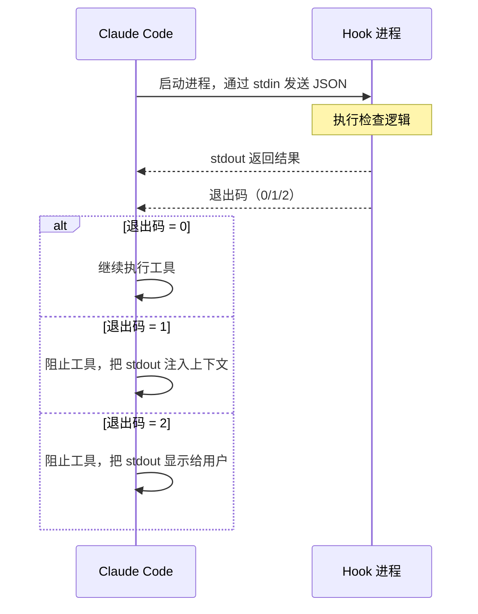

# 第 14 章：Hooks 与可扩展性

> **本章目标**：理解 Claude Code 的事件驱动扩展机制，以及如何用 Hooks 在不修改源码的前提下注入自定义逻辑。

---

## 14.1 先用大白话理解

想象你在一家餐厅工作。每次顾客点菜（工具调用），厨房开始做菜（执行），菜做好了（工具完成）。

现在老板想加一个规则：**每次顾客点酒之前，先检查他的年龄**。

有两种方式实现这个规则：
1. 修改厨房的整个工作流程（修改源码）
2. 在「顾客点菜」这个事件上挂一个检查钩子（Hook）

Claude Code 选择了方式二——**Hooks 是事件驱动的扩展机制**，让你在不修改 Claude Code 源码的前提下，在关键节点注入自定义逻辑。

---

## 14.2 Hooks 能做什么？

几个典型的使用场景：

- **每次 `git push` 之前自动运行 lint 检查**（PreToolUse + Bash 工具）
- **每次编辑文件后在后台跑测试**（PostToolUse + FileEdit 工具）
- **把所有工具调用发送到公司审计系统**（PostToolUse + 所有工具）
- **阻止 AI 删除某些重要文件**（PreToolUse + FileDelete 工具）
- **会话开始时自动加载环境变量**（SessionStart）

---

## 14.3 25 种 Hook 事件

Claude Code 定义了 25 种 Hook 事件，覆盖 Agent Loop 的完整生命周期：

```typescript
// src/entrypoints/agentSdkTypes.ts
export const HOOK_EVENTS = [
  'PreToolUse', 'PostToolUse', 'PostToolUseFailure',
  'Notification', 'UserPromptSubmit', 'SessionStart', 'SessionEnd',
  'Stop', 'StopFailure', 'SubagentStart', 'SubagentStop',
  'PreCompact', 'PostCompact', 'PermissionRequest', 'PermissionDenied',
  'Setup', 'TeammateIdle', 'TaskCreated', 'TaskCompleted',
  'Elicitation', 'ElicitationResult', 'ConfigChange',
  'WorktreeCreate', 'WorktreeRemove', 'InstructionsLoaded',
  'CwdChanged', 'FileChanged'
] as const
```

按功能分类：

| 类别 | 事件 | 触发时机 |
|------|------|---------|
| **工具生命周期** | PreToolUse | 工具执行前 |
| | PostToolUse | 工具执行成功后 |
| | PostToolUseFailure | 工具执行失败后 |
| **权限系统** | PermissionRequest | 权限判定时 |
| | PermissionDenied | 自动分类器拒绝时 |
| **会话生命周期** | SessionStart | 会话开始 |
| | SessionEnd | 会话结束 |
| | UserPromptSubmit | 用户提交输入时 |
| **模型响应** | Stop | 模型决定停止时 |
| | StopFailure | API 调用失败时 |
| **Agent 协调** | SubagentStart | 子 Agent 启动 |
| | SubagentStop | 子 Agent 停止 |
| **压缩** | PreCompact | 上下文压缩前 |
| | PostCompact | 上下文压缩后 |
| **环境变化** | ConfigChange | 配置文件变更 |
| | CwdChanged | 工作目录变更 |
| | FileChanged | 被监听文件变更 |

---

## 14.4 Hook 配置格式

Hooks 在 `.claude/settings.json` 中配置：

```json
{
  "hooks": {
    "PreToolUse": [
      {
        "matcher": "Bash",
        "hooks": [
          {
            "type": "command",
            "command": "python3 /path/to/safety-check.py"
          }
        ]
      }
    ],
    "PostToolUse": [
      {
        "matcher": "FileEdit",
        "hooks": [
          {
            "type": "command",
            "command": "npm run lint --fix"
          }
        ]
      }
    ],
    "SessionStart": [
      {
        "hooks": [
          {
            "type": "command",
            "command": "source ~/.env.local"
          }
        ]
      }
    ]
  }
}
```

---

## 14.5 Hook 的三种响应方式

Hook 通过退出码和 stdout 来控制行为：

| 退出码 | 含义 | 效果 |
|--------|------|------|
| `0` | 成功 | 继续执行，stdout 内容作为上下文注入 |
| `1` | 软阻止 | 阻止工具执行，stdout 内容作为错误信息显示给模型 |
| `2` | 硬阻止 | 阻止工具执行，stdout 内容直接显示给用户（不经过模型） |

```python
# 一个简单的安全检查 Hook（Python）
import json
import sys

# 从 stdin 读取工具调用信息
tool_call = json.loads(sys.stdin.read())

tool_name = tool_call.get('tool_name', '')
tool_input = tool_call.get('tool_input', {})

# 检查是否要删除重要文件
if tool_name == 'Bash':
    command = tool_input.get('command', '')
    if 'rm -rf' in command and '/production' in command:
        print("❌ 禁止在生产目录执行 rm -rf")
        sys.exit(2)  # 硬阻止，直接显示给用户

# 检查通过
sys.exit(0)
```

---

## 14.6 PreToolUse Hook：阻止和修改

PreToolUse 是最强大的 Hook 类型——它可以在工具执行前**阻止**或**修改**工具调用。

**阻止示例**：防止 AI 修改 `.env` 文件

```bash
#!/bin/bash
# pre-tool-use-hook.sh

TOOL_INPUT=$(cat)
TOOL_NAME=$(echo "$TOOL_INPUT" | python3 -c "import sys,json; print(json.load(sys.stdin)['tool_name'])")
FILE_PATH=$(echo "$TOOL_INPUT" | python3 -c "import sys,json; d=json.load(sys.stdin); print(d.get('tool_input', {}).get('file_path', ''))")

if [[ "$TOOL_NAME" == "FileEdit" || "$TOOL_NAME" == "FileWrite" ]]; then
    if [[ "$FILE_PATH" == *".env"* ]]; then
        echo "禁止修改 .env 文件，请手动编辑敏感配置"
        exit 2
    fi
fi

exit 0
```

**修改示例**：自动在 Bash 命令前加 `timeout`

```python
import json, sys

tool_call = json.loads(sys.stdin.read())

if tool_call['tool_name'] == 'Bash':
    command = tool_call['tool_input']['command']
    # 如果命令没有 timeout，自动添加
    if not command.startswith('timeout '):
        tool_call['tool_input']['command'] = f'timeout 30 {command}'
    
    # 返回修改后的工具调用
    print(json.dumps({"modified_tool_input": tool_call['tool_input']}))

sys.exit(0)
```

---

## 14.7 PostToolUse Hook：审计和后处理

PostToolUse 在工具执行成功后触发，适合审计日志、自动化后处理等场景：

```python
# audit-logger.py - 记录所有工具调用到审计日志
import json, sys, datetime

tool_result = json.loads(sys.stdin.read())

log_entry = {
    "timestamp": datetime.datetime.utcnow().isoformat(),
    "tool_name": tool_result.get("tool_name"),
    "tool_input": tool_result.get("tool_input"),
    "success": True
}

with open("/var/log/claude-audit.jsonl", "a") as f:
    f.write(json.dumps(log_entry) + "\n")

sys.exit(0)
```

---

## 14.8 FileChanged Hook：响应外部变化

FileChanged 是一个特殊的 Hook——它不是响应 Claude Code 的行为，而是响应**外部文件系统的变化**：

```json
{
  "hooks": {
    "FileChanged": [
      {
        "matcher": "*.test.ts",
        "hooks": [
          {
            "type": "command",
            "command": "npx jest --testPathPattern=$CHANGED_FILE"
          }
        ]
      }
    ]
  }
}
```

当你（或其他工具）修改了 `*.test.ts` 文件时，Claude Code 会自动运行对应的测试。这实现了「文件保存后自动测试」的工作流，而不需要 Claude Code 主动执行测试命令。

---

## 14.9 Hook 的执行模型



**超时机制**：每个 Hook 进程有默认 30 秒的超时时间。超时后，Hook 被强制终止，工具调用继续执行（不阻止）。这防止了 Hook 卡死导致整个 Agent 无响应。

**并行执行**：同一事件上的多个 Hook 会并行执行，而不是串行。如果任何一个 Hook 返回非零退出码，工具调用被阻止。

---

## 14.10 设计洞察

**Hooks 是「控制反转」的体现**。传统的扩展方式是「调用方控制」——你调用一个函数，决定是否传入回调。Hooks 是「被调用方控制」——你注册一个监听器，等待事件发生时被调用。

这种设计让扩展者不需要了解 Claude Code 的内部实现，只需要知道「在什么事件上注册什么行为」。Claude Code 的核心逻辑不需要为每种扩展场景添加特殊代码——扩展者自己处理自己的逻辑。

**25 种事件的设计哲学**：覆盖 Agent Loop 完整生命周期的所有关键决策点。每个可能需要外部干预的节点，都暴露一个事件。这不是「越多越好」，而是「恰好足够」——每个事件都有明确的使用场景。

---

> 下一章：[技能系统 →](#/docs/15-skills-system)
