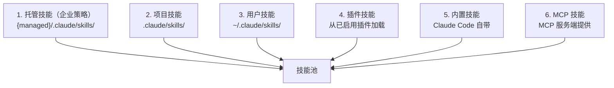
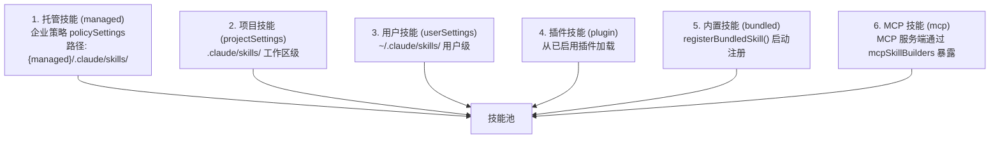
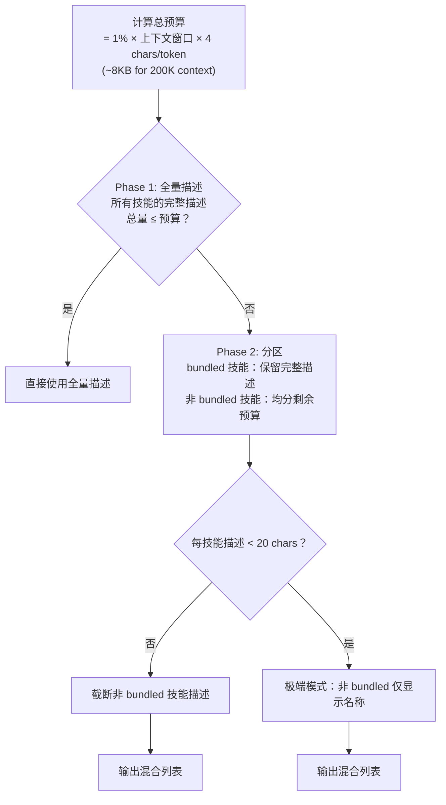

# 第 15 章：技能系统

> **本章目标**：理解 Claude Code 的技能（Skills）系统，以及如何用 Markdown 文件定义可复用的 AI 工作流。

---

## 15.1 先用大白话理解

Shell 脚本自动化终端任务，技能自动化 AI 任务。

想象你每天都要让 Claude Code 做同一件事：「检查代码质量，生成测试，然后提交 git」。每次你都要重新描述这个流程。

技能就是解决这个问题的方案：**把验证有效的 prompt 模板化，存成一个文件，下次直接调用**。

```
/commit                   ← 用户手动调用
"帮我提交代码"             ← 模型自动识别并调用
```

两种方式都触发同一个技能，执行同一套流程。

---

## 15.2 技能的本质

技能是一个 Markdown 文件，包含两部分：

```markdown
---
name: commit
description: 生成规范的 git commit 信息并提交
whenToUse: 当用户想要提交代码时
allowedTools:
  - Bash
  - FileRead
model: sonnet
---

你是一个 git commit 专家。请按照以下步骤操作：

1. 运行 `git diff --staged` 查看暂存的改动
2. 分析改动内容，生成符合 Conventional Commits 规范的 commit 信息
3. 运行 `git commit -m "生成的信息"`
4. 报告提交结果

参数：$ARGUMENTS
```

**Frontmatter**（`---` 之间的部分）是元数据，控制技能的行为。**正文**是实际的提示词内容。

---

## 15.3 技能的双重调用模型

技能有两种触发方式：

| 调用方式 | 触发者 | 示例 |
|---------|--------|------|
| **用户手动** | 用户输入 `/commit` | 用户明确需要某个流程 |
| **模型自动** | 模型根据 `whenToUse` 判断 | 用户说「帮我提交代码」，模型识别意图并调用 |

这两条路径最终汇合到同一个提示词加载和执行逻辑。

`whenToUse` 字段是关键——它告诉模型「在什么情况下应该自动触发这个技能」。写得越清晰，模型自动触发的准确率越高。

---

## 15.4 技能的来源

技能从 6 个来源加载，优先级从高到低：



高优先级来源的技能在命名冲突时覆盖低优先级。

**技能文件格式要求**：只支持 `skill-name/SKILL.md` 的目录格式——每个技能是一个目录，包含一个 `SKILL.md` 文件。这不是随意的限制：目录格式允许技能附带资源文件（如模板、配置），并通过 `${CLAUDE_SKILL_DIR}` 引用。

---

## 15.5 Frontmatter 字段详解

```typescript
type SkillFrontmatter = {
  name: string           // 技能名称（用于 /name 调用）
  description: string    // 显示描述
  whenToUse?: string     // 模型据此判断何时自动触发
  allowedTools?: string[] // 允许的工具白名单
  model?: string         // 模型覆盖（sonnet/haiku/opus）
  effort?: 'low' | 'medium' | 'high'  // 工作量级别
  context?: 'inline' | 'fork'  // 执行模式
  agent?: string         // fork 时的 Agent 类型
}
```

**`context` 字段**：
- `inline`：在当前对话上下文中执行（默认）
- `fork`：fork 一个子 Agent 执行，不影响当前对话历史

`fork` 模式适合耗时较长的任务——子 Agent 在后台执行，不阻塞当前对话。

---

## 15.6a 提示词模板语法

技能提示词支持三种动态内容：

**`$ARGUMENTS`**：用户调用技能时传入的参数

```markdown
# 技能调用
/translate 把这段代码翻译成 Python

# 提示词中
请把以下内容翻译成 $ARGUMENTS 语言：
```

**`!`shell 命令``**：内联执行 Shell 命令，结果嵌入提示词

```markdown
当前 git 状态：
!`git status`

最近 5 次提交：
!`git log --oneline -5`
```

**`${ENV_VAR}`**：环境变量

```markdown
当前用户：${USER}
项目根目录：${CLAUDE_SKILL_DIR}
```

---

## 15.7a 写一个实用的技能

下面是一个完整的「代码审查」技能示例：

```
.claude/skills/
└── code-review/
    └── SKILL.md
```

```markdown
---
name: review
description: 对当前改动进行代码审查
whenToUse: 当用户想要代码审查、review 代码、检查代码质量时
allowedTools:
  - Bash
  - FileRead
  - GlobTool
  - GrepTool
model: sonnet
effort: medium
---

你是一个经验丰富的代码审查专家。请对以下改动进行全面审查：

## 当前改动
!`git diff HEAD`

## 审查维度

请从以下几个维度进行审查：

1. **正确性**：代码逻辑是否正确？有没有明显的 bug？
2. **安全性**：有没有安全漏洞（SQL 注入、XSS、权限问题）？
3. **性能**：有没有明显的性能问题？
4. **可读性**：代码是否清晰易懂？命名是否合理？
5. **测试**：改动是否有对应的测试覆盖？

## 输出格式

请用以下格式输出审查结果：

### 🔴 必须修复
[严重问题，必须在合并前修复]

### 🟡 建议改进
[非严重问题，建议但不强制]

### 🟢 做得好的地方
[值得表扬的代码实践]

$ARGUMENTS
```

---

## 15.8a 技能 vs CLAUDE.md vs Hooks

这三种扩展机制有不同的适用场景：

| 机制 | 适用场景 | 触发方式 | 持久性 |
|------|---------|---------|--------|
| **CLAUDE.md** | 项目规则和约定 | 每次会话自动加载 | 永久 |
| **技能** | 可复用的工作流 | 用户调用或模型触发 | 永久 |
| **Hooks** | 事件响应和拦截 | 特定事件触发 | 永久 |

**CLAUDE.md** 是「背景知识」——告诉 AI 项目的规则和约定。

**技能** 是「工作流模板」——把验证有效的操作流程固化下来。

**Hooks** 是「事件监听器」——在特定事件发生时自动执行检查或后处理。

---

## 15.9a 设计洞察（基础）

**技能是「提示词工程的版本控制」**。当你发现某个提示词特别有效时，把它固化成技能，就像把有用的 Shell 脚本保存到 `~/.local/bin/` 一样。

**双重调用模型的价值**：用户可以显式调用（`/commit`），模型也可以根据上下文自动触发。这让技能既是「工具」也是「行为」——用户不需要记住所有技能的名字，只需要用自然语言描述需求，模型会自动选择合适的技能。

**`whenToUse` 的重要性**：写清楚 `whenToUse` 比写清楚技能内容更重要。如果模型不知道什么时候应该触发这个技能，再好的技能也没有用。好的 `whenToUse` 应该包含：触发场景、关键词、用户意图的描述。

---

> 继续阅读扩展内容 ↓

---

## 15.6 技能来源与优先级

技能从 6 个来源加载，优先级从高到低：



高优先级来源的技能在命名冲突时覆盖低优先级。

### 去重：为什么用 realpath 而非 inode

去重通过 `realpath()` 解析符号链接实现——相同规范路径的文件视为同一技能。源码注释解释了为什么不用 inode 号：

> 虚拟文件系统、容器文件系统、NFS 可能报告不可靠的 inode 值（如 inode 0），ExFAT 可能丢失精度。`realpath()` 在所有平台上行为一致。

---

## 15.7 完整的 Frontmatter 字段

```markdown
---
name: my-skill                    # 显示名称（可选，默认使用目录名）
description: 描述                  # 技能描述（模型据此判断是否自动触发）
aliases: [ms]                     # 命令别名列表
when_to_use: 自动触发条件描述       # 模型据此判断何时主动调用
argument-hint: "文件路径"          # 参数提示（显示在帮助和 Tab 补全中）
arguments: [file, mode]           # 命名参数列表（映射到 $file, $mode）
allowed-tools: [Bash, Edit, Read] # 允许的工具白名单
model: claude-sonnet              # 模型覆盖（"inherit" = 继承父级）
effort: quick                     # 工作量：quick / standard / 整数分钟
context: fork                     # 执行上下文：inline（默认）或 fork
agent: explorer                   # fork 时使用的 Agent 类型
version: "1.0"                    # 语义版本号
user-invocable: true              # false 则用户不可通过 /name 直接调用
disable-model-invocation: false   # true 则只允许用户手动调用，模型不可自动触发
paths:                            # 可见性路径模式（gitignore 风格）
  - "src/components/**"           # 仅在匹配路径下工作时显示此技能
hooks:                            # 技能级 Hook 定义
  PreToolUse:
    - matcher: "Bash(*)"
      hooks:
        - type: command
          command: "echo checking"
---
技能提示词内容...
```

**关键字段解析**：

- **`model: "inherit"`**：被解析为 undefined，意味着使用当前会话的模型。
- **`effort` 字段**：接受 `"quick"`、`"standard"` 或整数（自定义分钟数），影响模型的思考深度。
- **`paths` 字段**：gitignore 风格的路径模式，允许技能仅在特定代码区域激活。
- **`hooks` 字段**：无效的 hooks 定义仅记录警告但不致命——一个格式错误的 hook 不应该阻止整个技能加载。

---

## 15.8 懒加载与 Token 预算

### 懒加载：只加载需要的

技能内容**不在启动时加载**——只有 frontmatter（name, description, whenToUse）被预加载。完整的 Markdown 内容在用户实际调用或模型触发时才读取。

**为什么懒加载？** 系统可能注册几十个技能。如果全部加载到系统提示词中：
- 挤占上下文空间（一个技能可能有几百行提示词）
- 大部分技能在当前会话中不会被使用
- 加载时间增加，影响首次响应速度

### Token 预算分配算法

技能列表在系统提示词中需要占据空间，但空间有限。`formatCommandsWithinBudget()` 实现了一个三阶段预算分配算法：



**Phase 1**：尝试所有技能使用完整描述。如果总量在预算内，直接完成。

**Phase 2**：Bundled 技能始终保留完整描述——它们是核心功能，截断会隐藏基本能力。计算 bundled 占用后的剩余预算，在非 bundled 技能间均分。

**Phase 3（极端情况）**：如果均分后每个技能不足 20 个字符，非 bundled 技能降级为仅显示名称。此时用户仍然可以看到技能存在，只是没有描述。

---

## 15.9 SkillTool：模型如何调用技能

`SkillTool` 是技能系统与 Agent Loop 的接口——它是一个特殊的工具，让模型可以「调用技能」：

```typescript
// 模型调用 SkillTool 的方式
{
  tool: "SkillTool",
  input: {
    name: "my-skill",
    arguments: "arg1 arg2"
  }
}
```

**SkillTool 的执行流程**：

1. **查找技能**：在技能池中按名称查找，支持别名匹配
2. **参数替换**：将 `$ARGUMENTS`、`$file`、`${file}` 等占位符替换为实际参数
3. **内联执行**（`context: inline`）：将技能提示词注入当前对话，模型直接处理
4. **Fork 执行**（`context: fork`）：创建子 Agent，在独立上下文中执行技能

**`disable-model-invocation: true` 的设计意图**：某些技能是「用户工具」而非「AI 工具」——例如一个「生成日报」技能，应该由用户主动触发，而不是 AI 在某个时机自动调用。这个标志明确区分了「用户调用」和「模型调用」两种使用模式。

---

## 15.10 技能的路径感知

`paths` 字段让技能具备「上下文感知」能力——只在相关代码区域显示：

```yaml
---
name: react-component
description: 创建 React 组件
paths:
  - "src/components/**"
  - "src/pages/**"
---
```

当用户在 `src/utils/` 目录下工作时，这个技能不会出现在可用技能列表中。当用户切换到 `src/components/` 时，技能自动出现。

这个设计解决了「技能太多、列表太长」的问题——通过路径过滤，每个工作场景只显示相关的技能，减少认知负担。

---

## 15.11 设计洞察（扩展）

**六层来源的优先级设计**：企业（托管）> 项目 > 用户 > 插件 > 内置 > MCP。这个优先级反映了「控制权」的层次——企业管理员的规则优先于项目规则，项目规则优先于用户规则。在企业环境中，这允许 IT 部门强制执行合规技能，同时允许开发者自定义个人工作流。

**懒加载的经济学**：技能的「展示成本」（frontmatter）远低于「执行成本」（完整内容）。通过只在系统提示词中展示 frontmatter，将完整内容的加载推迟到调用时，实现了「展示成本低、执行成本按需」的经济模型。在有几十个技能的环境中，这可以节省数千个 Token 的系统提示词空间。

**技能是「提示词模块化」的体现**：传统的 AI 应用把所有指令塞进一个巨大的系统提示词。技能系统把这些指令拆分成独立的模块，按需加载。这不仅节省了 Token，也让指令的维护和复用变得更容易。

---

> 下一章：[宠物系统与彩蛋 →](#/docs/11-buddy-system)

---

## 15.12 技能权限模型

### SAFE_SKILL_PROPERTIES 白名单

SkillTool 在执行技能前需要检查权限。一个关键优化是：**只包含「安全属性」的技能自动允许，无需用户确认**。

「安全属性」由 `SAFE_SKILL_PROPERTIES` 白名单定义：

```typescript
const SAFE_SKILL_PROPERTIES = new Set([
  // PromptCommand 属性
  'type', 'progressMessage', 'contentLength', 'argNames', 'model', 'effort',
  'source', 'pluginInfo', 'disableNonInteractive', 'skillRoot', 'context',
  'agent', 'getPromptForCommand', 'frontmatterKeys',
  // CommandBase 属性
  'name', 'description', 'hasUserSpecifiedDescription', 'isEnabled',
  'isHidden', 'aliases', 'isMcp', 'argumentHint', 'whenToUse', 'paths',
  'version', 'disableModelInvocation', 'userInvocable', 'loadedFrom',
  'immediate'
])
```

**为什么是白名单而非黑名单？** 前向兼容安全。如果未来 `PromptCommand` 类型增加了新属性（如 `networkAccess`），白名单模式下它**默认需要权限审批**，直到被显式加入白名单。黑名单模式则相反——新属性默认被允许，必须被显式加入黑名单才会触发审批。在安全敏感的上下文中，「默认拒绝」比「默认允许」更安全。

### 不同来源的信任级别

| 来源 | 信任级别 | 说明 |
|------|---------|------|
| managed（企业策略） | 最高 | 企业管理员审核过 |
| bundled（内置） | 高 | Claude Code 团队维护 |
| project/user skills | 中 | 用户自己创建，安全属性自动允许，其他需确认 |
| plugin | 中低 | 第三方代码，需要启用插件的显式同意 |
| MCP | 最低 | 远程不受信任，禁用 Shell 执行 |

---

## 15.13 压缩后的技能保留

### 问题

当对话过长触发 autocompact（上下文压缩）时，之前注入的技能提示词会被**压缩摘要覆盖**。模型失去对技能指令的访问，导致行为在压缩前后不一致——压缩前按技能指令行事，压缩后「忘记」了技能。

### 解决方案

`addInvokedSkill()` 在每次技能调用时记录完整信息到全局状态：

```typescript
addInvokedSkill(name, path, content, agentId)
// 记录：名称、路径、完整内容、时间戳、所属 Agent ID
```

压缩后，`createSkillAttachmentIfNeeded()` 从全局状态重建技能内容作为 attachment 重新注入。

### 预算管理

```
POST_COMPACT_SKILLS_TOKEN_BUDGET = 25,000  总预算
POST_COMPACT_MAX_TOKENS_PER_SKILL = 5,000  单技能上限
```

- 按**最近调用优先**排序——最近使用的技能最可能仍然相关
- 超出单技能上限时，**保留头部截断尾部**——因为技能的设置指令和使用说明通常在开头
- 超出总预算时，最不活跃的技能被丢弃

### Agent 作用域隔离

记录的技能按 `agentId` 隔离——子 Agent 调用的技能不会泄漏到父 Agent 的压缩恢复中，反之亦然。`clearInvokedSkillsForAgent(agentId)` 在 fork Agent 完成时清理其技能记录。

**为什么这个机制重要？** 没有它，一个长时间的编码会话（跨越多次压缩）会逐渐「忘记」技能上下文。用户在第 50 轮使用 `/commit` 时的行为应该与第 5 轮一致——技能保留机制确保了这种一致性。

---

## 15.14 内置技能详解

### 始终注册的内置技能

| 技能 | 用途 | 执行上下文 |
|------|------|-----------|
| `updateConfig` | 修改 settings.json 配置 | inline |
| `keybindings` | 快捷键参考 | inline |
| `verify` | 验证工作流 | fork |
| `debug` | 调试工具 | inline |
| `simplify` | 代码简化审查 | inline |
| `batch` | 批量操作 | fork |
| `stuck` | 卡住时的帮助 | inline |
| `remember` | 显式保存记忆 | inline |
| `skillify` | Markdown 脚本转技能 | inline |

### Feature-gated 技能

| 技能 | Feature Flag | 用途 |
|------|-------------|------|
| `dream` | KAIROS / KAIROS_DREAM | 每日日志蒸馏 |
| `hunter` | REVIEW_ARTIFACT | 制品审查 |
| `/loop` | AGENT_TRIGGERS | 类 Cron 的 Agent 触发 |
| `claudeApi` | BUILDING_CLAUDE_APPS | Claude API 辅助 |

### 安全的文件提取

部分内置技能需要在运行时提取资源文件（如提示词模板）到磁盘。这通过 `safeWriteFile()` 实现，使用了多重安全措施：

- **`O_NOFOLLOW | O_EXCL` 标志**：防止符号链接攻击。攻击者可能预先在目标路径创建指向敏感文件的符号链接
- **每进程 nonce 目录**：使用随机命名的临时目录，防止路径预测
- **owner-only 权限**（0o700/0o600）：只有当前用户可以读写

**懒提取**：`extractionPromise` 被 memoize 化，多个并发调用等待同一个提取完成，而不是各自竞争。

---

## 15.15 MCP 技能集成

MCP（Model Context Protocol）服务端可以向 Claude Code 暴露技能，与本地技能无缝融合。

### 安全模型

MCP 技能被视为**不受信任的远程代码**，施加了最严格的安全限制：

| 限制项 | 原因 |
|--------|------|
| 禁用内联 Shell 执行 | 远程提示词中的 shell 命令可能是恶意的 |
| 不替换 `${CLAUDE_SKILL_DIR}` | 暴露本地路径是信息泄露 |
| `disableModelInvocation: true` 可选 | 服务端可以要求技能只能手动触发 |
| 没有文件系统资源 | MCP 技能没有 `skillRoot` 目录 |

尽管受限，MCP 技能仍然可以使用参数替换（`$ARGUMENTS`）和所有非 Shell 的功能，且在 UI 和模型视角中与本地技能无差别。

---

## 15.16 技能级 Hook

技能可以在 frontmatter 中定义自己的 Hook，在技能执行期间生效：

```yaml
---
name: safe-deploy
description: 安全部署工作流
hooks:
  PreToolUse:
    - matcher: "Bash(*)"
      hooks:
        - type: command
          command: "validate-deploy-command.sh"
---
```

### 层级叠加

```
全局 Hook（settings.json）── 始终生效
  └── 技能级 Hook（技能 frontmatter）── 仅在该技能执行时生效
```

技能级 Hook 不覆盖全局 Hook，而是**叠加**。两者同时生效，全局 Hook 先执行。

### 校验与容错

Hook 定义通过 Zod schema 校验。如果定义格式错误：
- 记录警告日志
- **不阻止技能加载**——一个无效的 Hook 不应该让整个技能无法使用
- 无效的 Hook 被忽略，有效部分正常生效

---

## 15.17 设计洞察（深度扩展）

**「白名单 vs 黑名单」的安全哲学**：`SAFE_SKILL_PROPERTIES` 白名单体现了「最小权限原则」——只有明确声明为安全的属性才被允许，其他一切默认需要审批。这与很多安全系统的设计原则一致：「默认拒绝，显式允许」比「默认允许，显式拒绝」更安全，因为它迫使设计者主动思考每个权限的必要性。

**「压缩后保留」的一致性保证**：技能保留机制解决了一个深层的「状态一致性」问题——AI 系统在长时间运行后应该保持行为一致，而不是因为内部状态（上下文）的变化而改变行为。这个机制是「幂等性」原则在 AI 系统中的应用：无论压缩发生多少次，技能的行为应该保持一致。

**「懒加载 + 按需注入」的经济模型**：技能系统的设计体现了一个重要的经济原则——「展示成本」（frontmatter）远低于「执行成本」（完整内容）。通过分离展示和执行，系统在保持丰富功能的同时，将 Token 消耗降到最低。这是「按需付费」思想在 AI 系统设计中的体现。

---

> 下一章：[宠物系统与彩蛋 →](#/docs/11-buddy-system)
