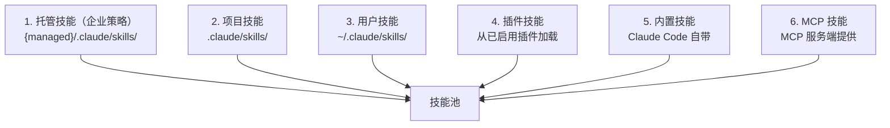

# 第 15 章：技能系统

> **本章目标**：理解 Claude Code 的技能（Skills）系统，以及如何用 Markdown 文件定义可复用的 AI 工作流。

---

## 15.1 先用大白话理解

Shell 脚本自动化终端任务，技能自动化 AI 任务。

想象你每天都要让 Claude Code 做同一件事：「检查代码质量，生成测试，然后提交 git」。每次你都要重新描述这个流程。

技能就是解决这个问题的方案：**把验证有效的 prompt 模板化，存成一个文件，下次直接调用**。

```
/commit                   ← 用户手动调用
"帮我提交代码"             ← 模型自动识别并调用
```

两种方式都触发同一个技能，执行同一套流程。

---

## 15.2 技能的本质

技能是一个 Markdown 文件，包含两部分：

```markdown
---
name: commit
description: 生成规范的 git commit 信息并提交
whenToUse: 当用户想要提交代码时
allowedTools:
  - Bash
  - FileRead
model: sonnet
---

你是一个 git commit 专家。请按照以下步骤操作：

1. 运行 `git diff --staged` 查看暂存的改动
2. 分析改动内容，生成符合 Conventional Commits 规范的 commit 信息
3. 运行 `git commit -m "生成的信息"`
4. 报告提交结果

参数：$ARGUMENTS
```

**Frontmatter**（`---` 之间的部分）是元数据，控制技能的行为。**正文**是实际的提示词内容。

---

## 15.3 技能的双重调用模型

技能有两种触发方式：

| 调用方式 | 触发者 | 示例 |
|---------|--------|------|
| **用户手动** | 用户输入 `/commit` | 用户明确需要某个流程 |
| **模型自动** | 模型根据 `whenToUse` 判断 | 用户说「帮我提交代码」，模型识别意图并调用 |

这两条路径最终汇合到同一个提示词加载和执行逻辑。

`whenToUse` 字段是关键——它告诉模型「在什么情况下应该自动触发这个技能」。写得越清晰，模型自动触发的准确率越高。

---

## 15.4 技能的来源

技能从 6 个来源加载，优先级从高到低：



高优先级来源的技能在命名冲突时覆盖低优先级。

**技能文件格式要求**：只支持 `skill-name/SKILL.md` 的目录格式——每个技能是一个目录，包含一个 `SKILL.md` 文件。这不是随意的限制：目录格式允许技能附带资源文件（如模板、配置），并通过 `${CLAUDE_SKILL_DIR}` 引用。

---

## 15.5 Frontmatter 字段详解

```typescript
type SkillFrontmatter = {
  name: string           // 技能名称（用于 /name 调用）
  description: string    // 显示描述
  whenToUse?: string     // 模型据此判断何时自动触发
  allowedTools?: string[] // 允许的工具白名单
  model?: string         // 模型覆盖（sonnet/haiku/opus）
  effort?: 'low' | 'medium' | 'high'  // 工作量级别
  context?: 'inline' | 'fork'  // 执行模式
  agent?: string         // fork 时的 Agent 类型
}
```

**`context` 字段**：
- `inline`：在当前对话上下文中执行（默认）
- `fork`：fork 一个子 Agent 执行，不影响当前对话历史

`fork` 模式适合耗时较长的任务——子 Agent 在后台执行，不阻塞当前对话。

---

## 15.6 提示词模板语法

技能提示词支持三种动态内容：

**`$ARGUMENTS`**：用户调用技能时传入的参数

```markdown
# 技能调用
/translate 把这段代码翻译成 Python

# 提示词中
请把以下内容翻译成 $ARGUMENTS 语言：
```

**`!`shell 命令``**：内联执行 Shell 命令，结果嵌入提示词

```markdown
当前 git 状态：
!`git status`

最近 5 次提交：
!`git log --oneline -5`
```

**`${ENV_VAR}`**：环境变量

```markdown
当前用户：${USER}
项目根目录：${CLAUDE_SKILL_DIR}
```

---

## 15.7 写一个实用的技能

下面是一个完整的「代码审查」技能示例：

```
.claude/skills/
└── code-review/
    └── SKILL.md
```

```markdown
---
name: review
description: 对当前改动进行代码审查
whenToUse: 当用户想要代码审查、review 代码、检查代码质量时
allowedTools:
  - Bash
  - FileRead
  - GlobTool
  - GrepTool
model: sonnet
effort: medium
---

你是一个经验丰富的代码审查专家。请对以下改动进行全面审查：

## 当前改动
!`git diff HEAD`

## 审查维度

请从以下几个维度进行审查：

1. **正确性**：代码逻辑是否正确？有没有明显的 bug？
2. **安全性**：有没有安全漏洞（SQL 注入、XSS、权限问题）？
3. **性能**：有没有明显的性能问题？
4. **可读性**：代码是否清晰易懂？命名是否合理？
5. **测试**：改动是否有对应的测试覆盖？

## 输出格式

请用以下格式输出审查结果：

### 🔴 必须修复
[严重问题，必须在合并前修复]

### 🟡 建议改进
[非严重问题，建议但不强制]

### 🟢 做得好的地方
[值得表扬的代码实践]

$ARGUMENTS
```

---

## 15.8 技能 vs CLAUDE.md vs Hooks

这三种扩展机制有不同的适用场景：

| 机制 | 适用场景 | 触发方式 | 持久性 |
|------|---------|---------|--------|
| **CLAUDE.md** | 项目规则和约定 | 每次会话自动加载 | 永久 |
| **技能** | 可复用的工作流 | 用户调用或模型触发 | 永久 |
| **Hooks** | 事件响应和拦截 | 特定事件触发 | 永久 |

**CLAUDE.md** 是「背景知识」——告诉 AI 项目的规则和约定。

**技能** 是「工作流模板」——把验证有效的操作流程固化下来。

**Hooks** 是「事件监听器」——在特定事件发生时自动执行检查或后处理。

---

## 15.9 设计洞察

**技能是「提示词工程的版本控制」**。当你发现某个提示词特别有效时，把它固化成技能，就像把有用的 Shell 脚本保存到 `~/.local/bin/` 一样。

**双重调用模型的价值**：用户可以显式调用（`/commit`），模型也可以根据上下文自动触发。这让技能既是「工具」也是「行为」——用户不需要记住所有技能的名字，只需要用自然语言描述需求，模型会自动选择合适的技能。

**`whenToUse` 的重要性**：写清楚 `whenToUse` 比写清楚技能内容更重要。如果模型不知道什么时候应该触发这个技能，再好的技能也没有用。好的 `whenToUse` 应该包含：触发场景、关键词、用户意图的描述。

---

> 下一章：[宠物系统与彩蛋 →](#/docs/11-buddy-system)
