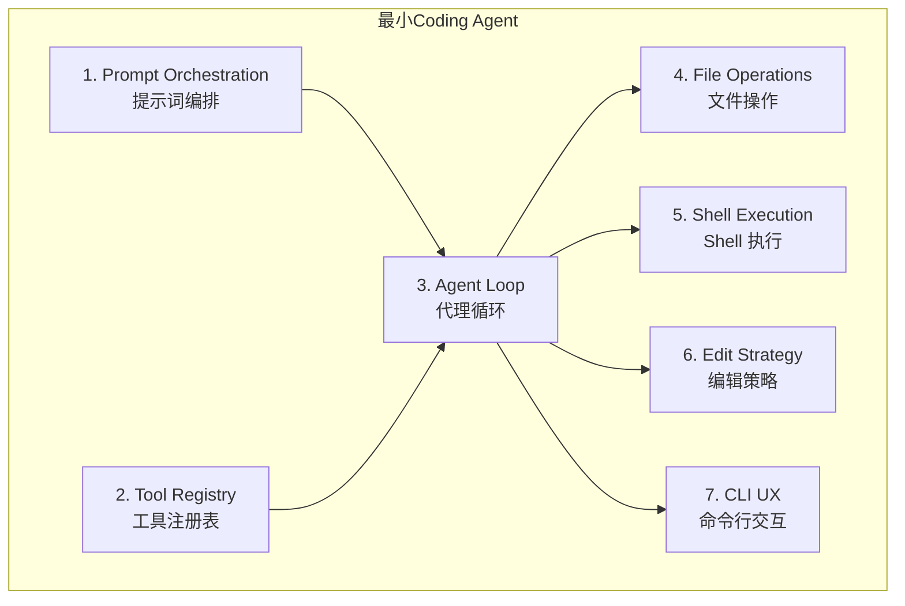

# 第 16 章：最小必要组件

> **本章目标**：从 512K+ 行源码中提炼出「最小必要」的 7 个组件，理解 coding agent 的本质。

---

## 16.1 为什么需要「最小必要」视角

Claude Code 是一个生产级系统，512K+ 行代码覆盖了从 OAuth 到 MCP 到 Vim 模式的方方面面。如果你试图通过阅读全部源码来理解 coding agent 的本质，你会迷失在大量的边界情况处理、UI 优化和平台适配代码中。

这就像试图通过研究波音 747 的全部蓝图来理解「飞行」的原理一样——你需要的是先理解伯努利方程和四个基本力。

Fred Brooks 在《人月神话》中区分了**本质复杂性**（essential complexity）和**偶然复杂性**（accidental complexity）。对于 coding agent：

- **本质复杂性**：循环调用模型、执行工具、管理上下文——这 7 个组件是任何 coding agent 都必须解决的问题
- **偶然复杂性**：MCP 协议集成、Vim 模式、OSC 8 超链接、OAuth 认证——这些是生产环境和用户体验驱动的需求

---

## 16.2 七个最小必要组件



### 组件 1：提示词编排（Prompt Orchestration）

**为什么需要提示词编排？**

系统提示词是 agent 的「操作手册」。没有它，模型不知道自己是一个 coding agent，不知道有哪些工具可用，甚至不知道自己在哪个目录下工作。

一个有效的系统提示词必须包含三个要素：
1. **角色身份与行为准则**：告诉模型它是什么、该怎么做
2. **环境状态**：当前工作目录、操作系统、git 分支、最近提交
3. **项目特定指令**：CLAUDE.md 中的项目规则

**关键洞察**：系统提示词不是一个静态文本文件，而是一个**运行时组装的文档**。每次启动 agent 时，当前目录、git 状态、项目指令都不同，所以提示词必须动态生成。

```typescript
// 最小实现：系统提示词构造器（65 行）
export function buildSystemPrompt(): string {
  const template = readFileSync(join(__dirname, "system-prompt.md"), "utf-8");
  const date = new Date().toISOString().split("T")[0];
  const platform = `${os.platform()} ${os.arch()}`;
  const shell = process.env.SHELL || "unknown";
  const gitContext = getGitContext();   // git 分支/状态/最近提交
  const claudeMd = loadClaudeMd();      // 项目指令
  
  return template
    .replace("{{cwd}}", process.cwd())
    .replace("{{date}}", date)
    .replace("{{platform}}", platform)
    .replace("{{shell}}", shell)
    .replace("{{git_context}}", gitContext)
    .replace("{{claude_md}}", claudeMd);
}
```

**`getGitContext()` 的优雅降级**：运行 git 命令时设置 3 秒超时，在非 git 仓库时返回空字符串。这种「优雅降级」模式在 agent 开发中非常重要：环境信息是锦上添花，不是必要条件。

**Claude Code 的生产实现**：`src/context.ts` 做了同样的事，但规模大得多——它动态组装 20+ 个上下文片段，每个片段有独立的 token 预算，通过 `enhanceSystemPromptWithEnvDetails()` 注入实时环境信息。

| 维度 | 最小实现 | Claude Code 生产实现 |
|------|---------|---------------------|
| 代码量 | 65 行 | 2000+ 行 |
| 上下文片段 | 6 个 | 20+ 个 |
| Token 管理 | 无 | 精确预算分配 |
| 缓存 | 无 | Prompt Cache 优化 |
| 动态更新 | 无 | 环境变化时重新生成 |

---

### 组件 2：工具注册表（Tool Registry）

**为什么需要工具注册表？**

工具注册表解决了两个问题：
1. 告诉模型「有哪些工具可用」（工具描述注入系统提示词）
2. 告诉运行时「如何执行工具」（工具名 → 执行函数的映射）

```typescript
// 最小实现：工具注册表（~100 行）
const tools: Record<string, Tool> = {
  read_file: {
    description: "读取文件内容",
    parameters: { path: { type: "string" } },
    execute: async (params) => {
      return readFileSync(params.path, "utf-8");
    }
  },
  write_file: {
    description: "写入文件内容",
    parameters: { path: { type: "string" }, content: { type: "string" } },
    execute: async (params) => {
      writeFileSync(params.path, params.content);
      return "文件写入成功";
    }
  },
  run_command: {
    description: "执行 Shell 命令",
    parameters: { command: { type: "string" } },
    execute: async (params) => {
      return execSync(params.command, { encoding: "utf-8" });
    }
  }
};
```

**Claude Code 的生产实现**：66+ 个工具，每个工具有完整的权限系统、安全检查、UI 渲染方法、并发控制。工具注册表从一个简单的 `Record<string, Tool>` 演化成了一个完整的工具生命周期管理系统。

---

### 组件 3：代理循环（Agent Loop）

**为什么需要代理循环？**

这是 coding agent 的核心——一个 `while(true)` 循环，持续调用模型、执行工具，直到任务完成。

```typescript
// 最小实现：代理循环（~80 行）
async function agentLoop(userMessage: string): Promise<void> {
  const messages: Message[] = [
    { role: "user", content: userMessage }
  ];
  
  while (true) {
    // 1. 调用模型
    const response = await anthropic.messages.create({
      model: "claude-opus-4-5",
      system: buildSystemPrompt(),
      messages,
      tools: getToolDefinitions()
    });
    
    // 2. 检查停止原因
    if (response.stop_reason === "end_turn") {
      // 模型决定停止，任务完成
      break;
    }
    
    if (response.stop_reason === "tool_use") {
      // 3. 执行工具
      const toolResults = await executeTools(response.content);
      
      // 4. 把工具结果加入对话历史
      messages.push({ role: "assistant", content: response.content });
      messages.push({ role: "user", content: toolResults });
      
      // 5. 继续循环
    }
  }
}
```

**Claude Code 的生产实现**：`src/query.ts` 中的 `query()` 函数做了同样的事，但有：
- 流式输出（实时显示模型思考过程）
- 并发工具执行（多个工具同时运行）
- 上下文压缩（对话太长时自动压缩）
- 错误重试（API 失败时自动重试）
- 多 Agent 协调（子 Agent 的生命周期管理）

---

### 组件 4：文件操作（File Operations）

**最小实现**：三个函数——`read_file`、`write_file`、`list_directory`。

**Claude Code 的生产实现**：`FileReadTool`、`FileEditTool`、`FileWriteTool`、`GlobTool`、`GrepTool`——每个工具都有：
- 路径验证（防止访问工作目录之外的文件）
- 大文件处理（超过阈值时截断并提示）
- 权限检查（写操作需要用户确认）
- 二进制文件检测（避免读取图片等二进制文件）

**关键差距**：最小实现的 `read_file` 直接返回文件内容，没有大小限制。Claude Code 的 `FileReadTool` 在文件超过 `maxFileSize` 时，只返回前 N 行并附上「文件已截断」的提示——这防止了一次读取 10MB 日志文件炸掉上下文窗口。

---

### 组件 5：Shell 执行（Shell Execution）

**最小实现**：一个 `run_command` 函数，直接调用 `execSync`。

**Claude Code 的生产实现**：`BashTool`——7 层安全检查、AST 语法树分析、命令语义感知、后台任务管理。

**关键差距**：最小实现没有任何安全检查。用户可以让模型执行 `rm -rf /`，模型会照做。Claude Code 的 BashTool 在执行任何命令之前，都会经过 7 层检查，任何一层拒绝都会阻止执行。

---

### 组件 6：编辑策略（Edit Strategy）

**为什么编辑策略是独立的组件？**

写文件有两种方式：
1. **全量替换**：读取文件，修改内容，写回整个文件
2. **精确编辑**：只替换需要修改的部分（search-replace）

全量替换简单，但有两个问题：
- 大文件消耗大量 Token（读取 + 写回整个文件）
- 容易引入意外改动（模型可能在「复制」文件时改变格式）

精确编辑更高效，但需要模型精确描述「把什么替换成什么」。

```typescript
// 最小实现：精确编辑（~30 行）
function editFile(path: string, oldStr: string, newStr: string): string {
  const content = readFileSync(path, "utf-8");
  if (!content.includes(oldStr)) {
    throw new Error(`未找到要替换的内容：${oldStr}`);
  }
  const newContent = content.replace(oldStr, newStr);
  writeFileSync(path, newContent);
  return "编辑成功";
}
```

**Claude Code 的生产实现**：`FileEditTool` 使用相同的 search-replace 策略，但有：
- 模糊匹配（允许空白字符差异）
- 唯一性验证（确保 oldStr 在文件中只出现一次）
- diff 预览（显示修改前后的对比）
- 权限检查（编辑操作需要用户确认）

---

### 组件 7：CLI 交互（CLI UX）

**最小实现**：一个简单的 readline 循环，读取用户输入，调用 `agentLoop`，打印结果。

**Claude Code 的生产实现**：完整的 TUI（终端用户界面）——流式输出、颜色高亮、进度指示器、工具调用折叠显示、多行输入、历史记录、Tab 补全。

**关键差距**：最小实现必须等待 `agentLoop` 完成才能显示结果。Claude Code 使用流式 API，在模型生成的同时实时显示输出，用户不需要等待整个响应完成。

---

## 16.3 从最小实现到生产实现的距离

| 组件 | 最小实现行数 | Claude Code 行数 | 复杂度倍数 |
|------|------------|-----------------|-----------|
| 提示词编排 | 65 行 | 2000+ 行 | ~30x |
| 工具注册表 | 100 行 | 5000+ 行 | ~50x |
| 代理循环 | 80 行 | 1500+ 行 | ~20x |
| 文件操作 | 50 行 | 1000+ 行 | ~20x |
| Shell 执行 | 20 行 | 2000+ 行 | ~100x |
| 编辑策略 | 30 行 | 500+ 行 | ~17x |
| CLI 交互 | 30 行 | 3000+ 行 | ~100x |
| **总计** | **~375 行** | **~15000 行** | **~40x** |

这个 40x 的差距就是「偶然复杂性」——安全检查、用户体验、平台适配、错误处理、性能优化。这些不是「多余的」复杂性，而是生产环境必须解决的问题。

---

## 16.4 设计洞察

**「最小必要」是理解的起点，不是终点**：理解了 7 个最小组件，你就理解了 coding agent 的本质。但要构建生产级系统，你需要理解每一层「偶然复杂性」是为了解决什么问题而存在的。

**复杂性是有理由的**：BashTool 的 7 层安全检查看起来「过度设计」，但在 34M+ 次/周的调用规模下，每一层都在防止真实的安全事故。FileEditTool 的模糊匹配看起来「多余」，但它解决了模型在复制代码时引入空白字符差异的真实问题。

**从最小实现开始构建你自己的 Agent**：如果你想构建自己的 coding agent，从这 7 个组件开始，逐步添加生产级特性。每次添加特性时，问自己：「这解决了什么真实问题？」

---

> 下一章：[宠物系统与彩蛋 →](#/docs/11-buddy-system)

---

## 16.5 最小代理循环的完整实现

下面是一个完整的最小代理循环实现（约 150 行），包含工具执行、权限确认、上下文压缩等核心功能：

```typescript
class MinimalAgent {
  private anthropicMessages: Anthropic.MessageParam[] = [];
  private confirmedPaths = new Set<string>();  // 会话级权限白名单
  private lastInputTokenCount = 0;
  private effectiveWindow = 200000;  // 模型上下文窗口

  async run(userMessage: string): Promise<void> {
    // 1. 加入用户消息
    this.anthropicMessages.push({ role: "user", content: userMessage });

    while (true) {
      // 2. 调用 API（流式）
      const response = await this.callAnthropicStream();

      // 3. 加入助手响应
      this.anthropicMessages.push({ role: "assistant", content: response.content });

      // 4. 检查是否有工具调用
      const toolUses = response.content.filter(b => b.type === "tool_use");
      if (toolUses.length === 0) break;  // 没有工具调用，任务完成

      // 5. 执行工具调用
      const toolResults: Anthropic.ToolResultBlockParam[] = [];
      for (const toolUse of toolUses) {
        const input = toolUse.input as Record<string, unknown>;

        // 6. 危险操作确认
        if (isDangerous(toolUse.name, input)) {
          const confirmMsg = `${toolUse.name}(${JSON.stringify(input)})`;
          if (!this.confirmedPaths.has(confirmMsg)) {
            const confirmed = await askUser(`允许执行 ${confirmMsg}? (y/n) `);
            if (!confirmed) {
              toolResults.push({
                type: "tool_result",
                tool_use_id: toolUse.id,
                content: "User denied this action.",  // 拒绝≠失败，反馈给模型
              });
              continue;
            }
            this.confirmedPaths.add(confirmMsg);  // 加入白名单
          }
        }

        // 7. 执行工具
        const result = await executeTool(toolUse.name, input);
        toolResults.push({ type: "tool_result", tool_use_id: toolUse.id, content: result });
      }

      // 8. 工具结果作为 user 消息加入历史
      this.anthropicMessages.push({ role: "user", content: toolResults });

      // 9. 检查是否需要压缩
      await this.checkAndCompact();
    }
  }
}
```

几个值得注意的设计决策：

**用户拒绝 ≠ 工具失败**：当用户拒绝一个危险操作时，结果仍然被反馈给模型（`"User denied this action."`）。这让模型知道操作被拒绝了，可以选择替代方案，而不是困惑于「为什么没有结果」。

**会话级权限白名单**：`confirmedPaths` 是一个 `Set<string>`，存储已确认的操作。如果用户确认了 `rm -rf dist/`，后续相同命令不会再次询问。这是一个简单但重要的用户体验优化。

**工具结果的消息角色**：工具结果以 `role: "user"` 的形式加入消息历史。这是 Anthropic API 的设计约定——在 API 的消息格式中，对话总是 user → assistant → user → assistant 交替。工具结果虽然不是人类说的话，但在消息结构上占据 "user" 的位置。

---

## 16.6 流式调用的实现

```typescript
private async callAnthropicStream(): Promise<Anthropic.Message> {
  return withRetry(async (signal) => {
    const stream = this.anthropicClient!.messages.stream(createParams, { signal });
    let firstText = true;
    stream.on("text", (text) => {
      if (firstText) { process.stdout.write("\n"); firstText = false; }
      process.stdout.write(text);  // 实时输出每个文本片段
    });
    const finalMessage = await stream.finalMessage();
    // 过滤 thinking blocks（不存入历史，它们是推理过程的内部状态）
    if (this.thinking) {
      finalMessage.content = finalMessage.content.filter(
        (block: any) => block.type !== "thinking"
      );
    }
    return finalMessage;
  }, this.abortController?.signal);
}
```

这里有两个巧妙之处：

1. **流式 + 最终消息分离**：`stream.on("text")` 用于实时显示（用户体验），`stream.finalMessage()` 用于获取完整响应（用于后续处理）。流式是给人看的，最终消息是给代码用的。

2. **thinking block 过滤**：Claude 的 extended thinking 功能会产生 `thinking` 类型的内容块。这些块对调试有用，但不应存入消息历史——它们会消耗大量上下文空间，而且重新发送给模型没有意义（模型不需要「回忆」自己的思考过程）。

---

## 16.7 重试机制的实现

```typescript
async function withRetry<T>(fn: Function, signal?: AbortSignal, maxRetries = 3): Promise<T> {
  for (let attempt = 0; ; attempt++) {
    try {
      return await fn(signal);
    } catch (error: any) {
      if (signal?.aborted) throw error;  // 用户主动中止，不重试
      if (attempt >= maxRetries || !isRetryable(error)) throw error;
      // 指数退避 + 随机抖动（防止多客户端同时重试的"惊群效应"）
      const delay = Math.min(1000 * Math.pow(2, attempt), 30000) + Math.random() * 1000;
      console.log(`Retry ${attempt + 1}/${maxRetries} after ${delay}ms...`);
      await new Promise((r) => setTimeout(r, delay));
    }
  }
}

function isRetryable(error: any): boolean {
  const status = error?.status;
  return status === 429  // 速率限制
      || status === 503  // 服务不可用
      || status === 529; // API 过载
  // 注意：400（请求格式错误）、401（认证失败）不重试——这些是永久性错误
}
```

可重试的错误码精心选择：429、503、529 都是临时性错误——等一等通常就能恢复。而 400、401 不会重试——这些是永久性错误，重试没有意义。

**随机抖动**（`Math.random() * 1000`）防止「惊群效应」——如果多个客户端同时遇到 429 错误，没有抖动的话它们会在完全相同的时刻重试，再次触发 429。随机抖动让重试时间分散，避免集体冲击。

---

## 16.8 自动压缩的实现

```typescript
private async checkAndCompact(): Promise<void> {
  // 当上下文使用率超过 85% 时触发压缩
  if (this.lastInputTokenCount > this.effectiveWindow * 0.85) {
    await this.compactConversation();
  }
}

private async compactConversation(): Promise<void> {
  if (this.anthropicMessages.length < 4) return;  // 太短不需要压缩

  // 保留最后一条用户消息（当前正在处理的任务）
  const lastUserMsg = this.anthropicMessages[this.anthropicMessages.length - 1];

  // 请求模型总结之前的对话
  const summaryResp = await this.anthropicClient!.messages.create({
    model: this.model,
    max_tokens: 2048,
    system: "You are a conversation summarizer. Be concise but preserve important details.",
    messages: [
      ...this.anthropicMessages.slice(0, -1),
      { role: "user", content: "Summarize our conversation, preserving key decisions, file paths, and context." }
    ],
  });

  const summaryText = summaryResp.content[0].text;

  // 用总结替换整个历史（保持 user-assistant 交替格式）
  this.anthropicMessages = [
    { role: "user", content: `[Previous conversation summary]\n${summaryText}` },
    { role: "assistant", content: "Understood. I have the context from our previous conversation." },
  ];

  // 恢复最后一条用户消息
  if (lastUserMsg.role === "user") this.anthropicMessages.push(lastUserMsg);
}
```

为什么是 85% 而不是 95%？因为压缩本身需要调用一次 API——把当前历史发送给模型并请求总结。这次调用本身会消耗 Token。如果等到 95% 再压缩，压缩请求可能因为上下文不够而失败。85% 留出了足够的余量。

---

## 16.9 最小实现 vs Claude Code 的关键差距

| 特性 | 最小实现 | Claude Code |
|------|---------|------------|
| 工具执行 | 串行 | 只读并行 + 写操作串行 |
| 错误处理 | 直接抛出 | 错误扣留 + 多级恢复 |
| 上下文压缩 | 简单摘要 | 9 部分结构化摘要 + 压缩后恢复 |
| 权限系统 | 简单确认 | 7 层规则系统 + bypass-immune 保护 |
| 流式输出 | 基本流式 | 流式 + 工具并行执行 |
| 重试机制 | 简单指数退避 | 分类型恢复策略 + 熔断器 |
| 思考过滤 | 无 | 过滤 thinking blocks |
| 会话管理 | 无 | QueryEngine 双层架构 |

---

## 16.10 设计洞察（扩展）

**「用户拒绝 ≠ 工具失败」的深层含义**：这个设计决策体现了「模型是协作者，不是执行器」的理念。当操作被拒绝时，模型需要知道发生了什么，才能做出合理的下一步决策。如果拒绝被当作「工具失败」处理，模型可能会重试相同的操作，陷入无限循环。

**会话级白名单的粒度**：`confirmedPaths` 存储的是完整的工具调用字符串（包括参数），而不是工具名称。这意味着「允许 `rm dist/`」不会自动允许 `rm src/`——每个不同的操作都需要单独确认。这种细粒度控制在安全性和便利性之间取得了平衡。

**40x 复杂度差距的本质**：最小实现（~375 行）到 Claude Code（~15000 行）的 40x 差距，大部分是「偶然复杂性」——安全检查、用户体验、平台适配、错误处理、性能优化。这些不是「多余的」复杂性，而是生产环境必须解决的问题。理解这个差距，就理解了为什么「简单的想法」在生产环境中需要大量工程工作。

---

> 下一章：[宠物系统与彩蛋 →](#/docs/11-buddy-system)

---

## 16.11 Shell 执行的安全张力

Shell 执行让 agent 从「只能读写文件」升级为「能做程序员做的一切事」——运行测试、安装依赖、使用 git、编译代码、启动服务。这是 coding agent 最强大的能力。

但它同时也是最危险的。一个能执行任意 Shell 命令的程序，本质上拥有用户的全部权限。`rm -rf ~` 能删除用户的所有文件；`curl ... | bash` 能执行任意远程代码。这创造了一个根本性的张力：**最大化能力的需求与最小化风险的需求直接冲突**。

### 最小实现的危险命令检测

```typescript
const DANGEROUS_PATTERNS = [
  /\brm\s/,           // rm 命令
  /\bgit\s+(push|reset|clean|checkout\s+\.)/, // 破坏性 git 操作
  /\bsudo\b/,         // 提权
  /\bmkfs\b/,         // 格式化磁盘
  /\bdd\s/,           // 底层磁盘操作
  />\s*\/dev\//,      // 写入设备文件
  /\bkill\b/,         // 终止进程
  /\bpkill\b/,        // 按名称终止进程
  /\breboot\b/,       // 重启
  /\bshutdown\b/,     // 关机
];
```

这 10 个模式覆盖了最常见的危险操作。注意 `\b` 单词边界的使用——`/\brm\s/` 匹配 `rm -rf` 但不匹配 `perform`。但这种正则方式有明显的局限性：`r''m -rf /`（引号打断）、`$(rm -rf /)`（命令替换）、`echo rm | bash`（间接执行）都能绕过检测。

### Claude Code 的 Bash AST 分析

Claude Code 使用 tree-sitter 解析器将命令解析为抽象语法树，然后在 AST 上执行安全检查。为什么 AST 比正则强大得多？考虑这个命令：

```bash
eval "$(echo cm0gLXJmIC8= | base64 -d)"
```

这是 base64 编码的 `rm -rf /`，正则完全无法检测。AST 分析可以识别 `eval` + 命令替换的模式，将其标记为潜在危险。

**命令分类**：Claude Code 将命令分为 search/read/list/neutral/write/destructive 六个类别。只读类别的命令可以免权限执行。这大幅减少了权限确认弹窗的频率——在一个典型的编程任务中，`grep`、`find`、`ls`、`git log` 等命令占调用总量的 60% 以上。如果每次都要确认，用户会陷入「权限疲劳」。

---

## 16.12 编辑策略的三种选择

文件编辑是 agent 最有后果的操作——一次错误的编辑可以破坏构建、引入 bug、甚至导致数据丢失。三种常见的编辑方式各有优劣：

| 方式 | 优点 | 致命缺陷 |
|------|------|---------|
| **全文件重写** | 实现最简单 | 大文件消耗大量 token；模型可能「遗忘」未修改的部分 |
| **行号编辑** | 精确定位 | 多步编辑时行号偏移：改了第 10 行后，原来的第 20 行变成了第 21 行 |
| **search-and-replace** | 基于内容定位，不受行号变化影响 | 需要唯一性约束 |

Claude Code 选择了 **search-and-replace**。核心原因是：**模型「思考」的单位是文本内容，而不是坐标位置**。让模型指定「把这段代码改成那段代码」比让模型指定「修改第 42 行到第 45 行」更自然、更可靠。

### 最小实现的 editFile

```typescript
function editFile(input: { file_path: string; old_string: string; new_string: string }): string {
  try {
    const content = readFileSync(input.file_path, "utf-8");
    // 核心：唯一性检查
    const count = content.split(input.old_string).length - 1;
    if (count === 0) return `Error: old_string not found in ${input.file_path}`;
    if (count > 1) return `Error: old_string found ${count} times. Be more specific.`;
    // 执行替换
    const newContent = content.replace(input.old_string, input.new_string);
    writeFileSync(input.file_path, newContent, "utf-8");
    return `Successfully edited ${input.file_path}`;
  } catch (e: any) {
    return `Error editing file: ${e.message}`;
  }
}
```

`count > 1` 的唯一性检查是关键——如果 `old_string` 在文件中出现多次，替换哪一个？最小实现选择「拒绝并要求更具体」，而不是「替换第一个」。这是「快速失败」原则的体现。

---

## 16.13 FileReadTool 的多格式支持

生产版本不仅读文本文件，还支持：

- **图片**：base64 编码后作为多模态内容发送给模型。为什么需要图片支持？因为调试 UI 问题时，「看一眼截图」是最自然的动作。模型是多模态的——限制它只处理文本是人为的浪费。
- **PDF**：提取指定页面的文本。
- **Jupyter Notebook**：解析 JSON 结构展示 cell 内容，而不是展示原始 JSON。

**大结果持久化**：当工具结果超过内联大小限制时，Claude Code 将完整结果写入临时文件，在消息历史中只保留一个引用。这样，上下文窗口不会被单次大结果撑满，但模型仍然可以通过读取临时文件来访问完整数据。这是一种用文件系统换上下文空间的策略。

**GrepTool 基于 ripgrep**：ripgrep 比系统 grep 快 10-100 倍（在大型代码库上差异更明显），默认尊重 `.gitignore`（自动排除构建产物和依赖），支持更丰富的正则语法。对于需要频繁搜索的 coding agent，这个性能差异直接影响用户体验。

---

## 16.14 从最小实现到生产系统的差距

| 特性 | 最小实现 | Claude Code | 差距原因 |
|------|---------|------------|---------|
| 工具执行 | 串行 | 只读并行 + 写操作串行 | 性能优化 |
| 错误处理 | 直接抛出 | 错误扣留 + 多级恢复 | 可靠性 |
| 上下文压缩 | 简单摘要 | 9 部分结构化摘要 + 压缩后恢复 | 质量 |
| 权限系统 | 简单确认 | 7 层规则系统 + bypass-immune 保护 | 安全性 |
| Shell 安全 | 10 个正则 | 23 项 AST 检查 + Zsh 特定防护 | 安全性 |
| 文件编辑 | 简单替换 | 14 步验证管线 + 并发检测 | 可靠性 |
| 流式输出 | 基本流式 | 流式 + 工具并行执行 | 用户体验 |
| 重试机制 | 简单指数退避 | 分类型恢复策略 + 熔断器 | 可靠性 |
| 思考过滤 | 无 | 过滤 thinking blocks | 安全性 |
| 会话管理 | 无 | QueryEngine 双层架构 | 可靠性 |

**40x 复杂度差距的本质**：最小实现（~375 行）到 Claude Code（~15000 行）的 40x 差距，大部分是「偶然复杂性」——安全检查、用户体验、平台适配、错误处理、性能优化。这些不是「多余的」复杂性，而是生产环境必须解决的问题。理解这个差距，就理解了为什么「简单的想法」在生产环境中需要大量工程工作。

---

## 16.15 设计洞察（深度扩展）

**「正则 vs AST」的安全等级差异**：正则黑名单是「已知攻击的防御」，AST 分析是「语义级的防御」。正则只能检测已知的危险模式，AST 可以理解命令的语义结构，检测未知的危险组合。在安全关键系统中，「语义级防御」比「模式匹配防御」更可靠，但实现成本也更高。

**「search-and-replace 的心智模型对齐」**：编辑策略的选择体现了「工具设计应该对齐用户（模型）的心智模型」的原则。模型在生成编辑指令时，自然地以「旧代码 → 新代码」的方式思考，而不是以「坐标 → 新内容」的方式思考。让工具接口对齐这个心智模型，减少了「翻译」的认知负担，提高了编辑的准确性。

**「唯一性约束」的防御性设计**：`old_string` 的唯一性检查是一个防御性设计——它宁可失败，也不愿意做出错误的修改。这与「快速失败」原则一致：在不确定的情况下，拒绝操作比做出可能错误的操作更安全。这个设计在短期内增加了「失败率」，但在长期内减少了「错误修改率」，提高了系统的整体可靠性。

---

> 下一章：[宠物系统与彩蛋 →](#/docs/11-buddy-system)
