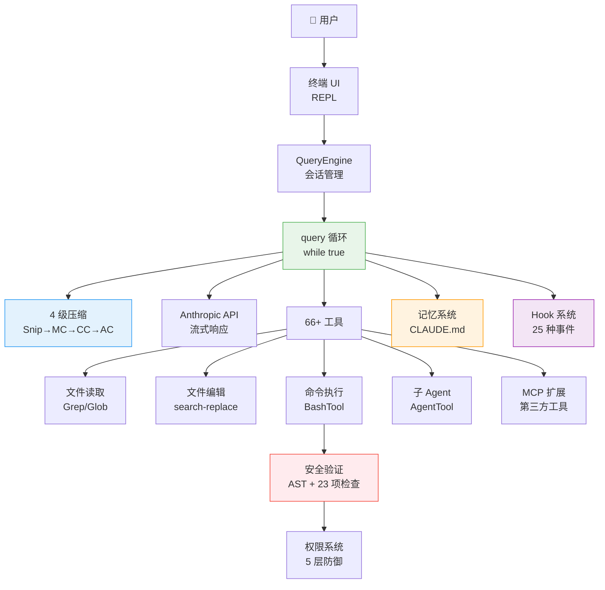

# ⚡ 10 分钟快速入门

> 这是整个教程的浓缩版。如果你只有 10 分钟，读这一页就够了。

Claude Code 是 Anthropic 开发的 AI 编程助手，但它和你见过的所有「AI 写代码」工具都不一样。它不只是生成代码——它能**自主在你的电脑上执行操作**：读文件、改代码、跑命令、看结果、再修改，一直到任务完成。

这份教程基于 Claude Code 真实泄露的 512,000+ 行 TypeScript 源码，带你从零理解它是怎么做到的。

---

## 一句话理解核心

Claude Code 的本质是一个**「思考 → 行动 → 观察 → 再思考」的无限循环**。

就像一个真实的程序员：看到任务 → 想方案 → 动手做 → 看结果 → 发现问题 → 继续修 → 直到完成。

源码里这个循环就是一个 `while(true)`，只有当 AI 认为任务完成了，才会停下来。

---

## 五个关键设计，读懂 Claude Code

### 1. 全链路流式输出——为什么感觉这么快？

普通 AI 工具是「等 AI 想完，再一次性给你答案」。Claude Code 不一样，它每生成一个字就立刻显示出来，同时在 AI 还在「说话」的时候，就已经开始执行工具了。

这叫**工具预执行**：AI 说「我要读这个文件」的时候，文件已经在读了。利用模型生成的 5-30 秒窗口，把约 1 秒的工具延迟藏了起来。

### 2. 四级渐进式压缩——对话太长怎么办？

AI 的「记忆」是有限的（叫做上下文窗口）。对话太长，AI 就记不住前面说了什么。Claude Code 的解法是四级压缩流水线：

| 级别 | 名称 | 做什么 | 成本 |
|------|------|--------|------|
| 1 | 裁剪（Snip） | 截断旧的工具输出 | 极低 |
| 2 | 去重（MC） | 删除重复内容 | 极低 |
| 3 | 折叠（CC） | 折叠不活跃段落（可恢复） | 低 |
| 4 | 摘要（AC） | 启动子 Agent 做全文摘要 | 高 |

每一级都可能释放足够空间，让后面的级别不需要执行。压缩后还会**自动恢复最近编辑的 5 个文件内容**，防止 AI 忘记刚在干什么。

### 3. 五层纵深防御——怎么防止 AI 乱来？

Claude Code 在你电脑上执行真实命令，一条 `rm -rf /` 就能毁掉一切。它的安全系统有 5 层：

```
权限规则匹配（用户声明哪些操作允许）
    ↓
Bash AST 语法树分析（不是正则，是真正理解命令结构）
    ↓
23 项静态安全检查（硬编码的危险模式黑名单）
    ↓
ML 分类器（捕获规则覆盖不到的新型危险）
    ↓
用户确认对话框（最终人类审核，200ms 防误触）
```

任何一层拦住就不执行，纵深防御。

### 4. 统一工具接口——66 个工具怎么协同？

所有工具——读文件、写文件、跑命令、搜索、第三方 MCP 工具——都遵循同一套接口规范。这意味着：第三方工具和内置工具走完全相同的执行流水线，享受同样的安全检查和权限控制。只读工具自动并行执行，写操作自动串行，不需要手动管理并发。

### 5. 多 Agent 协作——一个 AI 不够用怎么办？

Claude Code 支持三种多 Agent 模式：**子 Agent**（主 Agent 分派子任务）、**协调器**（纯指挥官，只分配任务不动手）、**Swarm**（多个 Agent 点对点通信）。为了防止多个 Agent 同时改同一个文件产生冲突，系统用 Git Worktree 给每个 Agent 一份独立的代码副本。

---

## 整体架构图



---

## 关键文件速查

| 文件 | 行数 | 职责 |
|------|------|------|
| `src/query.ts` | 1,728 | 核心查询循环（Agent 的心跳） |
| `src/QueryEngine.ts` | 1,155 | 会话引擎（管理多轮对话） |
| `src/services/api/claude.ts` | 3,419 | API 调用与流式处理 |
| `src/services/compact/compact.ts` | 1,705 | 4 级压缩引擎 |
| `src/utils/bash/bashSecurity.ts` | ~800 | Bash 安全验证（23 项检查） |
| `src/hooks/` | — | Hook 执行引擎 |
| `src/coordinator/` | — | 多 Agent 协调器 |
| `src/memdir/` | — | 记忆系统 |

---

## 选择你的阅读路径

**完全不懂代码，想了解 AI Agent 是怎么工作的？**
→ 按顺序读 [第 0 章](docs/00-what-is-claude-code.md) → [第 1 章](docs/01-architecture-overview.md) → [第 3 章](docs/03-agentic-loop.md)

**想理解核心技术原理？**
→ [第 3 章：代理循环](docs/03-agentic-loop.md) → [第 4 章：对话引擎](docs/04-query-engine.md) → [第 5 章：上下文压缩](docs/05-context-compression.md)

**想深入了解安全设计？**
→ [第 6 章：工具与权限](docs/06-tools-permissions.md)

**想了解多 Agent 架构？**
→ [第 7 章：多 Agent 协作](docs/07-multi-agent.md) → [第 8 章：MCP 集成](docs/08-mcp-integration.md)

**想了解有趣的彩蛋和隐藏功能？**
→ [第 12 章：隐藏命令与宠物系统](docs/12-hidden-commands.md) → [源码泄露的故事](docs/appendix-leak-story.md)

---

*本教程基于 [sanbuphy/claude-code-source-code](https://github.com/sanbuphy/claude-code-source-code) 的源码分析，以及手工川《Claude Code 0331 系统报告》。*
