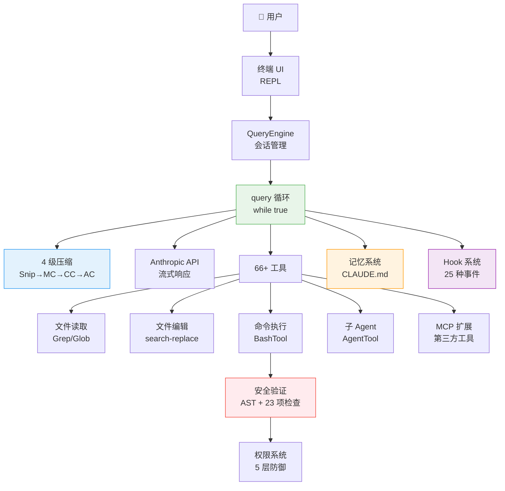

# ⚡ 10 分钟快速入门

> 这是整个教程的浓缩版。如果你只有 10 分钟，读这一页就够了。

Claude Code 是 Anthropic 开发的 AI 编程助手，但它和你见过的所有「AI 写代码」工具都不一样。它不只是生成代码——它能**自主在你的电脑上执行操作**：读文件、改代码、跑命令、看结果、再修改，一直到任务完成。

这份教程基于 Claude Code 真实泄露的 512,000+ 行 TypeScript 源码，带你从零理解它是怎么做到的。

---

## 一句话理解核心

Claude Code 的本质是一个**「思考 → 行动 → 观察 → 再思考」的无限循环**。

就像一个真实的程序员：看到任务 → 想方案 → 动手做 → 看结果 → 发现问题 → 继续修 → 直到完成。

源码里这个循环就是一个 `while(true)`，只有当 AI 认为任务完成了，才会停下来。

---

## 五个关键设计，读懂 Claude Code

### 1. 全链路流式输出——为什么感觉这么快？

普通 AI 工具是「等 AI 想完，再一次性给你答案」。Claude Code 不一样，它每生成一个字就立刻显示出来，同时在 AI 还在「说话」的时候，就已经开始执行工具了。

这叫**工具预执行**：AI 说「我要读这个文件」的时候，文件已经在读了。利用模型生成的 5-30 秒窗口，把约 1 秒的工具延迟藏了起来。

### 2. 四级渐进式压缩——对话太长怎么办？

AI 的「记忆」是有限的（叫做上下文窗口）。对话太长，AI 就记不住前面说了什么。Claude Code 的解法是四级压缩流水线：

| 级别 | 名称 | 做什么 | 成本 |
|------|------|--------|------|
| 1 | 裁剪（Snip） | 截断旧的工具输出 | 极低 |
| 2 | 去重（MC） | 删除重复内容 | 极低 |
| 3 | 折叠（CC） | 折叠不活跃段落（可恢复） | 低 |
| 4 | 摘要（AC） | 启动子 Agent 做全文摘要 | 高 |

每一级都可能释放足够空间，让后面的级别不需要执行。压缩后还会**自动恢复最近编辑的 5 个文件内容**，防止 AI 忘记刚在干什么。

### 3. 五层纵深防御——怎么防止 AI 乱来？

Claude Code 在你电脑上执行真实命令，一条 `rm -rf /` 就能毁掉一切。它的安全系统有 5 层：

```
权限规则匹配（用户声明哪些操作允许）
    ↓
Bash AST 语法树分析（不是正则，是真正理解命令结构）
    ↓
23 项静态安全检查（硬编码的危险模式黑名单）
    ↓
ML 分类器（捕获规则覆盖不到的新型危险）
    ↓
用户确认对话框（最终人类审核，200ms 防误触）
```

任何一层拦住就不执行，纵深防御。

### 4. 统一工具接口——66 个工具怎么协同？

所有工具——读文件、写文件、跑命令、搜索、第三方 MCP 工具——都遵循同一套接口规范。这意味着：第三方工具和内置工具走完全相同的执行流水线，享受同样的安全检查和权限控制。只读工具自动并行执行，写操作自动串行，不需要手动管理并发。

### 5. 多 Agent 协作——一个 AI 不够用怎么办？

Claude Code 支持三种多 Agent 模式：**子 Agent**（主 Agent 分派子任务）、**协调器**（纯指挥官，只分配任务不动手）、**Swarm**（多个 Agent 点对点通信）。为了防止多个 Agent 同时改同一个文件产生冲突，系统用 Git Worktree 给每个 Agent 一份独立的代码副本。

---

## 整体架构图



---

## 关键文件速查

| 文件 | 行数 | 职责 |
|------|------|------|
| `src/query.ts` | 1,728 | 核心查询循环（Agent 的心跳） |
| `src/QueryEngine.ts` | 1,155 | 会话引擎（管理多轮对话） |
| `src/services/api/claude.ts` | 3,419 | API 调用与流式处理 |
| `src/services/compact/compact.ts` | 1,705 | 4 级压缩引擎 |
| `src/utils/bash/bashSecurity.ts` | ~800 | Bash 安全验证（23 项检查） |
| `src/hooks/` | — | Hook 执行引擎 |
| `src/coordinator/` | — | 多 Agent 协调器 |
| `src/memdir/` | — | 记忆系统 |

---

## 选择你的阅读路径

**完全不懂代码，想了解 AI Agent 是怎么工作的？**
→ 按顺序读 [第 0 章](#/docs/00-what-is-claude-code) → [第 1 章](#/docs/01-architecture-overview) → [第 3 章](#/docs/03-agentic-loop)

**想理解核心技术原理？**
→ [第 3 章：代理循环](#/docs/03-agentic-loop) → [第 4 章：对话引擎](#/docs/04-query-engine) → [第 5 章：上下文压缩](#/docs/05-context-compression)

**想深入了解安全设计？**
→ [第 6 章：工具与权限](#/docs/06-tools-permissions)

**想了解多 Agent 架构？**
→ [第 7 章：多 Agent 协作](#/docs/07-multi-agent) → [第 8 章：MCP 集成](#/docs/08-mcp-integration)

**想了解有趣的彩蛋和隐藏功能？**
→ [第 12 章：隐藏命令与宠物系统](#/docs/11-buddy-system) → [源码泄露的故事](#/docs/12-leak-story)

---

*本教程基于 [sanbuphy/claude-code-source-code](https://github.com/sanbuphy/claude-code-source-code) 的源码分析，以及手工川《Claude Code 0331 系统报告》。*

---

## 关键数字速查

| 指标 | 数值 | 意义 |
|------|------|------|
| 源码总行数 | 512,000+ | 相当于 512 本 1000 行的技术书 |
| TypeScript 文件 | ~1,332 | 平均每文件 384 行 |
| 内置工具数 | 66+ | 覆盖文件、搜索、执行、Agent 等 |
| 压缩流水线级数 | 5 级 | 从无损到有损，渐进降级 |
| Bash 安全检查项 | 23 项 | 每次执行命令都要过这 23 关 |
| Hook 事件类型 | 23+ | 可以在任意关键节点插入自定义逻辑 |
| 启动关键路径 | ~235ms | 9 个阶段并行初始化 |
| Feature Flag 数量 | 89 个 | 控制功能开关，部分编译时删除 |
| 内置技能数 | 18+ | `/compact`、`/review`、`/dream` 等 |
| MCP 传输类型 | 7 种 | stdio、SSE、WebSocket、Docker 等 |
| 权限模式 | 5+2 种 | 5 种基础模式 + 2 种特殊模式 |
| 最大上下文窗口 | 200K tokens | 约 150 万字 |
| 压缩触发阈值 | 95% | 上下文使用率超过 95% 触发压缩 |
| 熔断阈值 | 3 次 | 连续压缩失败 3 次后停止重试 |

---

## 三大核心设计哲学

### 1. 工具优先（Tool-First）

Claude Code 的核心不是「更好的 AI 对话」，而是「能执行真实操作的 AI Agent」。所有的设计决策都围绕「如何让 AI 安全、高效地使用工具」展开：

- 工具接口统一化（内置工具 = MCP 工具 = 子 Agent 工具）
- 工具执行并行化（只读工具自动并行）
- 工具安全纵深防御（5 层安全检查）

### 2. 上下文感知（Context-Aware）

AI 的能力上限取决于它能「看到」多少信息。Claude Code 在上下文管理上投入了大量工程：

- 5 级压缩流水线（最大化有效上下文）
- 提示词缓存优化（降低重复内容的 Token 成本）
- 记忆系统（跨会话保留重要信息）
- CLAUDE.md（项目级知识注入）

### 3. 人类在循环（Human-in-the-Loop）

AI 自主执行操作，但人类始终保持控制权：

- 危险操作需要用户确认（200ms 防误触延迟）
- 权限系统（用户可以精确控制 AI 能做什么）
- Hook 系统（用户可以在任意节点插入自定义逻辑）
- 审计日志（所有操作可追溯）

---

## 最值得深入的 5 个设计

如果你只有时间深入理解 5 个设计，选这 5 个：

**1. 异步生成器链（query.ts）**
整个 Agent 循环是一个 `async function*`，通过 `yield` 逐步输出事件。这个设计实现了背压控制、延迟隐藏和关注点分离。理解这个设计，你就理解了 Claude Code 的数据流。

**2. Context Collapse（compact.ts）**
上下文折叠是一种「可恢复的无损压缩」——折叠的内容被保存在侧信道，可以在需要时恢复。这是 Claude Code 最优雅的工程设计之一。

**3. 错误扣留（query.ts）**
可恢复的错误（PTL、MOT）不立即暴露给用户，而是在内部尝试恢复。只有当所有恢复尝试都失败时，错误才会暴露。这是「用户体验优先」的典型体现。

**4. 提示词缓存感知的上下文组装（claude.ts）**
系统提示词的组装顺序（静态内容在前、动态内容在后）是为了最大化提示词缓存命中率而精心设计的。理解这个设计，你就理解了为什么「提示词工程」不只是写好提示词，还包括如何排列提示词。

**5. 编译时 Feature Gate（构建系统）**
内部功能（协调器、Swarm）在公开版本中被物理删除，而不是运行时隐藏。这是「深度防御」安全哲学的体现，也是 Claude Code 内外部版本差异的根本原因。

---

## 常见问题

**Q：Claude Code 的源码是公开的吗？**

A：不是正式公开的。2025 年 3 月，一个包含 512,000+ 行 TypeScript 源码的包意外出现在 npm 上，被研究者发现并分析。Anthropic 随后删除了这个包，但分析报告和部分代码已经在网上流传。本教程基于这些分析报告。

**Q：我需要懂 TypeScript 才能看这个教程吗？**

A：不需要。教程的设计原则是「先大白话，后代码」——每个概念都先用日常语言解释，代码只是辅助理解的补充。如果你看不懂某段代码，跳过它，理解文字描述就够了。

**Q：这个教程和官方文档有什么区别？**

A：官方文档告诉你「怎么用 Claude Code」，这个教程告诉你「Claude Code 是怎么工作的」。两者互补，不互斥。

**Q：Claude Code 的架构适用于其他 AI Agent 吗？**

A：非常适用。Claude Code 解决的问题（上下文管理、工具安全、多 Agent 协作）是所有 AI Agent 都面临的通用问题。它的解决方案（压缩流水线、纵深防御、统一工具接口）是可以迁移的工程模式。

**Q：教程会持续更新吗？**

A：会的。Claude Code 本身在快速演进，教程会跟进重要的架构变化。

---

## 推荐阅读顺序


**最短路径（2 小时）**：快速入门 → 第 1 章 → 第 3 章 → 第 5 章 → 第 6 章

**完整路径（10 小时）**：按章节顺序阅读全部 18 章

**工程师路径（4 小时）**：快速入门 → 第 3 章 → 第 4 章 → 第 5 章 → 第 16 章（最小组件）

---

*本教程基于 [sanbuphy/claude-code-source-code](https://github.com/sanbuphy/claude-code-source-code) 的源码分析，以及手工川《Claude Code 0331 系统报告》。教程内容仅供学习研究，不代表 Anthropic 官方立场。*
